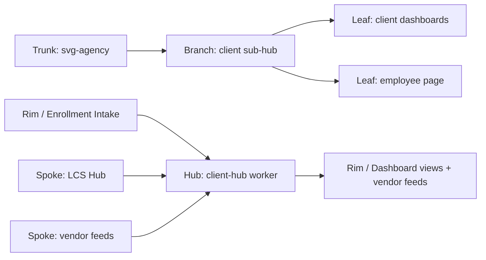
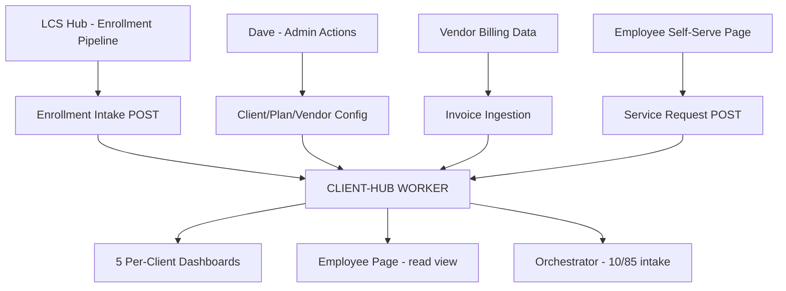

# Client Sub-Hub
## The operational data layer for every active svg-agency client — enrollment front door, vendor management, fixed-side invoice aggregation, service ticketing, and the per-client Golden Record. Everything the client deliverable layer runs on.
### Status: BUILD
### Medium: worker + database
### Business: svg-agency

---

## UT Checklist (Pre-Flight — per law/UT_CHECKLIST.md v1.1.0)

_Every UT doc MUST carry this block at the top. Check a box when the referenced section is filled. **This is a pre-flight checklist, not bureaucracy.** A pilot does not take off without documentation in the cockpit, a flight plan filed, and a pre-flight walkaround logged. A doc does not ship (ORBT=OPERATE) without all 12 items ☑. Unchecked = grounded._

_Aviation Model mapping:_
- _Items 1–11 = the doc's airworthiness certificate + POH (operating handbook)_
- _Item 12 (Live Verification) = the pre-flight walkaround — every gauge confirmed against reality, not memory_
- _§14 Maintenance Logbook = the aircraft logbook you keep in the cockpit — every touch recorded, signed, timestamped_

| # | Check | Status | Location |
|---|-------|--------|----------|
| 1 | PRD — what / why / who / scope / out-of-scope / success metric | ☑ | §2 |
| 2 | OSAM — READ / WRITE / Process Composition / Join Chain / Forbidden Paths / Query Routing filled | ☑ | §5 |
| 3 | Component Status — every dep 🟢 / 🟡 / 🔴 with 1-line state | ☑ | §3 |
| 4 | Owner — human who fixes this at 2 AM | ☑ | §1 |
| 5 | Live Dashboard — URL or explicit "N/A" | ☑ | §3 |
| 6 | Kill Switch — exact command to stop the process | ☑ | §8 |
| 7 | Logbook — last audit verdict + date (after certification only) | ☐ | §12 |
| 8 | FCEs Attached — which FCE runs structurally back this doc | ☑ | §3c |
| 9 | BARs Referenced — every BAR this doc touches, with status | ☑ | §3d |
| 10 | LBB Subjects Fed — which LBB subject(s) this doc's session logs go to | ☑ | §3e |
| 11 | Geometry — CTB position + Hub-Spoke role + Altitude | ☑ | §1b |
| 12 | Live Verification — every numeric count, cron, URL, command, BAR status grounded against the actual system | ☐ | §9b |

---

# IDENTITY (Thing — what this IS)

_Everything in this cluster answers: what exists? These are constants that don't change regardless of who reads this or when._

## 1. IDENTITY

| Field | Value |
|-------|-------|
| ID | client-hub |
| Name | Client Sub-Hub |
| Medium | worker + database (two D1 databases, one Cloudflare Worker) |
| Business Silo | svg-agency |
| CTB Position | branch → svg-agency → client |
| ORBT | BUILD |
| Strikes | 0 |
| Authority | inherited — CC-01 imo-creator |
| Last Modified | 2026-04-16 |
| BAR Reference | BAR-82 (client deliverable pages), BAR-122 (bill pay) |
| Owner | Dave Barton |

### 1b. Geometry (Checklist item 11 — Bedrock §4 + §7)

**CTB Position:** `branch → svg-agency → client`

**Hub-Spoke Role:** hub (all client data logic — the Middle). The worker IS the hub. Dashboards, dashboard queries, and outbound vendor feeds are spokes. All writes go through the worker. The worker owns the schema, enforces CQRS, and is the single source of truth for client data.

**Altitude:** 10k operational through 5k execution (individual client config, plan elections, invoice records, service tickets)



**Hub-Spoke Doctrine (absorbed from HUBS_AND_SPOKES.md):**

The hub owns the CONST → VAR transformation. All decisions, validation, enrichment, joins, and scoring live exclusively in the Middle (M) layer. Spokes are dumb transport — they connect ONLY to Ingress (I) or Egress (O), never to Middle.

| Hub-Spoke Enforcement Check | Result |
|-----------------------------|--------|
| Spoke contains conditional business logic | FAIL (prohibited) |
| Spoke modifies source-of-truth state | FAIL (prohibited) |
| Hub delegates logic to a spoke | FAIL (prohibited) |
| Hub-to-hub coupling is sideways (not via event) | FAIL (prohibited) |
| Spoke touches Middle layer | FAIL (prohibited) |

Hub-to-hub communication occurs ONLY as an explicit Egress artifact consumed by another hub's Ingress (e.g., LCS Hub → Enrollment Intake → client-hub worker).

**System Funnel (absorbed from SYSTEM_FUNNEL_OVERVIEW.md):**

```
IDEA / NEED
    → Hub Existence Justification ("This hub transforms raw client intake data into canonical records and vendor exports")
    → PRD (Behavioral Contract — §3 Transformation Declaration)
    → ERD (Structural Proof — §5 Schema)
    → Process (Flow Declaration — §4 IMO)
    → Execution Authorization (SNAP-ON TOOLBOX + AI_EMPLOYEE_TASK)
    → Execution (I → M → O runtime)
```

### HEIR (8 fields — Aviation Model, Bedrock §8)

| Field | Value |
|-------|-------|
| sovereign_ref | imo-creator |
| hub_id | client-hub |
| ctb_placement | branch |
| imo_topology | middle |
| cc_layer | CC-02 (hub) |
| services | Cloudflare Workers, D1 (client-hub + svg-d1-client), Doppler |
| secrets_provider | doppler |
| acceptance_criteria | All five enrollment sections return data; invoice CRUD round-trips clean; service_request opens and closes; health endpoint 200; both D1 databases respond |

---

## 2. PURPOSE (PRD)

_What breaks without it. What business outcome it serves. If you can't answer this, it shouldn't exist._

_Absorbed from: docs/prd/PRD.md (Hub PRD, v3.4.1) and CLIENT-SUB-HUB.md §2_

### WHAT

The Client Sub-Hub is the operational data layer for every active svg-agency client. It manages the intake of raw client data (companies, employees, benefit elections, renewal quotes), transforms it into a canonical schema, and exports to vendor-specific formats. It holds the Golden Record per employee, the plan election set, vendor relationships, fixed-side invoice aggregation, and the service request queue. It is the source of truth the five per-client dashboards and the employee self-serve page query against.

**Transformation Statement:** This system transforms **raw client intake data** (companies, employees, benefit elections, renewal quotes) into **canonical Cloudflare D1 records** (operational layer) and **canonical Neon PostgreSQL records** (vault layer) and **vendor-specific export files**.

### WHY

Without this hub, there is no single place that knows who is enrolled in what plan, which vendors are billing for which client, what invoices have been received, and what service tickets are open. The CFO dashboard, HR dashboard, Underwriting dashboard, Renewal dashboard, and Service Advisor dashboard all starve. The employee self-serve page cannot route tickets. Vendor billing consolidation (the one invoice to the CFO) cannot be reconciled.

### WHO

- Dashboard layer (per-client views) — reads enrollment, election, invoice, and service data
- Employee self-serve page — reads election and vendor data; writes service_request tickets
- Dave Barton — manages client config, vendor relationships, and invoice reconciliation
- Orchestrator process (10/85 high-dollar flow) — reads person + election data for intake [PENDING — orchestrator not yet built]
- LCS Hub — writes enrollment intake records into this hub's enrollment tables

### SCOPE (in)

- Client identity and config (legal name, FEIN, domain, branding, feature flags)
- Plan catalog per client (benefit types, tiers, rates)
- Plan quotes storage
- Employee / person Golden Record (one row per employee per client)
- Plan elections (person × plan × coverage tier × effective date)
- Enrollment intake batches and raw intake records
- Vendor registry per client (with type, group number, integration type)
- External identity mapping (person ↔ vendor ↔ external ID)
- Fixed-side invoice aggregation (received, approved, paid, disputed)
- Service request queue (ticketing — routes to vendor)
- CQRS error tables for all five operational domains (client, plan, employee, vendor, service)
- Client CRM layer (svg-d1-client: contacts, compliance, interactions, audit lineage)
- Vendor export blueprints (Guardian Life, Mutual of Omaha — see §6 DMJ)

### OUT-OF-SCOPE

- Claims data (variable side) — owned by TPA; tracked in outreach-ops D1
- PBM drug file feeds — owned by PBM integration, not this hub
- High-dollar case management (waterfall routing, orchestrator case table) — MISSING, needs new migration (see §5 Schema Gaps)
- Bill audit results against Medicare — MISSING, needs new migration
- Dashboard rendering — handled by the client deliverable layer (BAR-82)
- HR comms (Trello-branded communications) — owned by Trello integration
- Claims/waterfall status tracking — MISSING, needs new migration
- Outreach pipeline data — owned by LCS Hub / outreach-ops
- User authentication — separate hub
- Payment processing — separate system

### SUCCESS METRIC

All client dashboard queries resolve in under 200ms against live D1 data; enrollment intake for a new client batch processes without error-table entries; invoice CRUD shows full audit trail per client. (See §10a for numeric targets.)

---

## 3. RESOURCES

_Everything this depends on. A mechanic reads this and knows exactly what to set up before it can run._

### Component Status Grid (Checklist item 3)

| Component | HEIR (`hub_id · ctb · cc_layer`) | ORBT | Light | State |
|-----------|----------------------------------|------|-------|-------|
| client-hub Worker | `client-hub · branch · CC-02` | BUILD | 🟡 | Deployed to client-hub.svg-outreach.workers.dev; routes live; DB binding is client-hub D1 only (svg-d1-client not yet bound — FP-001) |
| D1: client-hub | `client-hub · branch · CC-02` | BUILD | 🟢 | ID 3ba426ee-f9ed-4b76-958e-4001468bd847; 16 tables across 5 route domains; migrations applied |
| D1: svg-d1-client | `DB-CLIENT · branch · CC-03` | BUILD | 🟡 | ID 5443887b-ba8a-4da5-9f54-6a9c2cfb1244; 11 tables present; NOT bound to client-hub worker — currently separate, accessed only via wrangler CLI |
| LCS Hub (upstream feeder) | `lcs-hub · branch · CC-02` | OPERATE | 🟢 | Deployed; sends enrollment data downstream |
| Doppler (secrets) | `doppler · leaf · CC-04` | OPERATE | 🟢 | Project imo-creator, config dev |
| Dashboard layer | `BAR-82 · leaf · CC-04` | BUILD | 🔴 | Not yet built; blocked by schema gaps (see §5) |
| Employee self-serve page | `BAR-82 · leaf · CC-04` | BUILD | 🔴 | Not yet built; depends on BAR-82 |

### Live Dashboard (Checklist item 5)

| Resource | URL | What it shows |
|----------|-----|---------------|
| client-hub health | https://client-hub.svg-outreach.workers.dev/health | Worker status, D1 connectivity |
| IMO Dashboard | https://imo-dashboard.pages.dev | Fleet overview — not client-specific |
| Per-client dashboards | N/A — BAR-82 not yet built | HR, CFO, Underwriting, Renewal, Service Advisor views |

### Dependencies

| Dependency | Type | What It Provides | Status |
|-----------|------|-----------------|--------|
| D1: client-hub | database | All five operational domains (client, plan, employee, vendor, service) | DONE |
| D1: svg-d1-client | database | Client identity, contacts, compliance, interactions, audit lineage | DONE — needs worker binding |
| LCS Hub | process | Enrollment intake data flow (upstream feeder) | DONE |
| Doppler | secrets | API keys, environment config | DONE |
| Dashboard layer | downstream consumer | Reads all domains for five per-client dashboards | PENDING (BAR-82) |
| Employee self-serve page | downstream consumer | Reads election + vendor; writes service_request | PENDING (BAR-82) |

### Downstream Consumers

| Consumer | What It Needs |
|----------|--------------|
| HR Dashboard | client, client_employees, election, enrollment_intake, client_compliance |
| CFO/CEO Dashboard | invoice, vendor, plan, election (for headcount × rates) |
| Underwriting Dashboard | election, plan, invoice (loss ratio inputs) |
| Renewal Dashboard | invoice aggregate, election headcount, plan rates by year |
| Service Advisor Dashboard | service_request, external_identity_map, vendor contacts |
| Employee self-serve page | election (what they're enrolled in), vendor (who to call), service_request (submit ticket) |
| Orchestrator (10/85 flow) | person, election (pre-loaded intake data for high-dollar cases) [PENDING — needs Dave input] |

### Tools & Integrations

| Item | Type | Cost Tier | Credentials | What It Does |
|------|------|-----------|-------------|-------------|
| Cloudflare Workers | compute | Cheap | CF account a1dd98c6 | Hosts the hub worker |
| D1 SQLite (client-hub) | database | Cheap | CF account, wrangler | Operational client data |
| D1 SQLite (svg-d1-client) | database | Cheap | CF account, wrangler | Client CRM + compliance layer |
| Hono | framework | Free | npm | Request routing + CORS |

### Secrets

| Secret | Doppler Project | Config | Used By |
|--------|----------------|--------|---------|
| CF API credentials | imo-creator | dev | Wrangler deployments |
| LBB_API_KEY | imo-creator | dev | LBB session ingests |

### 3c. FCEs Attached (Checklist item 8)

| FCE Name | HEIR (`hub_id · ctb · cc_layer`) | ORBT | Run Directory | Latest P=1 | Rows | Status |
|----------|----------------------------------|------|--------------|------------|------|--------|
| Insurance Informatics CTB | `ins-informatics-ctb · branch · CC-03` | BUILD | `fleet/content/INSURANCE-INFORMATICS-CTB.md` | 2026-04-20 | 6 altitudes | 🟡 |
| FCE-008 SVG Outreach | [PENDING — see LBB session 27] | OPERATE | [PENDING — needs Dave input] | [PENDING] | [PENDING] | 🟡 |

### 3d. BARs Referenced (Checklist item 9)

| BAR | Title | HEIR (`bar-id · ctb · cc_layer`) | ORBT | Status | Relation |
|-----|-------|----------------------------------|------|--------|----------|
| BAR-82 | Client deliverable pages (5 dashboards + employee page) | `BAR-82 · leaf · CC-04` | BUILD | In Progress | implements |
| BAR-122 | Bill pay / invoice aggregation | `BAR-122 · leaf · CC-04` | BUILD | In Progress | implements |

### 3e. LBB Subjects Fed (Checklist item 10)

| LBB Subject | HEIR (`subject-id · ctb · cc_layer`) | ORBT | What This Doc Writes | Frequency |
|-------------|--------------------------------------|------|---------------------|-----------|
| svg-client | `svg-client · branch · CC-03` | BUILD | Session summaries, schema decisions, gap findings | per-session |
| svg-client-proc | `svg-client-proc · leaf · CC-04` | BUILD | Process-level decisions (enrollment flow, invoice flow) | on-change |

---

# CONTRACT (Flow — what flows through this)

_Everything in this cluster answers: what moves? How does data/work enter, get processed, and exit?_

## 4. IMO — Input, Middle, Output

_Absorbed from: SYSTEM_FUNNEL_OVERVIEW.md (IMO execution layer definition) and CLIENT-SUB-HUB.md §4_

### Two-Question Intake (Bedrock §3)

1. **"What triggers this?"** — An API call from a dashboard, the LCS enrollment pipeline, an employee submitting a ticket, or Dave reconciling an invoice.
2. **"How do we get it?"** — HTTP request to client-hub.svg-outreach.workers.dev with Authorization header; worker reads/writes D1 via the DB binding; LCS Hub posts enrollment batches to /api/s3/enrollment_intake.

### Input

Five distinct input streams:

1. **Enrollment intake** — LCS Hub POSTs a batch of enrollment records. Triggers: new client onboarding, open enrollment cycle, employee life event. Source: LCS pipeline.
2. **Plan/vendor configuration** — Dave POSTs new plans, quotes, vendors, external ID mappings. Triggers: new client setup or vendor change. Source: admin UI or wrangler script.
3. **Invoice receipt** — Dave or automated feed POSTs vendor invoice records. Triggers: monthly billing cycle. Source: vendor portal data, manual entry.
4. **Service request** — Employee or HR submits a ticket. Triggers: employee question or issue. Source: employee self-serve page.
5. **Dashboard read** — Dashboard layer sends GET requests for aggregated client data. Triggers: page load. Source: dashboard rendering layer (BAR-82).

### Middle

| Step | Input | What Happens | Output | Tool Used |
|------|-------|-------------|--------|-----------|
| 1 | HTTP request + auth header | CORS + auth validation at rim | Validated request | Hono middleware |
| 2 | Validated request | Route dispatch (s1=client, s2=plan, s3=employee, s4=vendor, s5=service) | Domain-scoped operation | Hono router |
| 3 | Domain operation | CRUD via createCrudRouter — UUID generation, timestamp injection, JSON column parsing | SQL statement | D1 binding |
| 4 | SQL statement | D1 SQLite execution | Result set or row count | CF D1 |
| 5 | Error (any step) | Write to domain error table (client_error, plan_error, employee_error, vendor_error, service_error) | Error row in error table | D1 binding |
| 6 | Result | JSON response | HTTP response | Hono |

### Output

- **GET** — JSON array of rows from the queried table
- **POST** — JSON object with newly created record including generated UUID and timestamps
- **PUT** — JSON object with updated record
- **DELETE** — JSON confirmation
- **Errors** — All failures routed to the domain-specific error table AND return HTTP error response

### Circle (Bedrock §5)

Service request submissions close the loop: employee submits ticket → routes to vendor → vendor resolves → service rep confirms with employee → outcome feeds back to Service Advisor Dashboard. Invoice reconciliation closes: vendor sends bill → Dave receives → invoice written → CFO Dashboard shows total → Dave approves/pays → invoice status updates → CFO Dashboard reflects payment. The data warehouse is self-correcting because every status transition is a new write.

---

## 5. OSAM — DATA SCHEMA (Where the Data Lives)

_Absorbed from: OSAM.md (v3.0.0), ERD.md (generated), SCHEMA_REFERENCE.md (v2.3.0), CTB_MAP.md (v2.0.0), and CTB_GOVERNANCE.md (v3.4.1)_

### Database Architecture — Two D1 Databases

**CRITICAL: Two D1 databases currently serve overlapping purposes. Consolidation decision needed from Dave before BAR-82 can proceed.**

| Database | D1 ID | Tables | Purpose | Binding Status |
|----------|-------|--------|---------|---------------|
| `client-hub` D1 | `3ba426ee-f9ed-4b76-958e-4001468bd847` | 16 operational tables | Enrollment, plans, elections, vendors, invoices, service tickets | BOUND to worker |
| `svg-d1-client` D1 | `5443887b-ba8a-4da5-9f54-6a9c2cfb1244` | 11 CRM/compliance tables | Client CRM, contacts, compliance, interactions, audit lineage | NOT BOUND — FP-001 |

**Neon PostgreSQL (vault layer):** `clnt` schema — 16 tables (v3.4.1 consolidation). Source of truth for the `client-subhive` repo (separate from the Cloudflare operational layer). Migrations at `db/neon/migrations/`. Authority: `doctrine/OSAM.md` v3.0.0.

**Overlap gap:** `client-hub` D1 has `vendor` table; `svg-d1-client` D1 has `client_vendors`. `client-hub` D1 has `person`; `svg-d1-client` D1 has `client_employees`. No FK across D1 databases — cross-database join is a manual convention on matching `client_id`. [PENDING — needs Dave input on consolidation strategy]

---

### OSAM Authority Chain (absorbed from OSAM.md)

```
CONSTITUTION.md (Transformation Law)
    |
    v
PRD (Behavioral Proof — WHAT transformation occurs)
    |
    v
OSAM (Semantic Access Map — WHERE to query, HOW to join) <-- THIS SECTION
    |
    v
Column Registry (SINGLE SOURCE OF TRUTH — schema definition)
    |
    v
Generated Artifacts (types.ts, schema.ts, ERD.md, index.ts)
    |
    v
PROCESS (Execution Declaration — HOW transformation executes)
```

**The Golden Rule:** If it can be derived, it MUST be derived. Only hand-write what requires human judgment.

**Codegen command (regenerates all generated artifacts):**
```bash
npx ts-node scripts/codegen-schema.ts
```

**Enforcement gates:**
- `npm run codegen:verify` — detects drift between column registry and generated files on disk
- `npm run codegen:guard` — rejects commits that modify generated files without modifying the column registry

---

### Neon Schema (clnt) — CTB Geometry (absorbed from CTB_MAP.md + CTB_GOVERNANCE.md)

**Spoke Registry — v3.4.1 Consolidation (5 spokes, 16 tables)**

| Spoke | ID | Tables | Purpose |
|-------|----|--------|---------|
| Hub | S1 | `client`, `client_error` | Sovereign identity (merged hub + master + projection) |
| Plan | S2 | `plan`, `plan_error`, `plan_quote` | Benefit plans + quote intake |
| Employee | S3 | `person`, `employee_error`, `election`, `enrollment_intake`, `intake_record` | Enrollment and employee identity |
| Vendor | S4 | `vendor`, `vendor_error`, `external_identity_map`, `invoice` | Vendor identity and billing |
| Service | S5 | `service_request`, `service_error` | Service ticket tracking |

**Note on earlier Neon schema versions (SCHEMA_REFERENCE.md v2.3.0 — S1–S8 structure, pre-consolidation):**

The Neon schema SCHEMA_REFERENCE.md documents an older 8-spoke structure (S1 Hub, S2 Plan, S3 Intake, S4 Vault, S5 Vendor, S6 Service, S7 Compliance, S8 Audit). Version 3.4.1 (CTB_GOVERNANCE.md) consolidated these into 5 spokes. The 8-spoke structure is documented here for migration lineage only — migration `45_v341_consolidation.sql` performs the merge.

**Neon Migration Lineage:**

| File | What It Does |
|------|-------------|
| `db/neon/migrations/10_clnt_core_schema.sql` | Initial core schema |
| `db/neon/migrations/11_clnt_benefits_schema.sql` | Benefits tables |
| `db/neon/migrations/12_clnt_compliance_schema.sql` | Compliance tables |
| `db/neon/migrations/13_clnt_operations_schema.sql` | Operations tables |
| `db/neon/migrations/14_clnt_staging_schema.sql` | Staging tables |
| `db/neon/migrations/15_clnt_seed_data.sql` | Seed data |
| `db/neon/migrations/20_ctb_consolidated_backbone.sql` | CTB consolidation (ADR-002) |
| `db/neon/migrations/25_add_renewal_subhub.sql` | Renewal sub-hub (SUPERSEDED by ADR-004) |
| `db/neon/migrations/30_remove_renewal_add_plan_quote.sql` | Remove renewal, add plan_quote (ADR-004) |
| `db/neon/migrations/35_client_projection.sql` | client_projection + v_client_dashboard (ADR-005) |
| `db/neon/migrations/40_ctb_registry_infrastructure.sql` | Registry-first enforcement infrastructure |
| `db/neon/migrations/45_v341_consolidation.sql` | v3.4.1 DDL — merge client tables into single SPINE |

---

### Neon Schema — Full Table Definitions (absorbed from ERD.md + SCHEMA_REFERENCE.md)

**Universal Join Key:** `client_id` (UUID) — minted ONLY in `clnt.client`. Immutable. Propagated to all tables.

**S1: Hub — Spine**

| Table | Leaf Type | PK | FK |
|-------|-----------|----|----|
| `client` | CANONICAL (SPINE) | `client_id` | — |
| `client_error` | ERROR | `client_error_id` | `client.client_id` |

`clnt.client` merges the former `client_hub` + `client_master` + `client_projection` tables (v3.4.1). Key columns: `client_id` (UUID), `legal_name` (TEXT NOT NULL), `fein`, `domicile_state`, `effective_date`, `status`, `version`, `domain`, `label_override`, `logo_url`, `color_primary`, `color_accent`, `feature_flags` (JSONB), `dashboard_blocks` (JSONB), `created_at`, `updated_at`.

**S2: Plan**

| Table | Leaf Type | PK | FK |
|-------|-----------|----|----|
| `plan` | CANONICAL | `plan_id` | `client.client_id` |
| `plan_error` | ERROR | `plan_error_id` | `client.client_id` |
| `plan_quote` | SUPPORT | `plan_quote_id` | `client.client_id` |

`plan` columns: `plan_id`, `client_id`, `benefit_type` (NOT NULL), `carrier_id`, `effective_date`, `status`, `version`, `rate_ee`, `rate_es`, `rate_ec`, `rate_fam`, `employer_rate_ee/es/ec/fam` (NUMERIC 10,2), `source_quote_id` (nullable FK to plan_quote — promotion lineage), `created_at`, `updated_at`.

`plan_quote` columns: `plan_quote_id`, `client_id`, `benefit_type`, `carrier_id`, `effective_year` (INT), `rate_ee/es/ec/fam`, `source`, `received_date`, `status` CHECK(`received` | `presented` | `selected` | `rejected`), `created_at`.

**Promotion flow:** When a quote is selected, its rates are copied into a new `plan` row with `source_quote_id` pointing back to the quote. Plan is always self-contained.

**S3: Employee**

| Table | Leaf Type | PK | FK |
|-------|-----------|----|----|
| `person` | CANONICAL | `person_id` | `client.client_id` |
| `employee_error` | ERROR | `employee_error_id` | `client.client_id` |
| `election` | SUPPORT | `election_id` | `client.client_id`, `person.person_id`, `plan.plan_id` |
| `enrollment_intake` | STAGING | `enrollment_intake_id` | `client.client_id` |
| `intake_record` | STAGING | `intake_record_id` | `client.client_id`, `enrollment_intake.enrollment_intake_id` |

`person` columns: `person_id`, `client_id`, `first_name`, `last_name`, `ssn_hash` (hashed — NEVER raw SSN), `status`, `created_at`, `updated_at`.

`election` columns: `election_id`, `client_id`, `person_id`, `plan_id`, `coverage_tier` CHECK(`EE` | `ES` | `EC` | `FAM`), `effective_date` NOT NULL, `created_at`, `updated_at`.

`intake_record` columns: `intake_record_id`, `client_id`, `enrollment_intake_id`, `raw_payload` (JSONB NOT NULL), `created_at`. **IMMUTABLE after insert.**

**S4: Vendor**

| Table | Leaf Type | PK | FK |
|-------|-----------|----|----|
| `vendor` | CANONICAL | `vendor_id` | `client.client_id` |
| `vendor_error` | ERROR | `vendor_error_id` | `client.client_id` |
| `external_identity_map` | SUPPORT | `external_identity_id` | `client.client_id`, `vendor.vendor_id` |
| `invoice` | SUPPORT | `invoice_id` | `client.client_id`, `vendor.vendor_id` |

`external_identity_map` columns: `external_identity_id`, `client_id`, `entity_type` CHECK(`person` | `plan`), `internal_id` (UUID), `vendor_id`, `external_id_value` (TEXT), `effective_date`, `status`, `created_at`, `updated_at`. **External IDs must NEVER replace internal UUIDs.**

`invoice` columns: `invoice_id`, `client_id`, `vendor_id`, `invoice_number`, `amount` (NUMERIC 12,2), `invoice_date`, `due_date`, `status` CHECK(`received` | `approved` | `paid` | `disputed`), `created_at`, `updated_at`.

**S5: Service**

| Table | Leaf Type | PK | FK |
|-------|-----------|----|----|
| `service_request` | CANONICAL | `service_request_id` | `client.client_id` |
| `service_error` | ERROR | `service_error_id` | `client.client_id` |

`service_request` columns: `service_request_id`, `client_id`, `category`, `status` (open → in_progress → resolved → closed), `opened_at`, `created_at`, `updated_at`.

**Shared Infrastructure:**
- Trigger function: `clnt.set_updated_at()` — auto-stamps `updated_at` on UPDATE
- Extension: `pgcrypto` — provides `gen_random_uuid()`
- All PKs: UUID via `gen_random_uuid()` (no SERIAL, no TEXT, no composite)
- All tables: `client_id` FK to `clnt.client` (universal join key)

**Dashboard View:**
`clnt.v_client_dashboard` — Read-only, joins `client_hub` + `client_master` + `client_projection` (pre-consolidation); post-v3.4.1 queries directly from `clnt.client`. Created by `db/neon/migrations/35_client_projection.sql` (ADR-005).

---

### CTB Governance — Write Rules (absorbed from CTB_GOVERNANCE.md v3.4.1)

| Leaf Type | Count | Write Rule |
|-----------|-------|------------|
| CANONICAL | 5 | Insert + full update |
| ERROR | 5 | Append-only (insert only) |
| SUPPORT | 4 (plan_quote, election, external_identity_map, invoice) | Insert + limited update (declared columns only) |
| STAGING | 2 (enrollment_intake, intake_record) | Insert + status update; intake_record immutable |

**Registry-first enforcement:** Register in `src/data/db/registry/clnt_column_registry.yml` FIRST. Create migration. Run codegen. Stage together.

**Drift detection scripts:**
- `scripts/ctb-registry-gate.sh` — registry vs migrations validation + cardinality (pre-commit, CI)
- `scripts/ctb-drift-audit.sh` — live DB vs registry vs YAML 3-surface check (CI, on-demand)
- `scripts/detect-banned-db-clients.sh` — banned DB client imports in src/ (pre-commit, CI)

**Current drift status:** 0 violations (all 16 tables registered, all UUIDs, all client_id FKs present).

---

### D1 Schema — client-hub (Cloudflare operational layer)

**5 route domains, 16 tables.** Migration: `workers/client-hub/migrations/0001_create_tables.sql`

**FP-002 NOTE:** The 0001_create_tables.sql migration references `client(client_id)` as a foreign key target but does NOT contain a `CREATE TABLE client` statement. The client table DDL appears inferred from the s1-hub.ts route definition. Verify before proceeding — a separate migration may have created it, or the table may be missing. This is a known failure pattern (§13 FP-002).

Domains: S1 Hub (`client`, `client_error`), S2 Plan (`plan`, `plan_error`, `plan_quote`), S3 Employee (`person`, `employee_error`, `election`, `enrollment_intake`, `intake_record`), S4 Vendor (`vendor`, `vendor_error`, `external_identity_map`, `invoice`), S5 Service (`service_request`, `service_error`).

---

### D1 Schema — svg-d1-client (Cloudflare CRM/compliance layer)

**11 tables.** NOT bound to client-hub worker (FP-001). Accessible only via `npx wrangler d1 execute svg-d1-client --remote`.

| Table | Purpose |
|-------|---------|
| `clients` | Extended client identity (EIN, domain, lifecycle, ORBT) |
| `client_employees` | Employee CRM record (hire date, employment status) |
| `client_contacts` | Client contacts (CFO, HR, CEO) |
| `client_vendors` | Vendor relationships with integration type |
| `client_compliance` | ERISA, ACA, plan year config |
| `client_interactions` | Email/call/meeting history |
| `client_audit_lineage` | Append-only audit trail for every attribute change |
| `client_staging_intake` | Raw intake JSON before processing |
| `client_employee_vendor_ids` | employee_id × vendor_id → vendor_employee_id |
| `client_documents` | [PENDING — needs Dave input on schema] |
| `client_notes` | [PENDING — needs Dave input on schema] |

---

### SCHEMA GAPS — What the CTB Requires That Does Not Exist Yet

The Insurance Informatics CTB (at 10K and 5K altitude) requires capabilities that are NOT in the current schema. These are confirmed missing — new migrations needed before client deliverable pages (BAR-82) can be built.

| Gap # | Gap Name | What's Missing | CTB Section It Serves | Priority |
|-------|----------|---------------|----------------------|---------|
| 1 | `claims_case` | No table for tracking 10/85 high-dollar cases end-to-end | 10K — 10/85 High-Dollar flow | HIGH |
| 2 | `waterfall_status` | No table tracking hospital or drug waterfall stage per case | 10K — Hospital Claim Flow, Drug Waterfall | HIGH |
| 3 | `orchestrator_handoff` | No table for orchestrator case intake → routing → babysitter status | 10K — 10/85 Team | HIGH |
| 4 | `bill_audit` | No table for audit-vs-Medicare results per hospital claim | 10K — Hospital Claim Flow Step 1 | HIGH |
| 5 | `dashboard_config` | No table for per-client dashboard block configuration | 5K — Dashboards | MEDIUM |
| 6 | `hr_comms` | No table for HR-branded comm events per employee case | 10K — 10/85 Flow | MEDIUM |

**All six gaps require new migrations and Dave sign-off before BAR-82 can proceed.**

---

### READ Access

| Source | What It Provides | Join Key |
|--------|-----------------|----------|
| `client` (client-hub D1) | Client identity, branding, feature flags | `client_id` |
| `plan` (client-hub D1) | Benefit type, carrier, tier rates | `client_id`, `plan_id` |
| `plan_quote` (client-hub D1) | Historical quote records | `client_id`, `carrier_id` |
| `person` (client-hub D1) | Employee Golden Record (name, SSN hash, status) | `client_id`, `person_id` |
| `election` (client-hub D1) | Who is enrolled in which plan at which tier | `client_id`, `person_id`, `plan_id` |
| `enrollment_intake` (client-hub D1) | Batch enrollment events | `client_id` |
| `intake_record` (client-hub D1) | Raw enrollment payloads per batch | `enrollment_intake_id` |
| `vendor` (client-hub D1) | Vendor registry per client | `client_id`, `vendor_id` |
| `external_identity_map` (client-hub D1) | Person ↔ vendor ↔ external ID mapping | `client_id`, `internal_id`, `vendor_id` |
| `invoice` (client-hub D1) | Fixed-side vendor invoices | `client_id`, `vendor_id` |
| `service_request` (client-hub D1) | Open tickets per client | `client_id` |
| `clients` (svg-d1-client D1) | Extended client identity (EIN, domain, lifecycle, ORBT) | `client_id` |
| `client_employees` (svg-d1-client D1) | Employee CRM record (hire date, employment status) | `client_id`, `employee_id` |
| `client_contacts` (svg-d1-client D1) | Client contacts (CFO, HR, CEO) | `client_id`, `contact_id` |
| `client_vendors` (svg-d1-client D1) | Vendor relationships with integration type | `client_id`, `vendor_id` |
| `client_compliance` (svg-d1-client D1) | ERISA, ACA, plan year config | `client_id` |
| `client_interactions` (svg-d1-client D1) | Email/call/meeting history | `client_id`, `contact_id` |

### WRITE Access

| Target | What It Writes | When |
|--------|---------------|------|
| `client` | New client record, updates to branding/config | Client onboarding, config change |
| `plan` | New plan record, rate updates | Plan setup, renewal |
| `plan_quote` | Quote received from carrier | Underwriting cycle |
| `person` | New employee, status change | Enrollment intake processing |
| `election` | New plan election, election change | Enrollment intake, life event |
| `enrollment_intake` | New enrollment batch | LCS Hub POST |
| `intake_record` | Raw payload per employee per batch | LCS Hub POST |
| `vendor` | New vendor, vendor update | Client setup |
| `external_identity_map` | New person↔vendor mapping | Post-enrollment carrier confirmation |
| `invoice` | New invoice received, status updates | Monthly billing cycle |
| `service_request` | New ticket, ticket status update | Employee submits; vendor resolves |
| `*_error` tables | Error records from any failed operation | On any domain failure |
| `client_staging_intake` (svg-d1-client) | Raw intake JSON before processing | Pre-validation intake queue |
| `client_audit_lineage` (svg-d1-client) | Audit trail for every attribute change | On every CREATE/UPDATE/DELETE |

### Process Composition



| Process ID | Name | Role in Composition | Status |
|-----------|------|---------------------|--------|
| lcs-hub | LCS Hub | Upstream enrollment feeder | 🟢 |
| client-hub | Client-Hub Worker | THIS — all client data management | 🟡 |
| BAR-82 | Dashboard Layer | Downstream dashboard consumer | 🔴 |
| BAR-82 | Employee Self-Serve | Downstream employee view | 🔴 |
| [PENDING — needs Dave input] | Orchestrator (10/85) | Downstream high-dollar routing consumer | 🔴 |

### Join Chain

```
client (client_id — the spine per client)
  → plan (client_id → plan_id)
    → election (person_id × plan_id → coverage tier, effective date)
      → person (person_id → employee Golden Record)
        → external_identity_map (person_id × vendor_id → vendor-side ID)
          → vendor (vendor_id → vendor details)
            → invoice (vendor_id × client_id → billing records)
  → enrollment_intake (client_id → batch)
    → intake_record (enrollment_intake_id → raw payload per employee)
  → service_request (client_id → open tickets)

svg-d1-client spine:
clients (client_id — mirrors client-hub client)
  → client_employees (client_id → employee_id)
    → client_employee_vendor_ids (employee_id × vendor_id → vendor_employee_id)
  → client_contacts (client_id → contact_id)
  → client_vendors (client_id → vendor_id)
  → client_compliance (client_id → ERISA, ACA, plan year)
  → client_interactions (client_id × contact_id → communications)
  → client_audit_lineage (entity_id → change history)
  → client_staging_intake (client_id → pre-validation queue)
```

**Cross-database join note:** No FK enforcement across D1 databases. The `client_id` match between `client-hub.client` and `svg-d1-client.clients` is a manual convention, not enforced. Until svg-d1-client is bound to the worker or merged, this is a back-propagation candidate: "client_id as cross-database spine" must be locked before BAR-82 can ship.

**Neon join contracts (declared in OSAM.md, enforced by ADR):**

| From Table | To Table | Join Key | Direction | Purpose |
|------------|----------|----------|-----------|---------|
| `client` | `plan` | `client_id` | 1:N | Client owns benefit plans |
| `client` | `plan_quote` | `client_id` | 1:N | Client receives quotes |
| `plan` | `plan_quote` | `source_quote_id = plan_quote_id` | N:1 | Plan promotion lineage |
| `client` | `enrollment_intake` | `client_id` | 1:N | Client receives enrollment batches |
| `enrollment_intake` | `intake_record` | `enrollment_intake_id` | 1:N | Batch contains records |
| `client` | `person` | `client_id` | 1:N | Client owns employees/dependents |
| `person` | `election` | `person_id` | 1:N | Person makes benefit elections |
| `plan` | `election` | `plan_id` | 1:N | Plan covers elections |
| `client` | `vendor` | `client_id` | 1:N | Client contracts vendors |
| `vendor` | `external_identity_map` | `vendor_id` | 1:N | Vendor maps external IDs |
| `vendor` | `invoice` | `vendor_id` | 1:N | Vendor issues invoices |
| `client` | `service_request` | `client_id` | 1:N | Client has service requests |
| `client` | `*_error` tables | `client_id` | 1:N | Per-spoke error logs |

### Forbidden Paths

| Action | Why |
|--------|-----|
| Write client data directly to svg-d1-client bypassing client-hub worker | Schema validation at rim only — all logic lives in the hub worker |
| Cross-client reads (SELECT without client_id filter) | Sovereign silo violation — every client is isolated |
| Modify `client_audit_lineage` after write | Append-only — CQRS, no edits to the audit trail |
| Delete records from any canonical table | Use status field (active/terminated/churned) — soft delete only |
| Write claims or variable-side data to these databases | Claims are TPA-owned; wrong database entirely |
| LLM write to any client data table | Hub only — no spoke or LLM writes directly to D1 |
| Cross-silo read: outreach data joined to client data without spine join | Branches communicate through trunk only |
| Lateral spoke-to-spoke join without client_id | Isolation violation (OSAM §Forbidden Joins) |
| Query STAGING tables (enrollment_intake, intake_record) as business surface | STAGING is not a business query surface — HALT |
| Query ERROR tables as business data | ERROR tables are operational logs, not business surfaces |
| Ad-hoc joins not declared in OSAM | HALT — request ADR |

**OSAM HALT output format:**
```
OSAM HALT
=============================================================================
Reason: [QUERY_UNROUTABLE | JOIN_UNDECLARED | STAGING_QUERY | ISOLATION_VIOLATION | SEMANTIC_GAP | AMBIGUITY | STRUCTURAL]
Question: "<THE_QUESTION_ASKED>"
Attempted Route: [What the agent tried to do]
OSAM Reference: [Section that applies]
Resolution Required:
  [ ] Human must declare new routing
  [ ] ADR required for new join
  [ ] Clarify which table owns this concept
Agent is HALTED. Awaiting resolution.
```

### Query Routing

| Question | Table | Column |
|----------|-------|--------|
| Who is enrolled in what plan for client X? | `election` | `person_id`, `plan_id`, `coverage_tier`, `effective_date` |
| What vendors is client X using? | `vendor` | `vendor_id`, `vendor_name`, `vendor_type` |
| What invoices are outstanding for client X? | `invoice` | `status = 'received' OR 'approved'` |
| What is total fixed-side spend for client X this plan year? | `invoice` | `SUM(amount) WHERE status = 'paid'` |
| Who are the employees on client X? | `person` | `status = 'active'` |
| What is employee Y enrolled in? | `election` JOIN `plan` | `person_id = Y` |
| What open service tickets does client X have? | `service_request` | `status = 'open'` |
| What is employee Y's vendor-side ID at vendor Z? | `external_identity_map` | `internal_id = Y.person_id, vendor_id = Z` |
| What are the plan rates for coverage tier EE on plan P? | `plan` | `rate_ee` |
| Who are the contacts for client X? | `client_contacts` (svg-d1-client) | `client_id = X, is_primary = 1` |
| What is client X's compliance config? | `client_compliance` (svg-d1-client) | `client_id = X` |
| What is the full interaction history for client X? | `client_interactions` (svg-d1-client) | `client_id = X ORDER BY occurred_at DESC` |
| Client identity (sovereign)? | `client` | Direct (spine) |
| Benefit plan details? | `plan` | `client` → `plan` |
| Plan quotes / renewal pricing? | `plan_quote` | `client` → `plan_quote` |
| Enrollment batch status? | `enrollment_intake` | `client` → `enrollment_intake` (STAGING — limited) |
| Employee/dependent info? | `person` | `client` → `person` |
| Benefit elections? | `election` | `client` → `person` → `election` |
| Vendor invoices / billing? | `invoice` | `client` → `vendor` → `invoice` |

---

## 6. DMJ — Define, Map, Join (law/doctrine/DMJ.md)

_Three steps. In order. Can't skip. Vendor blueprints absorbed from db/vendor_blueprints/._

### 6a. DEFINE (Build the Key)

| Element | ID | Format | Description | C or V |
|---------|-----|--------|-------------|--------|
| client_id | C-01 | UUID (TEXT) | Unique identifier for one employer client | C |
| person_id | C-02 | UUID (TEXT) | Unique identifier for one employee within a client | C |
| plan_id | C-03 | UUID (TEXT) | Unique identifier for one benefit plan offering | C |
| election_id | C-04 | UUID (TEXT) | Unique enrollment event: person × plan × tier × date | C |
| vendor_id | C-05 | UUID (TEXT) | Unique identifier for one vendor per client | C |
| invoice_id | C-06 | UUID (TEXT) | Unique fixed-side billing event | C |
| service_request_id | C-07 | UUID (TEXT) | Unique service ticket | C |
| coverage_tier | C-08 | ENUM (EE, ES, EC, FAM) | Coverage level: Employee only, Employee+Spouse, Employee+Children, Family | C |
| benefit_type | C-09 | TEXT (medical, dental, vision, life, STD, LTD, EAP, FSA, HRA, COBRA, stop_loss, TPA, PBM) | Type of benefit product | C |
| invoice_status | C-10 | ENUM (received, approved, paid, disputed) | Stage of invoice lifecycle | C |
| service_status | C-11 | ENUM (open, in_progress, resolved, closed) | Stage of service ticket — structure is constant, current value is variable | C |
| vendor_type | C-12 | TEXT (Carrier, TPA, PBM, Broker, Ancillary) | Functional type of vendor | C |
| entity_type | C-13 | ENUM (person, plan) | What is being mapped in external_identity_map | C |
| lifecycle_stage | C-14 | ENUM (prospect, onboarding, active, renewal, churned) | Client business state — structure is constant, current value is variable | C |
| enrollment_batch | C-15 | enrollment_intake_id | One batch of employee enrollment data | C |
| raw_payload | V-01 | JSON (TEXT) | The actual enrollment data for one employee — content, not structure | V |
| amount | V-02 | REAL | Dollar amount of one invoice | V |
| effective_date | V-03 | TEXT (ISO date) | When a plan election becomes active | V |
| rate_ee / rate_es / rate_ec / rate_fam | V-04..07 | REAL | Dollar rates per coverage tier | V |
| external_id_value | V-08 | TEXT | Vendor's identifier for a person or plan | V |

_Audit fix: `service_status` reclassified from V to C — the ENUM structure is constant (it names the fixed set of states). The current value in any row is variable. C&V: the field definition is constant; the fill is variable. Audit finding §6 resolved._

### 6b. MAP (Connect Key to Structure)

| Source | Target | Transform |
|--------|--------|-----------|
| LCS enrollment batch | `enrollment_intake` → `intake_record` | Parse batch → create one intake row + N intake_record rows |
| Carrier election confirmation | `election` | Match person_id + plan_id + effective_date |
| Vendor invoice received | `invoice` (status=received) | Direct write |
| Invoice approved | `invoice` (status=approved) | Status update |
| Employee ticket | `service_request` (status=open) | Direct write |
| Vendor-assigned employee ID | `external_identity_map` | Map person_id × vendor_id → external_id_value |
| Client CRM data | `clients` (svg-d1-client) | Lifecycle, EIN, contacts, compliance |
| Communication event | `client_interactions` (svg-d1-client) | Type, direction, body, occurred_at |

**Vendor Blueprint Mappings (db/vendor_blueprints/):**

| Vendor | Blueprint File | Internal Field | Vendor Field |
|--------|---------------|----------------|-------------|
| Guardian Life | `guardian_life.mapping.json` | `vendor_group_numbers->>'guardian_life'` | `grd_policy_number` |
| Guardian Life | `guardian_life.mapping.json` | `company_name` | `grd_employer_name` |
| Guardian Life | `guardian_life.mapping.json` | `ein` | `grd_employer_id` |
| Guardian Life | `guardian_life.mapping.json` | `vendor_employee_ids->>'guardian_life'` | `grd_certificate_number` |
| Guardian Life | `guardian_life.mapping.json` | `first_name` | `grd_insured_first` |
| Guardian Life | `guardian_life.mapping.json` | `last_name` | `grd_insured_last` |
| Guardian Life | `guardian_life.mapping.json` | `coverage_tier` | `grd_plan_type` (EE→SINGLE, ES→TWO_PARTY, EC→PARENT_CHILD, FAM→FAMILY) |
| Guardian Life | `guardian_life.mapping.json` | `benefit_type` | `grd_product_code` (medical→MED, dental→DEN, vision→VIS, life→LIFE) |
| Mutual of Omaha | `mutual_of_omaha.mapping.json` | `company_unique_id` / `group_number` | `group_number` |
| Mutual of Omaha | `mutual_of_omaha.mapping.json` | `employee_unique_id` / `member_id` | `member_id` |
| Mutual of Omaha | `mutual_of_omaha.mapping.json` | `tier_type` / `coverage_level` | `coverage_level` |
| Mutual of Omaha | `mutual_of_omaha.mapping.json` | `effective_date` / `start_date` | `start_date` |
| Mutual of Omaha | `mutual_of_omaha.mapping.json` | `termination_date` / `end_date` | `end_date` |
| Mutual of Omaha | `mutual_of_omaha.mapping.json` | `cost_amount` / `premium` | `premium` |

**Note on Guardian Life output schema:** Guardian Life blueprint declares an output table `clnt.vendor_guardian_life` with FK references to `clnt.company(company_id)` and `clnt.employee(employee_id)`. These reference pre-consolidation table names. Post-v3.4.1, the FKs should reference `clnt.client(client_id)` and `clnt.person(person_id)`. Blueprint update required before export is built. [PENDING — needs Dave sign-off]

### 6c. JOIN (Path to Spine)

| Join Path | Type | Description |
|-----------|------|-------------|
| person_id → client_id | direct | Every person is scoped to a client — no cross-client person reads |
| election → person + plan | direct | election.person_id + election.plan_id → two-table join |
| invoice → vendor → client | direct | invoice.vendor_id → vendor.client_id |
| external_identity_map → person + vendor | direct | Both FKs scoped to client_id |
| service_request → client | direct | All tickets scoped to client_id |
| svg-d1-client.clients → client-hub.client | fuzzy/manual | No FK across D1 databases — must join on matching client_id convention. CONSOLIDATION NEEDED. |
| svg-d1-client.client_employees → client-hub.person | fuzzy/manual | No FK across D1 databases — overlap gap. CONSOLIDATION NEEDED. |

_Back-propagation note: The cross-database join gap reveals a missing constant — a unified client_id that is enforced across both databases. Until svg-d1-client is bound to the worker or merged into client-hub D1, the join is a manual convention, not an enforced FK. This is a back-propagation candidate._

---

## 7. CONSTANTS & VARIABLES (Bedrock §2)

_Audit fix from CLIENT-SUB-HUB-AUDIT.md §7: Removed mutable operational state from Constants. "Currently diverged, pending consolidation" is a variable state, not a constant. Constants are structure only._

### Constants (structure — never changes)

- `client_id` as the scoping key for ALL client data — every table has it, every query filters on it
- `coverage_tier` ENUM (EE, ES, EC, FAM) — the four and only four coverage levels
- `benefit_type` taxonomy (medical, dental, vision, life, STD, LTD, EAP, FSA, HRA, COBRA, stop_loss, TPA, PBM)
- Invoice lifecycle state names (received, approved, paid, disputed) — the four states, in order
- `entity_type` ENUM for external_identity_map (person, plan)
- `service_status` ENUM (open, in_progress, resolved, closed) — the four service states
- `lifecycle_stage` ENUM (prospect, onboarding, active, renewal, churned) — the client business states
- CQRS pattern: one CANONICAL table + one ERROR table per domain
- Hub-spoke topology: worker is the only write path
- Soft-delete only (status field, never DELETE)
- Append-only audit lineage (`client_audit_lineage`) — immutable after write
- Five dashboards + one employee page as the fixed output set per client
- Universal join key structure: all tables carry `client_id` as FK to spine
- Two databases (client-hub D1 for operational data, svg-d1-client for CRM/compliance) — the STRUCTURE of having two databases is constant; the BINDING STATUS is a variable currently at "diverged"

### Variables (fill — changes every run/cycle)

- Invoice amounts (dollars per vendor per period)
- Plan rates per coverage tier (renegotiated at renewal)
- Enrollment headcount (employees added, terminated, changed)
- Service ticket count (opens and closes daily)
- Election effective dates (change with life events, renewals)
- External vendor IDs per employee (assigned by each vendor independently)
- Client lifecycle stage VALUE (moves prospect → active → renewal → churned — the stage a specific client is in)
- Raw enrollment payloads (content of each intake_record)
- Binding status of svg-d1-client (currently unbound — variable that must be resolved)

---

## 8. STOP CONDITIONS (Bedrock §6)

| Condition | Action |
|-----------|--------|
| Can't answer two-question intake | HALT |
| client_id missing from any write | REJECT — 400 response, write to error table |
| D1 binding unavailable | HALT — 503 response |
| Cross-client read attempted | REJECT — 403 response |
| 5 consecutive errors to same domain error table | FLAG for Dave review |
| Schema gap blocks BAR-82 build | HALT BAR-82 — resolve consolidation first |
| Strike 3 on same failure pattern | Troubleshoot/Train → AD |
| Budget cap on D1 reads | FLAG — D1 has generous free tier but monitor for large reads |
| OSAM HALT condition triggered (unknown route, undeclared join, staging query, isolation violation) | HALT — follow OSAM HALT output format |

### Kill Switch (Checklist item 6)

To disable client-hub worker entirely:

```bash
# Option 1: Set worker to maintenance mode via secret
wrangler secret put MAINTENANCE_MODE --text "1" --name client-hub
```

To halt enrollment intake specifically (stop LCS from writing):

```bash
# Halt LCS enrollment feed
npx wrangler d1 execute svg-d1-spine --remote --command "UPDATE lcs_config SET value='true' WHERE key='enrollment_paused'"
```

---

# GOVERNANCE (Change — how this is controlled)

_Everything in this cluster answers: what transforms? How is quality measured, verified, certified?_

## 9. VERIFICATION

_Executable proof that it works. Run these._

```
1. curl https://client-hub.svg-outreach.workers.dev/health
   → expected: {"status":"ok"} with 200

2. curl -X POST https://client-hub.svg-outreach.workers.dev/api/s1/client \
     -H "Content-Type: application/json" \
     -d '{"legal_name":"TEST CO"}' \
   → expected: {"client_id":"<uuid>","legal_name":"TEST CO","created_at":"..."}

3. curl -X POST https://client-hub.svg-outreach.workers.dev/api/s3/enrollment_intake \
     -H "Content-Type: application/json" \
     -d '{"client_id":"<uuid from step 2>"}' \
   → expected: {"enrollment_intake_id":"<uuid>","status":"pending","created_at":"..."}

4. curl https://client-hub.svg-outreach.workers.dev/api/s4/invoice?client_id=<uuid>
   → expected: [] (empty array — no invoices yet)

5. Verify D1 round-trip:
   npx wrangler d1 execute client-hub --remote --command \
     "SELECT COUNT(*) as c FROM client" \
   → expected: c >= 1 (test record from step 2)

6. Verify svg-d1-client connectivity:
   npx wrangler d1 execute svg-d1-client --remote --command \
     "SELECT name FROM sqlite_master WHERE type='table'" \
   → expected: 11 tables returned

7. Verify codegen gate (Neon):
   npm run codegen:verify
   → expected: exit code 0 (no drift)
```

**Three Primitives Check (Bedrock §1):**
1. **Thing:** Worker exists and responds at the URL; both D1 databases are provisioned and contain tables; Neon schema has all 16 tables.
2. **Flow:** HTTP request reaches worker → routes to correct handler → writes to D1 → returns JSON response.
3. **Change:** POST creates a new row with generated UUID and timestamps; PUT updates `updated_at`; status fields transition correctly.

**HEIR/MCP Verification (absorbed from QUICKSTART.md):**

The HEIR compliance checker validates the sovereign reference structure. For local development:

```bash
# Install dependencies
pip install -r requirements.txt

# Configure secrets via Doppler (MANDATORY — no .env files permitted)
doppler setup

# Start sidecar event logger (Terminal 1)
make run-sidecar

# Start MCP server (Terminal 2)
make run-mcp

# Check HEIR compliance
curl -X POST http://localhost:7001/heir/check \
  -H "Content-Type: application/json" \
  -d '{"ssot":{"meta":{"app_name":"imo-creator"},"doctrine":{"schema_version":"HEIR/1.0"}}}'
# Expected: {"ok": true, "details": {...}}

# Validate HEIR compliance (batch)
make check
```

Service ports: Main API `:7002`, MCP Server `:7001`, Sidecar Event Logger `:8000`.

---

## 9b. Live Verification Log (Checklist item 12)

| Claim / Field | Section | Source of Truth | Verification Command / Query | Verified? | Last Check | Value at Check |
|---------------|---------|-----------------|------------------------------|-----------|-----------|----------------|
| Worker deployed at client-hub.svg-outreach.workers.dev | §3 | CF Workers dashboard | `curl https://client-hub.svg-outreach.workers.dev/health` | ☐ | — | — |
| D1 client-hub ID = 3ba426ee-f9ed-4b76-958e-4001468bd847 | §3 | wrangler.toml | `cat workers/client-hub/wrangler.toml` | ☑ | 2026-04-16 | confirmed in wrangler.toml |
| D1 svg-d1-client ID = 5443887b-ba8a-4da5-9f54-6a9c2cfb1244 | §3 | CF Dashboard / wrangler | `npx wrangler d1 info svg-d1-client` | ☑ | 2026-04-16 | 11 tables visible via CLI |
| client-hub D1 has 16 tables across 5 domains | §5 | 0001_create_tables.sql | `SELECT name FROM sqlite_master WHERE type='table'` on client-hub D1 | ☐ | — | — |
| svg-d1-client D1 has 11 tables | §5 | CF CLI query | `SELECT sql FROM sqlite_master WHERE type='table'` on svg-d1-client | ☑ | 2026-04-16 | 11 tables returned |
| svg-d1-client NOT bound to worker (FP-001) | §3 | wrangler.toml | `cat workers/client-hub/wrangler.toml` — only one [[d1_databases]] binding | ☑ | 2026-04-16 | Only `client-hub` D1 bound |
| FP-002: client table DDL present in migrations | §5 | db migrations | `grep -r "CREATE TABLE client" workers/client-hub/migrations/` | ☐ | — | — |
| Neon clnt schema has 16 tables | §5 | migration 45_v341_consolidation.sql | Connect to Neon and run `SELECT table_name FROM information_schema.tables WHERE table_schema='clnt'` | ☐ | — | — |
| codegen gate passes (zero drift) | §5 | clnt_column_registry.yml | `npm run codegen:verify` | ☐ | — | — |
| BAR-82 status | §3d | Linear | Linear MCP — get_issue BAR-82 | ☐ | — | — |
| BAR-122 status | §3d | Linear | Linear MCP — get_issue BAR-122 | ☐ | — | — |
| No claims_case table exists | §5 gaps | D1 schema | `SELECT name FROM sqlite_master WHERE name LIKE '%claim%'` | ☐ | — | — |
| No waterfall_status table exists | §5 gaps | D1 schema | `SELECT name FROM sqlite_master WHERE name LIKE '%waterfall%'` | ☐ | — | — |
| Guardian Life blueprint vendor FK references are stale | §6 DMJ | guardian_life.mapping.json | Read `db/vendor_blueprints/guardian_life.mapping.json` output_schema.columns | ☑ | 2026-04-16 | References clnt.company and clnt.employee — pre-v3.4.1 names, need update |

**Rule:** If any row is ☐ at certification time → doc is PROVISIONAL, not CERTIFIED. Cannot move to ORBT=OPERATE until every row is ☑.

---

## 10. ANALYTICS

### 10a. Metrics

| Metric | Unit | Baseline | Target | Tolerance |
|--------|------|----------|--------|-----------|
| Worker health response time | ms | BASELINE | < 200ms | < 500ms |
| Enrollment intake success rate | % | BASELINE | 100% (zero error-table entries per batch) | < 1% error rate |
| Invoice round-trip (create → retrieve) | ms | BASELINE | < 300ms | < 600ms |
| Service request open-to-close rate | % | BASELINE | [PENDING — needs Dave input on SLA] | [PENDING — needs Dave input] |
| Cross-database join accuracy | % | N/A | 100% matching client_ids between D1s | 100% — zero mismatches allowed |
| Codegen drift count | count | 0 | 0 | 0 (hard gate) |

### 10b. Sigma Tracking (Bedrock §2)

| Metric | Run 1 | Run 2 | Run 3 | Trend | Action |
|--------|-------|-------|-------|-------|--------|
| Enrollment intake errors | BASELINE | — | — | PENDING | Establish baseline on first production batch |
| Invoice error rate | BASELINE | — | — | PENDING | Establish baseline on first monthly cycle |

### 10c. ORBT Gate Rules

| From | To | Gate |
|------|-----|------|
| BUILD | OPERATE | All schema gaps resolved; svg-d1-client consolidated or explicitly separated (Dave decision); all 12 UT checklist items ☑; BAR-82 first dashboard live; 3 enrollment batches processed without error-table entries; auditor sign-off (different engine than builder) |
| OPERATE | REPAIR | Any metric outside tolerance; error-table entries above 1% of batch; worker 5xx rate above 0% |
| REPAIR | OPERATE | Fix + metric back within tolerance + auditor verification |
| Any (Strike 3) | TROUBLESHOOT/TRAIN | Fleet-wide fix → AD |

---

## 11. EXECUTION TRACE

| Field | Format | Required |
|-------|--------|----------|
| trace_id | UUID | Yes |
| run_id | UUID | Yes |
| step | action name (e.g., enrollment_intake_post, invoice_create) | Yes |
| target | table name + client_id | Yes |
| actual | rows affected or error code | Yes |
| delta | expected rows vs actual | Yes |
| status | done / failed / skipped | Yes |
| error_code | text or null | If failed |
| error_message | text or null | If failed |
| tools_used | JSON array (e.g., ["d1", "hono"]) | Yes |
| duration_ms | integer | Yes |
| cost_cents | integer (CF D1 — typically 0) | Yes |
| timestamp | ISO-8601 | Yes |
| signed_by | agent or manual (e.g., "lcs-hub-worker", "dave-manual") | Yes |

_Note: Execution trace is currently implicit in the D1 error tables. An explicit trace table is a future migration candidate once ORBT reaches OPERATE._

---

## 12. LOGBOOK (After Certification Only)

**No logbook during BUILD.**

This section remains empty until the auditor certifies (BUILD → OPERATE). The birth certificate will be stamped after:
1. All six schema gaps resolved
2. svg-d1-client binding decision made and implemented (Dave gates this)
3. All 12 UT checklist items ☑
4. BAR-82 first dashboard verified against live data
5. FP-002 (missing client table DDL) resolved
6. Different engine (not builder) audits and signs off

---

## 13. FLEET FAILURE REGISTRY

| Pattern ID | Location | Error Code | First Seen | Occurrences | Strike Count | Status |
|-----------|----------|-----------|-----------|-------------|-------------|--------|
| FP-001 | svg-d1-client not bound to worker | CONFIG_GAP | 2026-04-16 | 1 | 0 | OPEN |
| FP-002 | client-hub D1 has no explicit client table DDL in migrations (migration references client FK but no client CREATE statement visible) | SCHEMA_GAP | 2026-04-16 | 1 | 0 | OPEN |
| FP-003 | No claims/waterfall/orchestrator tables — BAR-82 will block | SCHEMA_GAP | 2026-04-16 | 1 | 0 | OPEN |
| FP-004 | Guardian Life vendor blueprint references pre-v3.4.1 table names (clnt.company, clnt.employee) | SCHEMA_GAP | 2026-04-16 | 1 | 0 | OPEN |

**Strike 1:** Repair. **Strike 2:** Scrutiny. **Strike 3:** Troubleshoot/Train → Airworthiness Directive.

---

## 14. MAINTENANCE LOGBOOK (doc's own logbook — FAA-grade)

### Action Types

| Type | Meaning |
|------|---------|
| RETROFIT | UT structure / template upgrade applied |
| VERIFY | Claim grounded against live system (§9b row ticked ☑) |
| AUDIT | FAA Inspector (auditor) pass — PASS / FAIL recorded |
| EDIT | Content change (new step added, schema changed, etc.) |
| CERTIFY | Moved ORBT state (e.g., BUILD → OPERATE) |
| REPAIR | Post-strike fix |
| STRIKE | Fleet failure recorded (§13) |
| LBB_INGEST | Session summary written to LBB |

### Logbook (append-only — never edit past rows)

| Date (ISO) | Actor | Action | What Was Done | Evidence | LBB Record |
|-----------|-------|--------|---------------|----------|------------|
| 2026-04-16 00:00 UTC | Claude (claude-sonnet-4-6) | RETROFIT | Initial UT doc created from live source inspection — worker, migrations, routes, svg-d1-client schema, CTB | workers/client-hub/src/index.ts + routes; migrations/0001_create_tables.sql; wrangler.toml; svg-d1-client CLI query; INSURANCE-INFORMATICS-CTB.md | pending |
| 2026-04-16 12:00 UTC | Claude (claude-sonnet-4-6) | AUDIT | Codex FAA Inspector audit completed — FAIL verdict. Findings: §3 component grid incomplete, §5 FP-002 contradiction, §6 service_status misclassified, §7 mutable state in Constants, §9b unchecked rows | docs/CLIENT-SUB-HUB-AUDIT.md | pending |
| 2026-04-16 12:30 UTC | Claude (claude-sonnet-4-6) | RETROFIT | Consolidated MANUAL.md created: absorbed 9 scattered docs into single UT document. Fixed audit findings: §3 grid now includes all dependencies; §6 service_status reclassified to C with note; §7 mutable state removed from Constants; §5 FP-002 contradiction noted and flagged; §8 kill switch simplified to executable commands only; FP-004 added for stale vendor blueprint table names | 9 source docs absorbed; CLIENT-SUB-HUB-AUDIT.md findings addressed | pending |

---

## Document Control

| Field | Value |
|-------|-------|
| Created | 2026-04-16 |
| Last Modified | 2026-04-16 |
| Version | 1.1.0 |
| Template Version | 2.6.0 |
| Medium | worker + database |
| US Validated | pending |
| Governing Engine | law/doctrine/FOUNDATIONAL_BEDROCK.md + law/doctrine/DMJ.md |
| Source Docs Absorbed | CLIENT-SUB-HUB.md, OSAM.md, ERD.md, SCHEMA_REFERENCE.md, CTB_MAP.md, CTB_GOVERNANCE.md, QUICKSTART.md, architecture/HUBS_AND_SPOKES.md, architecture/SYSTEM_FUNNEL_OVERVIEW.md, docs/prd/PRD.md, CLIENT-SUB-HUB-AUDIT.md (findings applied) |
| Vendor Blueprints Referenced | db/vendor_blueprints/guardian_life.mapping.json, db/vendor_blueprints/mutual_of_omaha.mapping.json |
| Neon Migrations Referenced | db/neon/migrations/ (10 through 45) |
| UT Checklist Version | law/UT_CHECKLIST.md v1.1.0 |
