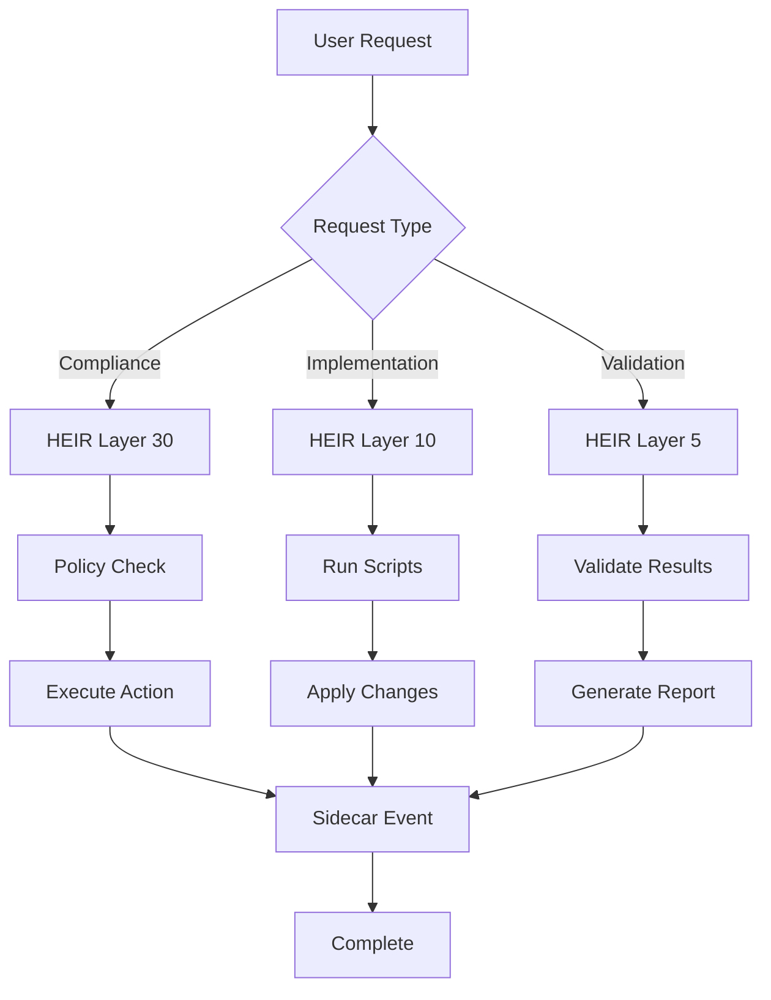

# CTB/AI - AI & Agent Configurations

**Branch:** `ai`
**Purpose:** AI agents, orchestration systems, and intelligent automation

---

## 📁 Directory Structure

```
ctb/ai/
├── agents/                    # AI agent definitions
│   └── claude-agents-library/
│       ├── agents/           # Agent configurations
│       └── mcp/              # MCP integration
├── modules/                  # Altitude-based Barton modules
│   └── barton-modules/
│       ├── altitude-05000/   # Layer 5: Validation
│       ├── altitude-10000/   # Layer 10: Implementation
│       ├── altitude-20000/   # Layer 20: Tactical
│       └── altitude-30000/   # Layer 30: Strategic
└── packages/                 # AI-related packages
    ├── heir/                 # HEIR error handling
    └── sidecar/              # Telemetry & events
```

## 🎯 Agent Purpose

### Primary Functions

1. **Intelligent Orchestration** - Coordinate complex workflows
2. **Error Handling** - HEIR altitude-based error recovery
3. **Event Telemetry** - Track and report system events
4. **Compliance Automation** - Automated compliance checking
5. **Code Generation** - Assist with development tasks

## 🗺️ Orchestration Map

### HEIR Altitude Layers

```
┌─────────────────────────────────────────┐
│  Layer 30: Strategic Orchestration      │
│  • Policy enforcement                   │
│  • Approve global changes               │
│  • Define compliance rules              │
├─────────────────────────────────────────┤
│  Layer 20: Tactical Processing          │
│  • Coordinate sync operations           │
│  • Manage conflicts                     │
│  • Prioritize tasks                     │
├─────────────────────────────────────────┤
│  Layer 10: Implementation                │
│  • File operations                      │
│  • Execute scripts                      │
│  • Apply fixes                          │
├─────────────────────────────────────────┤
│  Layer 5: Validation                    │
│  • Verify structure                     │
│  • Check compliance                     │
│  • Validate outputs                     │
└─────────────────────────────────────────┘
```

### Agent Flow



## 🤖 Available Agents

### Claude Agents Library

**Location:** `agents/claude-agents-library/`

**Agents:**
- Code analysis agents
- Documentation generators
- Compliance checkers
- Test generators

**Usage:**
```bash
cd agents/claude-agents-library

# Install agents
bash agents/install.sh

# List available agents
python mcp/registry_endpoint.py --list
```

### Barton Modules (Altitude-Based)

**Location:** `modules/barton-modules/`

#### Altitude 30000 (Strategic)
- Compliance policy enforcement
- Global change approval
- Strategic decision-making

#### Altitude 20000 (Tactical)
- Workflow coordination
- Conflict resolution
- Task prioritization

#### Altitude 10000 (Implementation)
- Script execution
- File operations
- Direct system changes

#### Altitude 05000 (Validation)
- Structure verification
- Compliance checking
- Output validation

## 📦 Packages

### HEIR Package (`packages/heir/`)

**Purpose:** Hierarchical Error-handling, ID management, and Reporting

**Key Components:**
```python
from ctb.ai.packages.heir import (
    HEIRError,
    handleError,
    withRetry,
    altitude_router
)

# Use HEIR error handling
try:
    result = perform_operation()
except Exception as e:
    await handleError(e, {
        'altitude': 10,
        'category': 'file_operation',
        'severity': 'medium'
    })
```

**Features:**
- Altitude-based routing
- Exponential backoff retry
- Error categorization
- Master logging integration

**Configuration:**
```yaml
# .heir-config.yaml
altitude_layers:
  - layer: 30
    description: "Strategic orchestration"
  - layer: 20
    description: "Tactical processing"
  - layer: 10
    description: "Implementation"
  - layer: 5
    description: "Validation"

error_handling:
  max_retries: 3
  retry_strategy: "exponential_backoff"
  log_to_master: true
```

### Sidecar Package (`packages/sidecar/`)

**Purpose:** Event emission and telemetry

**Key Components:**
```python
from ctb.ai.packages.sidecar import (
    emitEvent,
    trackMetric,
    logTelemetry
)

# Emit events
await emitEvent('ctb.compliance.checked', {
    'score': 95,
    'timestamp': datetime.now()
})

# Track metrics
trackMetric('files_tagged', 183)
```

**Events:**
- `ctb.structure.created`
- `ctb.compliance.checked`
- `ctb.sync.completed`
- `ctb.violation.detected`

**Configuration:**
```yaml
sidecar:
  url: ${IMOCREATOR_SIDECAR_URL}
  bearer_token: ${IMOCREATOR_BEARER_TOKEN}
  events:
    - ctb.compliance.checked
    - ctb.sync.completed
```

## 🔄 Orchestration Workflows

### CTB Compliance Cycle

**Trigger:** Weekly (Sundays 2 AM) or on-demand

**Workflow:**
```
1. HEIR Layer 30: Policy Check
   ↓
2. HEIR Layer 10: Execute Tagger
   ↓
3. HEIR Layer 10: Execute Auditor
   ↓
4. HEIR Layer 20: Evaluate Score
   ↓
5. HEIR Layer 10: Execute Remediator (if needed)
   ↓
6. HEIR Layer 5: Validate Results
   ↓
7. Sidecar: Emit Events
```

### Error Recovery Flow

```
Error Occurs
    ↓
HEIR Categorize (altitude, severity)
    ↓
Route to Appropriate Layer
    ↓
Retry with Backoff (if retryable)
    ↓
Log to Master Endpoint
    ↓
Emit Sidecar Event
    ↓
Return Result/Throw
```

## 🚀 Quick Start

### Running Agents

```bash
# Start Claude agent library
cd ctb/ai/agents/claude-agents-library
bash agents/install.sh

# Install MCP integration
bash mcp/scripts/install_agents.sh
```

### Using HEIR Package

```python
# Import HEIR utilities
from ctb.ai.packages.heir import HEIRError, withRetry

# Execute with retry
result = await withRetry(
    lambda: risky_operation(),
    maxRetries=3,
    retryDelay=1000
)
```

### Using Sidecar

```python
# Import sidecar
from ctb.ai.packages.sidecar import emitEvent

# Emit events
await emitEvent('app.started', {
    'version': '1.0.0',
    'environment': 'production'
})
```

## 📊 Monitoring & Telemetry

### Event Dashboard

Events are sent to sidecar for monitoring:

```bash
# View recent events
curl ${IMOCREATOR_SIDECAR_URL}/events/recent

# View metrics
curl ${IMOCREATOR_SIDECAR_URL}/metrics
```

### HEIR Error Logs

```bash
# View HEIR error logs
tail -f logs/errors/heir-errors.ndjson

# Parse error logs
jq '.altitude' logs/errors/heir-errors.ndjson | sort | uniq -c
```

## 🧪 Testing

### Run AI Package Tests

```bash
# Test HEIR package
cd ctb/ai/packages/heir
python -m pytest tests/

# Test Sidecar package
cd ctb/ai/packages/sidecar
python -m pytest tests/
```

## 🔐 Environment Variables

```bash
# Sidecar Configuration
IMOCREATOR_SIDECAR_URL=http://localhost:8000
IMOCREATOR_BEARER_TOKEN=<token>

# MCP Configuration
GARAGE_MCP_URL=http://localhost:7001

# HEIR Configuration
HEIR_MAX_RETRIES=3
HEIR_LOG_TO_MASTER=true
IMO_MASTER_ERROR_ENDPOINT=<endpoint>
```

## 📚 Agent Catalog

### Available Agents

| Agent | Purpose | Altitude | Status |
|-------|---------|----------|--------|
| Compliance Checker | Audit CTB structure | 5 | Active |
| Code Generator | Generate boilerplate | 10 | Active |
| Test Generator | Create test suites | 10 | Active |
| Doc Generator | Generate documentation | 10 | Active |
| Policy Enforcer | Enforce compliance rules | 30 | Active |
| Workflow Coordinator | Manage complex workflows | 20 | Active |

### Adding New Agents

```bash
# 1. Create agent definition
cat > agents/claude-agents-library/agents/my-agent.yaml << EOF
name: my-agent
altitude: 10
capabilities:
  - code_analysis
  - file_operations
EOF

# 2. Register agent
python mcp/registry_endpoint.py --register agents/my-agent.yaml

# 3. Test agent
python mcp/registry_endpoint.py --test my-agent
```

## 🔗 Integration Points

### With CTB/SYS

- Execute compliance scripts
- Trigger factory/mechanic operations
- Manage MCP servers

### With CTB/DATA

- Query database schemas
- Validate data structures
- Monitor data quality

### With CTB/UI

- Generate UI components
- Validate user flows
- Test frontend logic

## 🐛 Troubleshooting

### Agent Not Responding

```bash
# Check MCP server status
curl http://localhost:3001/health

# Restart agents
cd ctb/ai/agents/claude-agents-library
bash agents/install.sh --force
```

### HEIR Errors Not Logging

```bash
# Verify sidecar connection
curl ${IMOCREATOR_SIDECAR_URL}/health

# Check HEIR configuration
cat .heir-config.yaml

# View error log file
tail -f logs/errors/heir-errors.ndjson
```

### Event Emission Failures

```bash
# Check sidecar logs
curl ${IMOCREATOR_SIDECAR_URL}/logs

# Verify bearer token
echo $IMOCREATOR_BEARER_TOKEN

# Test event emission
curl -X POST ${IMOCREATOR_SIDECAR_URL}/events \
  -H "Authorization: Bearer ${IMOCREATOR_BEARER_TOKEN}" \
  -H "Content-Type: application/json" \
  -d '{"event": "test", "data": {}}'
```

## 📖 Documentation

- [HEIR Package](packages/heir/__init__.py) - Error handling documentation
- [Sidecar Package](packages/sidecar/__init__.py) - Event emission docs
- [Agent Library](agents/claude-agents-library/README.md) - Agent catalog
- [Dependencies](../meta/DEPENDENCIES.md) - Inter-branch dependencies

## 🔗 Quick Links

- **Agents:** [claude-agents-library/](agents/claude-agents-library/)
- **HEIR Package:** [packages/heir/](packages/heir/)
- **Sidecar Package:** [packages/sidecar/](packages/sidecar/)
- **Barton Modules:** [modules/barton-modules/](modules/barton-modules/)

---

**Last Updated:** 2025-10-23
**Maintained By:** CTB AI System
**Version:** 1.0.0
