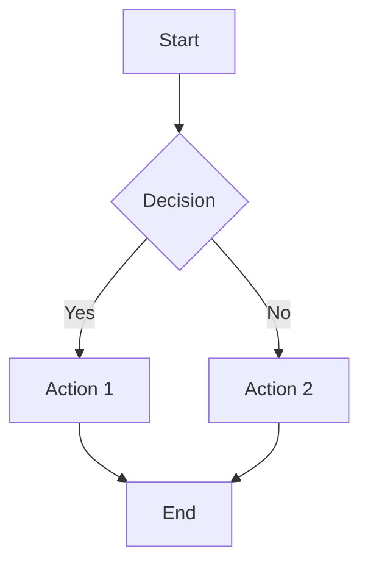

# CTB/DOCS - Documentation

**Branch:** `docs`
**Purpose:** Project documentation, blueprints, diagrams, and guides

---

## 📁 Directory Structure

```
ctb/docs/
├── architecture.mmd        # System architecture diagram (Mermaid)
├── docs/                   # Main documentation
│   └── blueprints/         # Blueprint documentation
│       ├── example/        # Example blueprint
│       ├── imo/            # IMO blueprint
│       └── ui/             # UI blueprint
└── README.md               # This file
```

## 📚 Documentation Overview

### What Lives Here

- **System Architecture** - High-level system diagrams
- **Blueprint Documentation** - IMO process blueprints
- **Integration Guides** - How components connect
- **API Documentation** - API references
- **Development Guides** - Setup and workflow docs

## 🗺️ Architecture Diagrams

### Main Architecture

**File:** [architecture.mmd](architecture.mmd)

View the complete system architecture showing data flow between:
- **DATA** layer (PostgreSQL, Firebase)
- **AI** layer (HEIR, Agents, Sidecar)
- **UI** layer (Next.js, Components)

**To view:**
```bash
# Using Mermaid CLI
mmdc -i ctb/docs/architecture.mmd -o architecture.png

# Or view in GitHub/compatible viewers
cat ctb/docs/architecture.mmd
```

### Component Diagrams

Located in `diagrams/`:
- Data flow diagrams
- Sequence diagrams
- State machines
- Integration maps

## 📋 Blueprints

### Available Blueprints

| Blueprint | Purpose | Location |
|-----------|---------|----------|
| **Example** | Sample blueprint structure | [docs/blueprints/example/](docs/blueprints/example/) |
| **IMO** | Input-Middle-Output process | [docs/blueprints/imo/](docs/blueprints/imo/) |
| **UI** | UI component blueprint | [docs/blueprints/ui/](docs/blueprints/ui/) |

### Blueprint Structure

Each blueprint contains:

```
blueprint-name/
├── manifest.yaml           # Blueprint configuration
├── docs/                   # Generated documentation
│   └── generated/
│       ├── 00-overview.md
│       ├── input-stage.md
│       ├── middle-stage.md
│       ├── output-stage.md
│       ├── development-guide.md
│       └── README.md
└── progress.json           # Implementation progress
```

### Generating Blueprint Docs

```bash
# Generate documentation for a blueprint
python ctb/sys/tools/blueprint_doc_generator.py \
  ctb/docs/docs/blueprints/imo

# Output:
# - docs/generated/00-overview.md
# - docs/generated/input-stage.md
# - docs/generated/middle-stage.md
# - docs/generated/output-stage.md
# - docs/generated/development-guide.md
# - docs/generated/progress.md
# - docs/generated/README.md
```

## 📖 Blueprint Manifest

### Example Manifest

```yaml
# manifest.yaml
process: imo-workflow
version: 1.0.0

mission:
  north_star: "Streamline client intake and blueprint creation"
  success_metrics:
    - "Reduce intake time by 50%"
    - "Increase blueprint accuracy to 95%"
  constraints:
    - "Must integrate with existing systems"
    - "HEIR compliance required"

buckets:
  input:
    description: "Data collection and validation"
    stages:
      - key: client_info
        title: "Client Information"
        kind: form
        fields:
          name: text
          email: email
          company: text

  middle:
    description: "Processing and transformation"
    stages:
      - key: blueprint_gen
        title: "Blueprint Generation"
        kind: automation
        actions:
          - "analyze_requirements"
          - "generate_structure"

  output:
    description: "Delivery and confirmation"
    stages:
      - key: review
        title: "Review & Approve"
        kind: review
        approvers:
          - role: admin
```

## 🔗 Documentation Links

### Internal Documentation

- [CTB Index](../../CTB_INDEX.md) - Complete path mappings
- [Implementation Summary](../../CTB_IMPLEMENTATION_SUMMARY.md) - CTB setup
- [Compliance Scripts](../../CTB_COMPLIANCE_SCRIPTS_SUMMARY.md) - Scripts overview
- [Global Config](../../global-config.yaml) - Configuration reference

### Branch Documentation

- [SYS README](../sys/README.md) - System infrastructure
- [AI README](../ai/README.md) - AI & agents
- [DATA README](../data/README.md) - Database & schemas
- [UI README](../ui/README.md) - UI components
- [META README](../meta/README.md) - Configuration

### External Links

- [Mermaid Documentation](https://mermaid.js.org/) - Diagram syntax
- [Blueprint Guide](https://docs.example.com/blueprints) - Blueprint creation
- [IMO Pattern](https://docs.example.com/imo) - IMO methodology

## 📝 Writing Documentation

### Documentation Standards

1. **Use Markdown** - All docs in Markdown format
2. **Include Examples** - Show, don't just tell
3. **Keep Updated** - Update docs with code changes
4. **Link Liberally** - Cross-reference related docs
5. **Use Diagrams** - Visual aids for complex concepts

### Markdown Templates

**Feature Documentation:**
```markdown
# Feature Name

## Overview
Brief description of the feature

## Usage
How to use the feature

## Examples
Code examples

## API Reference
Function signatures and parameters

## Testing
How to test the feature
```

**API Documentation:**
```markdown
# API Endpoint Name

## Request
- Method: POST
- Path: /api/endpoint
- Headers: Authorization
- Body: JSON payload

## Response
- Status: 200
- Body: JSON response

## Example
```bash
curl -X POST /api/endpoint \
  -H "Authorization: Bearer token" \
  -d '{"key": "value"}'
```
```

## 🎨 Diagrams

### Mermaid Diagrams

**Create diagrams using Mermaid syntax:**



### Architecture Diagrams

See [architecture.mmd](architecture.mmd) for the complete system architecture.

Key diagrams include:
- **Data Flow** - How data moves through the system
- **Component Interaction** - How components communicate
- **Deployment** - Infrastructure and services
- **User Flows** - End-to-end user journeys

## 🔍 Finding Documentation

### Quick Search

```bash
# Search all documentation
grep -r "search term" ctb/docs/

# Search blueprints
grep -r "IMO" ctb/docs/docs/blueprints/

# Search Mermaid diagrams
find ctb/docs -name "*.mmd"
```

### Documentation Index

All documentation is indexed in:
- [CTB_INDEX.md](../../CTB_INDEX.md) - Path mappings
- [ENTRYPOINT.md](../../ENTRYPOINT.md) - Start here guide

## 📊 Documentation Coverage

Track documentation coverage:

```bash
# List undocumented components
python ctb/sys/tools/doc_coverage.py

# Generate documentation report
python ctb/sys/tools/doc_coverage.py --report
```

## ✍️ Contributing Documentation

### Adding New Docs

1. Create file in appropriate directory
2. Follow markdown standards
3. Add cross-references
4. Include in index
5. Update CTB_INDEX.md if needed

### Updating Existing Docs

1. Make changes
2. Update "Last Updated" timestamp
3. Add to changelog if significant
4. Test all links

### Documentation Review

All documentation should be:
- ✅ Clear and concise
- ✅ Accurate and up-to-date
- ✅ Well-structured
- ✅ Properly linked
- ✅ Include examples

## 🔗 Quick Links

- **Architecture Diagram:** [architecture.mmd](architecture.mmd)
- **Blueprints:** [docs/blueprints/](docs/blueprints/)
- **Generated Docs:** [docs/blueprints/*/docs/generated/](docs/blueprints/)
- **IMO Blueprint:** [docs/blueprints/imo/](docs/blueprints/imo/)

## 📞 Support

For documentation questions:

1. Check existing docs first
2. Search for keywords
3. Review architecture diagrams
4. Consult blueprint manifests
5. Check ENTRYPOINT.md for navigation

---

**Last Updated:** 2025-10-23
**Maintained By:** CTB Documentation System
**Version:** 1.0.0
