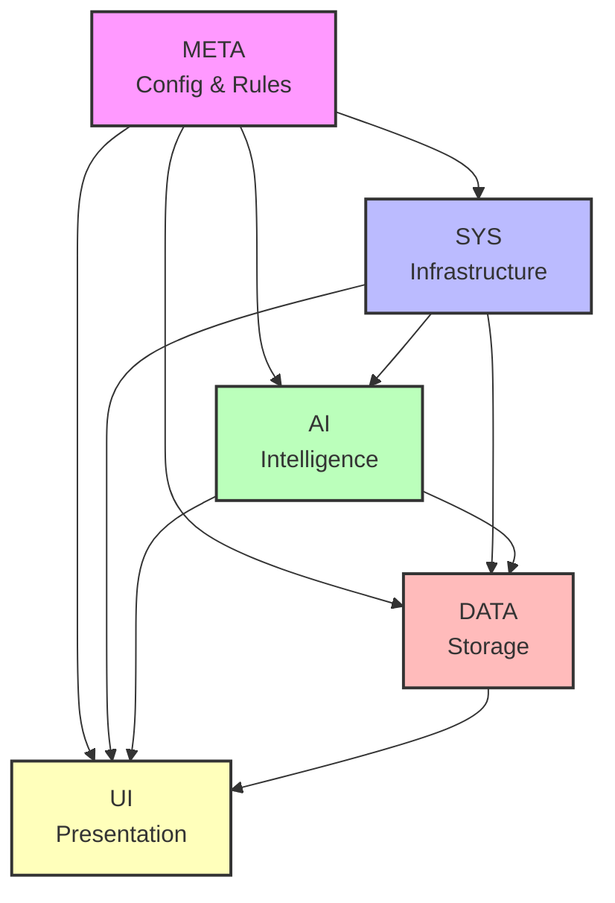

# CTB Inter-Branch Dependencies

**Version:** 1.0.0
**Last Updated:** 2025-10-23

---

## 📊 Overview

This document maps all dependencies between CTB branches, showing how components interact and depend on each other.

## 🎯 Dependency Hierarchy

```
┌─────────────────────────────────────────┐
│  META (Configuration & Rules)           │  ← Top Level (No dependencies)
│  • Global config                        │
│  • Enforcement rules                    │
│  • Workflow definitions                 │
└──────────────┬──────────────────────────┘
               │
┌──────────────▼──────────────────────────┐
│  SYS (System & Infrastructure)          │  ← Depends on: META
│  • Scripts                              │
│  • Tools                                │
│  • Global factory                       │
└──────────────┬──────────────────────────┘
               │
┌──────────────▼──────────────────────────┐
│  AI (Intelligence Layer)                │  ← Depends on: META, SYS
│  • HEIR                                 │
│  • Agents                               │
│  • Sidecar                              │
└──────────────┬──────────────────────────┘
               │
┌──────────────▼──────────────────────────┐
│  DATA (Storage Layer)                   │  ← Depends on: META, SYS, AI
│  • Schemas                              │
│  • Migrations                           │
│  • Database                             │
└──────────────┬──────────────────────────┘
               │
┌──────────────▼──────────────────────────┐
│  UI (Presentation Layer)                │  ← Depends on: META, SYS, AI, DATA
│  • Components                           │
│  • Pages                                │
│  • API endpoints                        │
└─────────────────────────────────────────┘
```

## 📋 Direct Dependencies

### META → No Dependencies

**Meta is self-contained:**
- Configuration files
- Enforcement rules
- Workflow definitions
- Registry files

**No external dependencies**

### SYS → META

**SYS depends on META for:**

| Dependency | Purpose | Files |
|------------|---------|-------|
| **global-config.yaml** | System configuration | META/global-config.yaml |
| **enforcement_rules.json** | Compliance rules | META/enforcement_rules.json |
| **ctb_registry.json** | File registry | META/ctb_registry.json |

**Examples:**
```python
# SYS reads META configuration
import yaml
with open('../meta/global-config.yaml') as f:
    config = yaml.safe_load(f)

# SYS uses enforcement rules
import json
with open('../meta/enforcement_rules.json') as f:
    rules = json.load(f)
```

### AI → META, SYS

**AI depends on META for:**

| Dependency | Purpose | Files |
|------------|---------|-------|
| **HEIR config** | Error handling config | heir.doctrine.yaml |
| **Sidecar config** | Event telemetry config | global-config.yaml |

**AI depends on SYS for:**

| Dependency | Purpose | Files |
|------------|---------|-------|
| **MCP servers** | Agent communication | SYS/mcp-servers/ |
| **Scripts** | Execution layer | SYS/scripts/ |
| **Tools** | Utilities | SYS/tools/ |

**Examples:**
```python
# AI uses HEIR from SYS
from ctb.ai.packages.heir import handleError

# AI calls SYS scripts
import subprocess
subprocess.run(['bash', '../sys/scripts/deploy.sh'])
```

### DATA → META, SYS, AI

**DATA depends on META for:**

| Dependency | Purpose | Files |
|------------|---------|-------|
| **Database config** | Connection strings | global-config.yaml, .env |
| **Registry** | Column definitions | META/config/imo_registry.yaml |

**DATA depends on SYS for:**

| Dependency | Purpose | Files |
|------------|---------|-------|
| **Migration scripts** | Schema management | SYS/tools/ |
| **Backup scripts** | Data backup | SYS/scripts/ |

**DATA depends on AI for:**

| Dependency | Purpose | Files |
|------------|---------|-------|
| **HEIR error handling** | Database errors | AI/packages/heir/ |
| **Sidecar events** | Data change events | AI/packages/sidecar/ |

**Examples:**
```python
# DATA uses HEIR for error handling
from ctb.ai.packages.heir import withRetry

# Retry database operations
result = await withRetry(
    lambda: database.query(sql),
    maxRetries=3
)

# DATA emits sidecar events
from ctb.ai.packages.sidecar import emitEvent
await emitEvent('data.record.created', {...})
```

### UI → META, SYS, AI, DATA

**UI depends on META for:**

| Dependency | Purpose | Files |
|------------|---------|-------|
| **UI config** | Component settings | global-config.yaml |
| **Workflow config** | CI/CD settings | META/workflows/ |

**UI depends on SYS for:**

| Dependency | Purpose | Files |
|------------|---------|-------|
| **API endpoints** | Backend services | SYS/api/ |
| **Build tools** | Compilation | SYS/tools/ |

**UI depends on AI for:**

| Dependency | Purpose | Files |
|------------|---------|-------|
| **Agent integration** | AI features | AI/agents/ |
| **HEIR** | Error boundaries | AI/packages/heir/ |
| **Sidecar** | Telemetry | AI/packages/sidecar/ |

**UI depends on DATA for:**

| Dependency | Purpose | Files |
|------------|---------|-------|
| **Database queries** | Data fetching | DATA/db/ |
| **Firebase** | Real-time data | DATA/firebase/ |
| **Type definitions** | TypeScript types | DATA/firebase/types/ |

**Examples:**
```typescript
// UI uses DATA types
import type { Client, Blueprint } from '@/ctb/data/firebase/types/firestore';

// UI uses AI HEIR
import { HEIRError } from '@/ctb/ai/packages/heir';

// UI uses SYS API
const response = await fetch('/api/endpoint');
```

## 🔄 Transitive Dependencies

### UI → META (via SYS, AI, DATA)

UI indirectly depends on META through all other layers:
- Configuration flows down from META
- Changes in META affect all layers
- UI must comply with META rules

### DATA → META (via SYS, AI)

DATA indirectly depends on META through infrastructure:
- Migration tools from SYS
- Error handling from AI
- All configured in META

## 🚫 Prohibited Dependencies

### No Circular Dependencies

```
❌ META → SYS → META (PROHIBITED)
❌ AI → DATA → AI (PROHIBITED)
❌ UI → SYS → UI (PROHIBITED)
```

### No Upward Dependencies

```
❌ SYS → AI (PROHIBITED - should be AI → SYS)
❌ DATA → UI (PROHIBITED - should be UI → DATA)
❌ SYS → META (PROHIBITED - should be META → SYS)
```

**Enforced by:**
- Code reviews
- Linting rules
- Architecture tests

## 📦 Package Dependencies

### Node.js (package.json)

```json
{
  "dependencies": {
    "next": "^14.0.0",
    "react": "^18.2.0",
    "firebase-admin": "^12.0.0"
  },
  "devDependencies": {
    "typescript": "^5.0.0",
    "@types/node": "^20.0.0"
  }
}
```

### Python (requirements.txt)

```txt
fastapi>=0.104.0
psycopg2-binary>=2.9.0
firebase-admin>=6.0.0
pyyaml>=6.0
pytest>=7.4.0
```

## 🔗 Integration Points

### SYS ↔ AI

```python
# SYS executes AI agents
from ctb.ai.agents import ComplianceAgent

agent = ComplianceAgent()
result = agent.check_compliance(path='ctb/')
```

### AI ↔ DATA

```python
# AI monitors DATA changes
from ctb.ai.packages.sidecar import emitEvent
from ctb.data.db import database

@database.on_change
async def on_data_change(record):
    await emitEvent('data.changed', record)
```

### DATA ↔ UI

```typescript
// UI queries DATA
import { getFirestore } from 'firebase-admin/firestore';

const db = getFirestore();
const clients = await db.collection('clients').get();
```

### SYS ↔ META

```python
# SYS reads META configuration
import yaml

with open('ctb/meta/global-config.yaml') as f:
    config = yaml.safe_load(f)

compliance_min = config['doctrine_enforcement']['min_score']
```

## 🛠️ Update Protocol

### When Updating Dependencies

1. **META Changes:**
   ```bash
   # Update META
   vim global-config.yaml

   # Check impact on SYS
   cd ctb/sys && grep -r "global-config"

   # Check impact on AI
   cd ctb/ai && grep -r "global-config"

   # Check impact on DATA
   cd ctb/data && grep -r "global-config"

   # Check impact on UI
   cd ctb/ui && grep -r "global-config"
   ```

2. **SYS Changes:**
   ```bash
   # Update SYS
   vim ctb/sys/scripts/new-script.sh

   # Check AI dependencies
   cd ctb/ai && grep -r "sys/scripts"

   # Check DATA dependencies
   cd ctb/data && grep -r "sys/scripts"

   # Check UI dependencies
   cd ctb/ui && grep -r "sys/scripts"
   ```

3. **Breaking Changes:**
   ```bash
   # Document breaking change
   echo "BREAKING: Changed X to Y" >> CHANGELOG.md

   # Update all dependents
   grep -r "old_function" ctb/

   # Run tests
   npm test && pytest

   # Update version
   npm version major
   ```

## 📊 Dependency Graph



## 🧪 Testing Dependencies

### Dependency Tests

```python
# test_dependencies.py
def test_no_circular_dependencies():
    """Ensure no circular dependencies exist"""
    # Check imports don't create cycles
    assert not has_circular_dependency('ctb/sys', 'ctb/ai')

def test_dependency_direction():
    """Ensure dependencies flow downward only"""
    # META should not import from SYS
    assert not imports_from('ctb/meta', 'ctb/sys')

    # SYS should not import from AI
    assert not imports_from('ctb/sys', 'ctb/ai')
```

## 📚 Documentation

- **Architecture:** [ctb/docs/architecture.mmd](../docs/architecture.mmd)
- **Branch READMEs:** Each `ctb/*/README.md`
- **Global Config:** [global-config.yaml](../../global-config.yaml)

---

**Last Updated:** 2025-10-23
**Maintained By:** CTB Meta System
**Version:** 1.0.0
