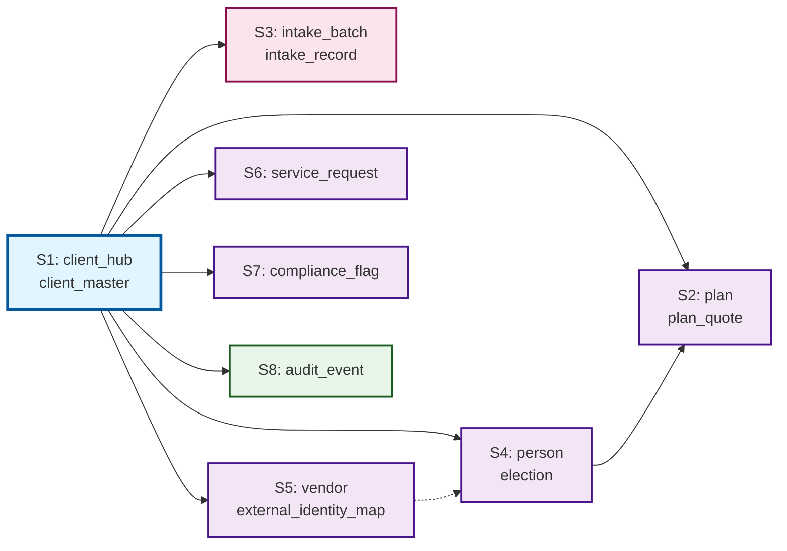
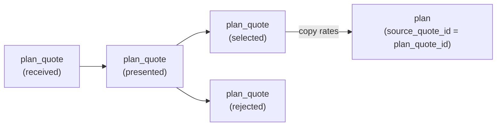
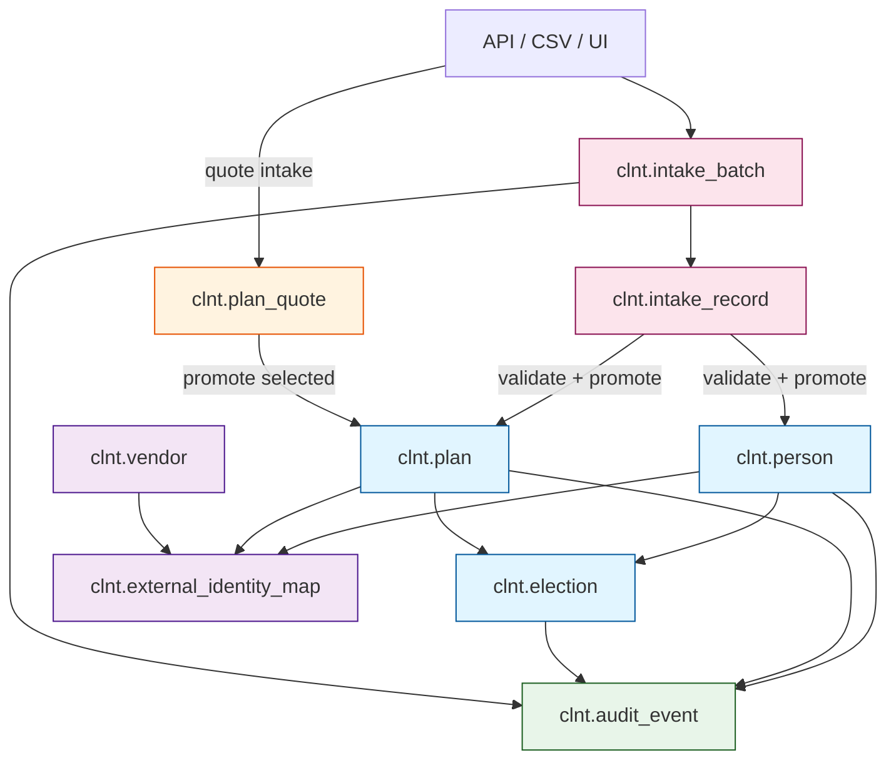

# Client Infrastructure — Entity Relationship Diagram

**Schema**: `clnt`
**Tables**: 13
**ADR**: ADR-002-ctb-consolidated-backbone, ADR-004-renewal-downgraded-to-plan-support
**Version**: 2.2.0

---

## Complete Schema Map

```mermaid
erDiagram
    %% S1: HUB + CLIENT MASTER
    clnt_client_hub {
        UUID client_id PK
        TIMESTAMPTZ created_at
        TEXT status
        TEXT source
        INT version
    }

    clnt_client_master {
        UUID client_id PK_FK
        TEXT legal_name
        TEXT fein
        TEXT domicile_state
        DATE effective_date
    }

    %% S2: PLAN + PLAN QUOTE
    clnt_plan {
        UUID plan_id PK
        UUID client_id FK
        TEXT benefit_type
        TEXT carrier_id
        DATE effective_date
        TEXT status
        INT version
        NUMERIC rate_ee
        NUMERIC rate_es
        NUMERIC rate_ec
        NUMERIC rate_fam
        NUMERIC employer_rate_ee
        NUMERIC employer_rate_es
        NUMERIC employer_rate_ec
        NUMERIC employer_rate_fam
        UUID source_quote_id FK
    }

    clnt_plan_quote {
        UUID plan_quote_id PK
        UUID client_id FK
        TEXT benefit_type
        TEXT carrier_id
        INT effective_year
        NUMERIC rate_ee
        NUMERIC rate_es
        NUMERIC rate_ec
        NUMERIC rate_fam
        TEXT source
        DATE received_date
        TEXT status
        TIMESTAMPTZ created_at
    }

    %% S3: ENROLLMENT INTAKE
    clnt_intake_batch {
        UUID intake_batch_id PK
        UUID client_id FK
        TIMESTAMPTZ upload_date
        TEXT status
    }

    clnt_intake_record {
        UUID intake_record_id PK
        UUID client_id FK
        UUID intake_batch_id FK
        JSONB raw_payload
    }

    %% S4: ENROLLMENT VAULT
    clnt_person {
        UUID person_id PK
        UUID client_id FK
        TEXT first_name
        TEXT last_name
        TEXT ssn_hash
        TEXT status
    }

    clnt_election {
        UUID election_id PK
        UUID client_id FK
        UUID person_id FK
        UUID plan_id FK
        TEXT coverage_tier
        DATE effective_date
    }

    %% S5: VENDOR + IDENTITY MAP
    clnt_vendor {
        UUID vendor_id PK
        UUID client_id FK
        TEXT vendor_name
        TEXT vendor_type
    }

    clnt_external_identity_map {
        UUID external_identity_id PK
        UUID client_id FK
        TEXT entity_type
        UUID internal_id
        UUID vendor_id FK
        TEXT external_id_value
        DATE effective_date
        TEXT status
    }

    %% S6: SERVICE
    clnt_service_request {
        UUID service_request_id PK
        UUID client_id FK
        TEXT category
        TEXT status
        TIMESTAMPTZ opened_at
    }

    %% S7: COMPLIANCE
    clnt_compliance_flag {
        UUID compliance_flag_id PK
        UUID client_id FK
        TEXT flag_type
        TEXT status
        DATE effective_date
    }

    %% S8: AUDIT
    clnt_audit_event {
        UUID audit_event_id PK
        UUID client_id FK
        TEXT entity_type
        UUID entity_id
        TEXT action
        TIMESTAMPTZ created_at
    }

    %% RELATIONSHIPS
    clnt_client_hub ||--|| clnt_client_master : "identity"
    clnt_client_hub ||--o{ clnt_plan : "has plans"
    clnt_client_hub ||--o{ clnt_plan_quote : "receives quotes"
    clnt_plan_quote ||--o{ clnt_plan : "promoted to"
    clnt_client_hub ||--o{ clnt_intake_batch : "receives"
    clnt_intake_batch ||--o{ clnt_intake_record : "contains"
    clnt_client_hub ||--o{ clnt_person : "enrolls"
    clnt_person ||--o{ clnt_election : "elects"
    clnt_plan ||--o{ clnt_election : "covers"
    clnt_client_hub ||--o{ clnt_vendor : "contracts"
    clnt_vendor ||--o{ clnt_external_identity_map : "maps IDs"
    clnt_client_hub ||--o{ clnt_service_request : "requests"
    clnt_client_hub ||--o{ clnt_compliance_flag : "flagged"
    clnt_client_hub ||--o{ clnt_audit_event : "audited"
```

---

## Spoke Architecture



---

## Promotion Flow (Quote → Plan)



---

## Data Flow



---

## Key Constraints

| Constraint | Table | Rule |
|-----------|-------|------|
| `coverage_tier` CHECK | `election` | Must be `EE`, `ES`, `EC`, or `FAM` |
| `entity_type` CHECK | `external_identity_map` | Must be `person` or `plan` |
| `status` CHECK | `plan_quote` | Must be `received`, `presented`, `selected`, or `rejected` |
| `source_quote_id` FK | `plan` | Nullable FK to `plan_quote.plan_quote_id` (promotion lineage) |
| All PKs | All tables | UUID via `gen_random_uuid()` |
| All FKs | All tables | Point to `client_hub.client_id` or parent spoke |

---

**Diagram Version**: 2.2.0
**Created**: 2026-02-11
**Schema**: `clnt`
**Views**: None
