# Barton Client Database - Entity Relationship Diagram

## Overview

This document provides visual representations of the Barton Client Database (`clnt`) schema relationships.

---

## 🗺️ Complete Schema Map

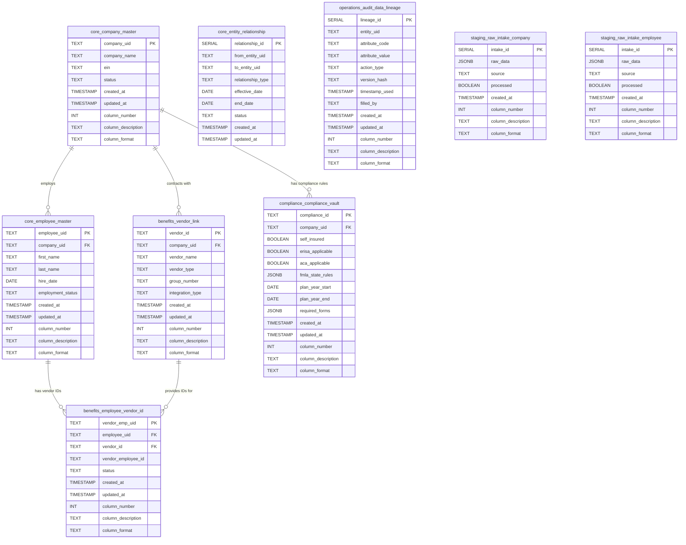

---

## 🔍 Schema-Level Relationships

This diagram shows only the inter-schema relationships:

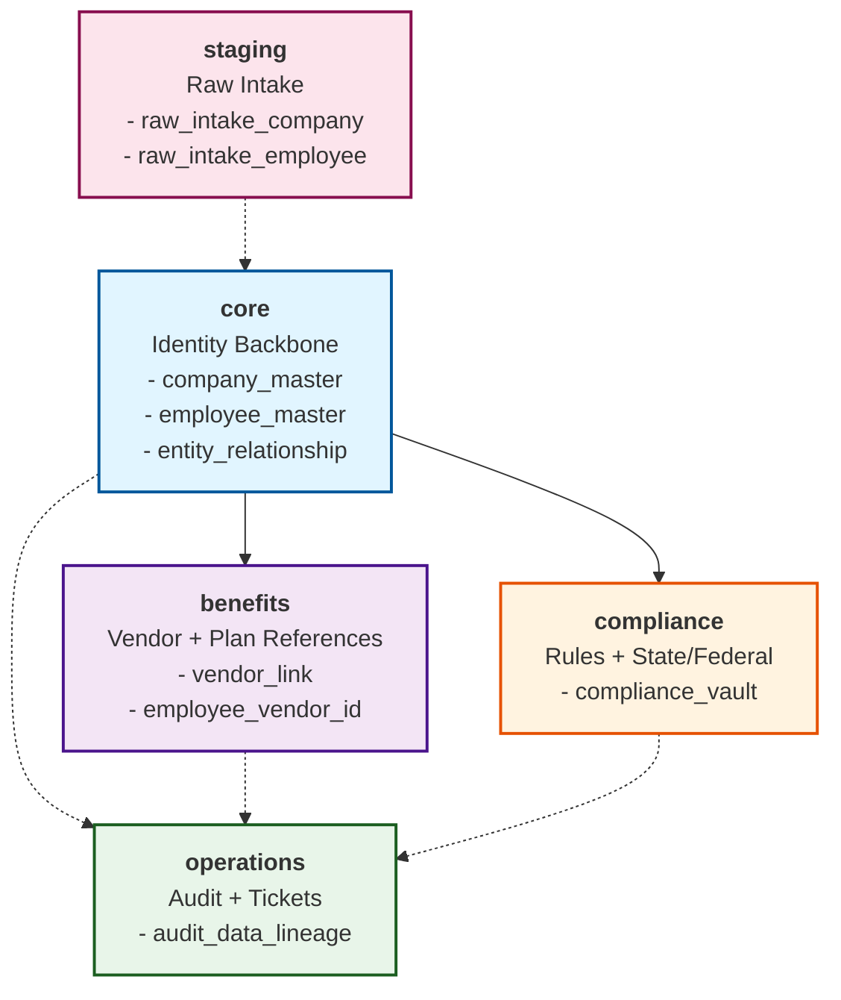

**Legend**:
- Solid arrows (→) represent direct foreign key relationships
- Dashed arrows (-.→) represent logical/audit relationships (no enforced FK)

---

## 📊 Data Flow Diagram

This diagram shows how data flows through the system:

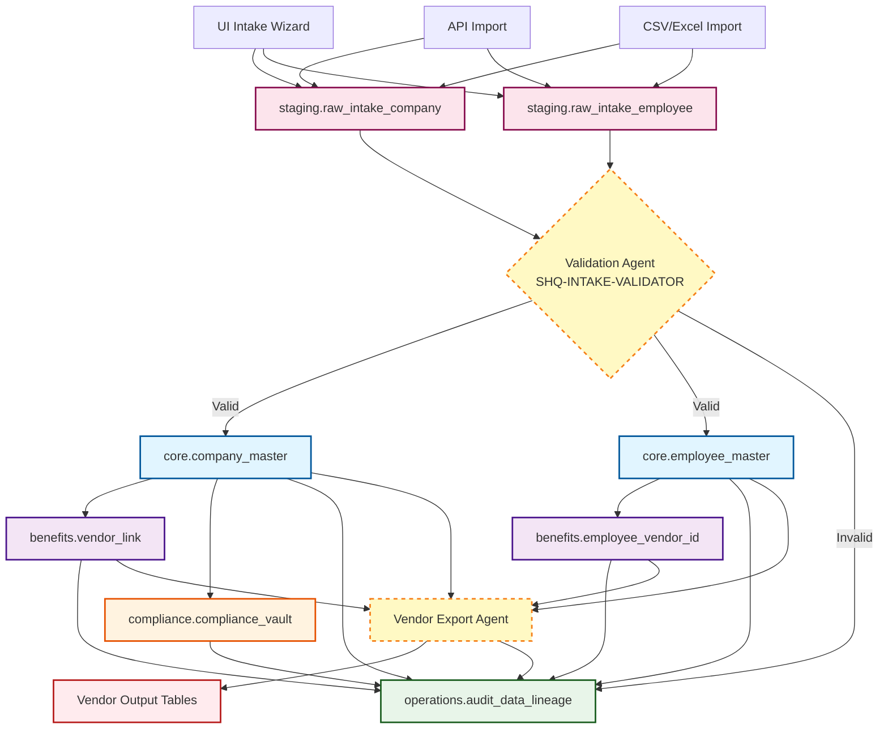

---

## 🏛️ Core Schema Detail

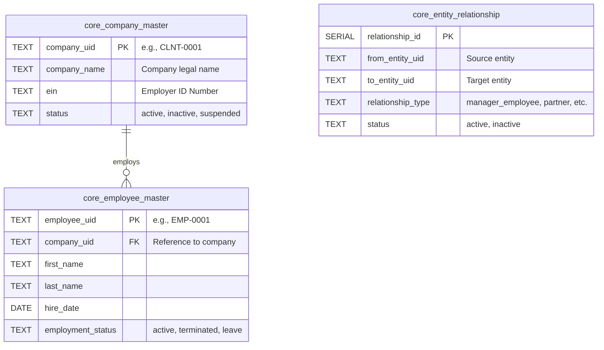

---

## 💼 Benefits Schema Detail

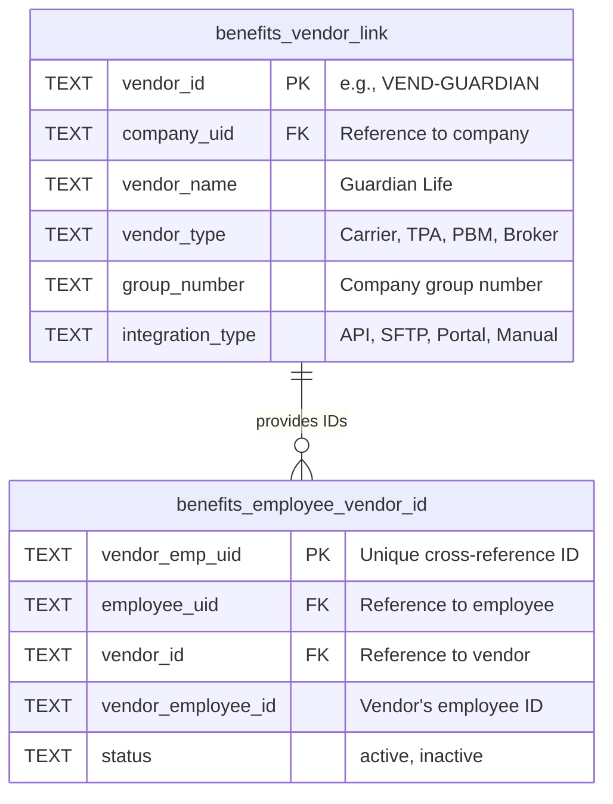

**Key Constraint**: `UNIQUE (employee_uid, vendor_id)` prevents duplicate vendor IDs per employee.

---

## ⚖️ Compliance Schema Detail

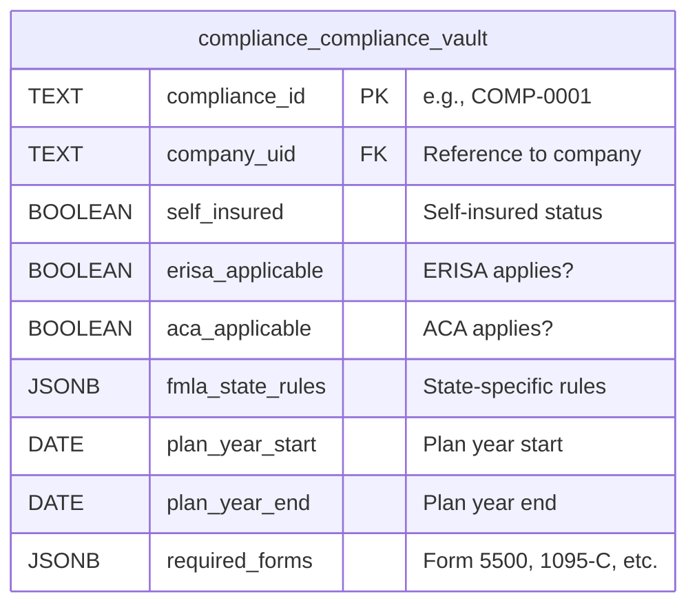

**JSONB Examples**:
```json
// fmla_state_rules
{
  "state": "CA",
  "enhanced_leave": true,
  "weeks_available": 12
}

// required_forms
["Form 5500", "1095-C", "Summary Plan Description"]
```

---

## 📋 Operations Schema Detail

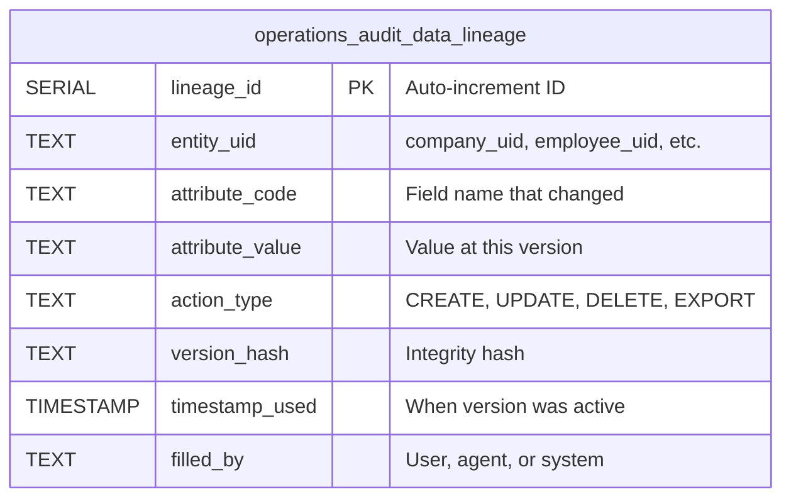

**Usage**: Every data modification across all schemas should log to this table for complete audit trails.

---

## 📥 Staging Schema Detail

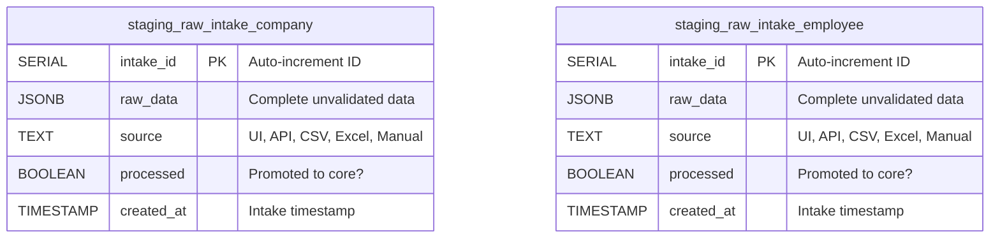

**Workflow**:
1. Data lands in staging with `processed = FALSE`
2. Validation agent checks data quality
3. Valid data promoted to `core.*` tables
4. Record marked `processed = TRUE`
5. Invalid data generates error logs

---

## 🔐 Doctrine Metadata Columns

Every table includes these columns for compliance:

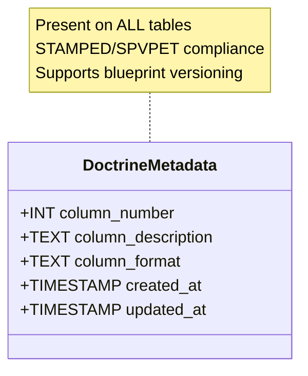

---

## 🚀 Extensibility Examples

### Adding a New Table to Existing Schema

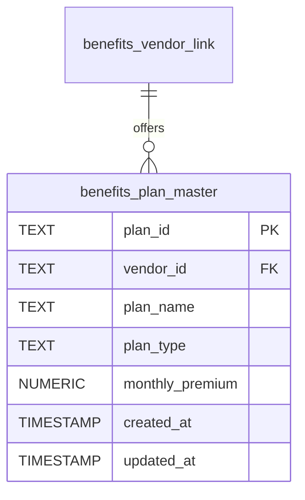

### Adding a New Schema

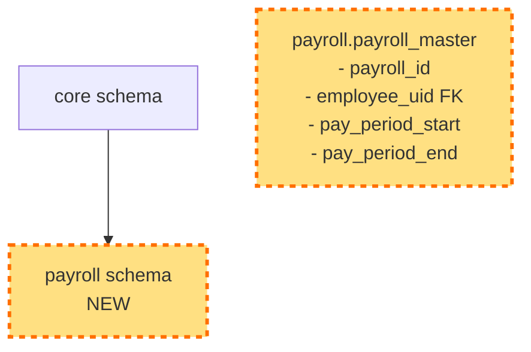

**No migration conflicts** - schemas are independent and loosely coupled.

---

## 📈 Key Relationships Summary

| From Schema | To Schema | Relationship Type | Description |
|------------|-----------|------------------|-------------|
| `core` | `benefits` | 1:N (FK) | Companies contract with vendors |
| `core` | `benefits` | 1:N (FK) | Employees have vendor-specific IDs |
| `core` | `compliance` | 1:N (FK) | Companies have compliance rules |
| `staging` | `core` | Logical | Raw data promoted after validation |
| `core` | `operations` | Logical | All core changes logged to audit |
| `benefits` | `operations` | Logical | All benefit changes logged to audit |
| `compliance` | `operations` | Logical | All compliance changes logged to audit |

**Total Foreign Keys**: 5 enforced FKs
**Total Logical Relationships**: 4 audit/validation relationships

---

## 📝 Notes

1. **Clean DAG Structure**: No circular dependencies
2. **Loose Coupling**: Schemas can be expanded independently
3. **Audit Everything**: All operations log to `operations.audit_data_lineage`
4. **Validation Layer**: Staging isolates raw data from canonical tables
5. **Vendor ID Strategy**: `benefits.employee_vendor_id` handles vendor-specific employee IDs

---

**Diagram Version**: 1.0.0
**Created**: 2025-10-27
**Database**: clnt
**Tool**: Mermaid (GitHub/Markdown compatible)
