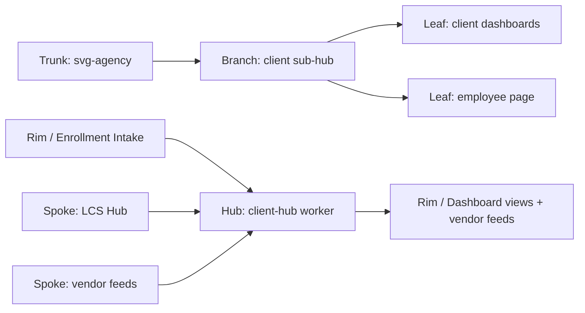
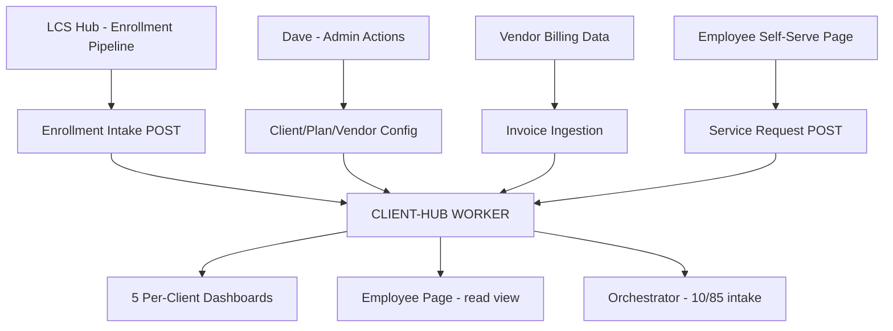

# Client Sub-Hub
## The operational hub for all client data — enrollment front door, vendor management, fixed-side invoice aggregation, service ticketing, and the per-client Golden Record. Everything the client deliverable layer runs on.
### Status: BUILD
### Medium: worker + database
### Business: svg-agency

---

## UT Checklist (Pre-Flight)

_Every UT doc MUST carry this block at the top. Check a box when the referenced section is filled. **This is a pre-flight checklist, not bureaucracy.** A pilot does not take off without documentation in the cockpit, a flight plan filed, and a pre-flight walkaround logged. A doc does not ship (ORBT=OPERATE) without all 12 items ☑. Unchecked = grounded._

_Aviation Model mapping:_
- _Items 1–11 = the doc's airworthiness certificate + POH (operating handbook)_
- _Item 12 (Live Verification) = the pre-flight walkaround — every gauge confirmed against reality, not memory_
- _§14 Maintenance Logbook = the aircraft logbook you keep in the cockpit — every touch recorded, signed, timestamped_

| # | Check | Status | Location |
|---|-------|--------|----------|
| 1 | PRD — what / why / who / scope / out-of-scope / success metric | ☑ | §2 |
| 2 | OSAM — READ / WRITE / Join Chain / Forbidden Paths / Query Routing filled | ☑ | §5 |
| 3 | Component Status — every dependency has 🟢 / 🟡 / 🔴 with 1-line state | ☑ | §3 |
| 4 | Owner — human who fixes this at 2 AM | ☑ | §1 |
| 5 | Live Dashboard — URL or explicit "N/A" | ☑ | §3 |
| 6 | Kill Switch — exact command to stop the process | ☑ | §8 |
| 7 | Logbook — last audit verdict + date (after certification only) | ☐ | §12 |
| 8 | FCEs Attached — which FCE runs (US/KC/DMJ/UP) structurally back this doc | ☑ | §3c |
| 9 | BARs Referenced — every BAR this doc touches, with status | ☑ | §3d |
| 10 | LBB Subjects Fed — which LBB subject(s) this doc's session logs go to | ☑ | §3e |
| 11 | Geometry — CTB position + Hub-Spoke role + Altitude | ☑ | §1b |
| 12 | Live Verification — every numeric count, cron, URL, command, BAR status grounded against the actual system | ☐ | §9b |

---

# IDENTITY (Thing — what this IS)

_Everything in this cluster answers: what exists? These are constants that don't change regardless of who reads this or when._

## 1. IDENTITY

| Field | Value |
|-------|-------|
| ID | client-hub |
| Name | Client Sub-Hub |
| Medium | worker + database (two D1 databases, one Cloudflare Worker) |
| Business Silo | svg-agency |
| CTB Position | branch → svg-agency → client |
| ORBT | BUILD |
| Strikes | 0 |
| Authority | inherited — CC-01 imo-creator |
| Last Modified | 2026-04-16 |
| BAR Reference | BAR-82 (client deliverable pages), BAR-122 (bill pay) |
| Owner | Dave Barton |

### 1b. Geometry (Checklist item 11 — Bedrock §4 + §7)

**CTB Position:** `branch → svg-agency → client`

**Hub-Spoke Role:** hub (all client data logic — the Middle). The worker IS the hub. Dashboards, dashboards queries, and outbound vendor feeds are spokes. All writes go through the worker. The worker owns the schema, enforces CQRS, and is the single source of truth for client data.

**Altitude:** 10k operational through 5k execution (individual client config, plan elections, invoice records, service tickets)



### HEIR (8 fields — Aviation Model, Bedrock §8)

| Field | Value |
|-------|-------|
| sovereign_ref | imo-creator |
| hub_id | client-hub |
| ctb_placement | branch |
| imo_topology | middle |
| cc_layer | CC-02 (hub) |
| services | Cloudflare Workers, D1 (client-hub + svg-d1-client), Doppler |
| secrets_provider | doppler |
| acceptance_criteria | All five enrollment sections return data; invoice CRUD round-trips clean; service_request opens and closes; health endpoint 200; both D1 databases respond |

---

## 2. PURPOSE (PRD)

_What breaks without it. What business outcome it serves. If you can't answer this, it shouldn't exist._

### WHAT

The Client Sub-Hub is the operational data layer for every active svg-agency client. It holds the Golden Record per employee, the plan election set, vendor relationships, fixed-side invoice aggregation, and the service request queue. It is the source of truth the five per-client dashboards and the employee self-serve page query against.

### WHY

Without this hub, there is no single place that knows who is enrolled in what plan, which vendors are billing for which client, what invoices have been received, and what service tickets are open. The CFO dashboard, HR dashboard, Underwriting dashboard, Renewal dashboard, and Service Advisor dashboard all starve. The employee self-serve page cannot route tickets. Vendor billing consolidation (the one invoice to the CFO) cannot be reconciled. The hub is the engine that makes "smooth on top, paddling like hell underneath" work.

### WHO

- Dashboard layer (per-client views) — reads enrollment, election, invoice, and service data
- Employee self-serve page — reads election and vendor data; writes service_request tickets
- Dave Barton — manages client config, vendor relationships, and invoice reconciliation
- Orchestrator process (10/85 high-dollar flow) — reads person + election data for intake
- LCS Hub — writes enrollment intake records into this hub's enrollment tables

### SCOPE (in)

- Client identity and config (legal name, FEIN, domain, branding, feature flags)
- Plan catalog per client (benefit types, tiers, rates)
- Plan quotes storage
- Employee / person Golden Record (one row per employee per client)
- Plan elections (person × plan × coverage tier × effective date)
- Enrollment intake batches and raw intake records
- Vendor registry per client (with type, group number, integration type)
- External identity mapping (person ↔ vendor ↔ external ID)
- Fixed-side invoice aggregation (received, approved, paid, disputed)
- Service request queue (ticketing — routes to vendor)
- CQRS error tables for all five domains (client, plan, employee, vendor, service)

### OUT-OF-SCOPE

- Claims data (variable side) — owned by TPA; tracked in outreach-ops D1
- PBM drug file feeds — owned by PBM integration, not this hub
- High-dollar case management (waterfall routing, orchestrator case table) — MISSING, needs new migration (see §5 Schema Gaps)
- Bill audit results against Medicare — MISSING, needs new migration
- Dashboard rendering — handled by the client deliverable layer (BAR-82)
- HR comms (Trello-branded communications) — owned by Trello integration
- Claims/waterfall status tracking — MISSING, needs new migration
- Outreach pipeline data — owned by LCS Hub / outreach-ops

### SUCCESS METRIC

All client dashboard queries resolve in under 200ms against live D1 data; enrollment intake for a new client batch processes without error-table entries; invoice CRUD shows full audit trail per client.

---

## 3. RESOURCES

_Everything this depends on. A mechanic reads this and knows exactly what to set up before it can run._

### Component Status Grid (Checklist item 3)

| Component | HEIR (`hub_id · ctb · cc_layer`) | ORBT | Light | State |
|-----------|----------------------------------|------|-------|-------|
| client-hub Worker | `client-hub · branch · CC-02` | BUILD | 🟡 | Deployed to client-hub.svg-outreach.workers.dev; routes live; DB binding is client-hub D1 only (svg-d1-client not yet bound) |
| D1: client-hub | `client-hub · branch · CC-02` | BUILD | 🟢 | ID 3ba426ee; 16 tables across 5 route domains; migrations applied |
| D1: svg-d1-client | `DB-CLIENT · branch · CC-03` | BUILD | 🟡 | ID 5443887b; 11 tables present; NOT bound to client-hub worker — currently separate, accessed only via wrangler CLI |
| LCS Hub (upstream feeder) | `lcs-hub · branch · CC-02` | OPERATE | 🟢 | Deployed; sends enrollment data downstream |
| Doppler (secrets) | `doppler · leaf · CC-04` | OPERATE | 🟢 | Project imo-creator, config dev |

### Live Dashboard (Checklist item 5)

| Resource | URL | What it shows |
|----------|-----|---------------|
| client-hub health | https://client-hub.svg-outreach.workers.dev/health | Worker status, D1 connectivity |
| IMO Dashboard | https://imo-dashboard.pages.dev | Fleet overview — not client-specific |
| Per-client dashboards | [PENDING — BAR-82 in progress] | HR, CFO, Underwriting, Renewal, Service Advisor views |

### Dependencies

| Dependency | Type | What It Provides | Status |
|-----------|------|-----------------|--------|
| D1: client-hub | database | All five operational domains (client, plan, employee, vendor, service) | DONE |
| D1: svg-d1-client | database | Client identity, contacts, compliance, interactions, audit lineage | DONE — needs worker binding |
| LCS Hub | process | Enrollment intake data flow (upstream feeder) | DONE |
| Doppler | secrets | API keys, environment config | DONE |
| Dashboard layer | downstream consumer | Reads all domains for five per-client dashboards | PENDING (BAR-82) |
| Employee self-serve page | downstream consumer | Reads election + vendor; writes service_request | PENDING (BAR-82) |

### Downstream Consumers

| Consumer | What It Needs |
|----------|--------------|
| HR Dashboard | client, client_employees, election, enrollment_intake, client_compliance |
| CFO/CEO Dashboard | invoice, vendor, plan, election (for headcount × rates) |
| Underwriting Dashboard | election, plan, invoice (loss ratio inputs) |
| Renewal Dashboard | invoice aggregate, election headcount, plan rates by year |
| Service Advisor Dashboard | service_request, external_identity_map, vendor contacts |
| Employee self-serve page | election (what they're enrolled in), vendor (who to call), service_request (submit ticket) |
| Orchestrator (10/85 flow) | person, election (pre-loaded intake data for high-dollar cases) |

### Tools & Integrations (if applicable)

| Item | Type | Cost Tier | Credentials | What It Does |
|------|------|-----------|-------------|-------------|
| Cloudflare Workers | compute | Cheap | CF account a1dd98c6 | Hosts the hub worker |
| D1 SQLite (client-hub) | database | Cheap | CF account, wrangler | Operational client data |
| D1 SQLite (svg-d1-client) | database | Cheap | CF account, wrangler | Client CRM + compliance layer |
| Hono | framework | Free | npm | Request routing + CORS |

### Secrets (if applicable)

| Secret | Doppler Project | Config | Used By |
|--------|----------------|--------|---------|
| CF API credentials | imo-creator | dev | Wrangler deployments |
| LBB_API_KEY | imo-creator | dev | LBB session ingests |

### 3c. FCEs Attached (Checklist item 8)

| FCE Name | HEIR (`hub_id · ctb · cc_layer`) | ORBT | Run Directory | Latest P=1 | Rows | Status |
|----------|----------------------------------|------|--------------|------------|------|--------|
| Insurance Informatics CTB | `ins-informatics-ctb · branch · CC-03` | BUILD | `fleet/content/INSURANCE-INFORMATICS-CTB.md` | 2026-04-20 | 6 altitudes | 🟡 |
| FCE-008 SVG Outreach | [PENDING — see LBB session 27] | OPERATE | [PENDING] | [PENDING] | [PENDING] | 🟡 |

### 3d. BARs Referenced (Checklist item 9)

| BAR | Title | HEIR (`bar-id · ctb · cc_layer`) | ORBT | Status | Relation |
|-----|-------|----------------------------------|------|--------|----------|
| BAR-82 | Client deliverable pages (5 dashboards + employee page) | `BAR-82 · leaf · CC-04` | BUILD | In Progress | implements |
| BAR-122 | Bill pay / invoice aggregation | `BAR-122 · leaf · CC-04` | BUILD | In Progress | implements |

### 3e. LBB Subjects Fed (Checklist item 10)

| LBB Subject | HEIR (`subject-id · ctb · cc_layer`) | ORBT | What This Doc Writes | Frequency |
|-------------|--------------------------------------|------|---------------------|-----------|
| svg-client | `svg-client · branch · CC-03` | BUILD | Session summaries, schema decisions, gap findings | per-session |
| svg-client-proc | `svg-client-proc · leaf · CC-04` | BUILD | Process-level decisions (enrollment flow, invoice flow) | on-change |

---

# CONTRACT (Flow — what flows through this)

_Everything in this cluster answers: what moves? How does data/work enter, get processed, and exit?_

## 4. IMO — Input, Middle, Output

### Two-Question Intake (Bedrock §3)
1. **"What triggers this?"** — An API call from a dashboard, the LCS enrollment pipeline, an employee submitting a ticket, or Dave reconciling an invoice.
2. **"How do we get it?"** — HTTP request to client-hub.svg-outreach.workers.dev with Authorization header; worker reads/writes D1 via the DB binding; LCS Hub posts enrollment batches to /api/s3/enrollment_intake.

### Input

Five distinct input streams:

1. **Enrollment intake** — LCS Hub POSTs a batch of enrollment records. Triggers: new client onboarding, open enrollment cycle, employee life event. Source: LCS pipeline.
2. **Plan/vendor configuration** — Dave POSTs new plans, quotes, vendors, external ID mappings. Triggers: new client setup or vendor change. Source: admin UI or wrangler script.
3. **Invoice receipt** — Dave or automated feed POSTs vendor invoice records. Triggers: monthly billing cycle. Source: vendor portal data, manual entry.
4. **Service request** — Employee or HR submits a ticket. Triggers: employee question or issue. Source: employee self-serve page.
5. **Dashboard read** — Dashboard layer sends GET requests for aggregated client data. Triggers: page load. Source: dashboard rendering layer (BAR-82).

### Middle

| Step | Input | What Happens | Output | Tool Used |
|------|-------|-------------|--------|-----------|
| 1 | HTTP request + auth header | CORS + auth validation at rim | Validated request | Hono middleware |
| 2 | Validated request | Route dispatch (s1=client, s2=plan, s3=employee, s4=vendor, s5=service) | Domain-scoped operation | Hono router |
| 3 | Domain operation | CRUD via createCrudRouter — UUID generation, timestamp injection, JSON column parsing | SQL statement | D1 binding |
| 4 | SQL statement | D1 SQLite execution | Result set or row count | CF D1 |
| 5 | Error (any step) | Write to domain error table (client_error, plan_error, employee_error, vendor_error, service_error) | Error row in error table | D1 binding |
| 6 | Result | JSON response | HTTP response | Hono |

### Output

- **GET** — JSON array of rows from the queried table
- **POST** — JSON object with newly created record including generated UUID and timestamps
- **PUT** — JSON object with updated record
- **DELETE** — JSON confirmation
- **Errors** — All failures routed to the domain-specific error table AND return HTTP error response

### Circle (Bedrock §5)

Service request submissions close the loop: employee submits ticket → routes to vendor → vendor resolves → service rep confirms with employee → outcome feeds back to Service Advisor Dashboard. Invoice reconciliation closes: vendor sends bill → Dave receives → invoice written → CFO Dashboard shows total → Dave approves/pays → invoice status updates → CFO Dashboard reflects payment. The data warehouse is self-correcting because every status transition is a new write.

---

## 5. OSAM — DATA SCHEMA (Where the Data Lives)

### READ Access

| Source | What It Provides | Join Key |
|--------|-----------------|----------|
| `client` (client-hub D1) | Client identity, branding, feature flags | `client_id` |
| `plan` (client-hub D1) | Benefit type, carrier, tier rates | `client_id`, `plan_id` |
| `plan_quote` (client-hub D1) | Historical quote records | `client_id`, `carrier_id` |
| `person` (client-hub D1) | Employee Golden Record (name, SSN hash, status) | `client_id`, `person_id` |
| `election` (client-hub D1) | Who is enrolled in which plan at which tier | `client_id`, `person_id`, `plan_id` |
| `enrollment_intake` (client-hub D1) | Batch enrollment events | `client_id` |
| `intake_record` (client-hub D1) | Raw enrollment payloads per batch | `enrollment_intake_id` |
| `vendor` (client-hub D1) | Vendor registry per client | `client_id`, `vendor_id` |
| `external_identity_map` (client-hub D1) | Person ↔ vendor ↔ external ID mapping | `client_id`, `internal_id`, `vendor_id` |
| `invoice` (client-hub D1) | Fixed-side vendor invoices | `client_id`, `vendor_id` |
| `service_request` (client-hub D1) | Open tickets per client | `client_id` |
| `clients` (svg-d1-client D1) | Extended client identity (EIN, domain, lifecycle, ORBT) | `client_id` |
| `client_employees` (svg-d1-client D1) | Employee CRM record (hire date, employment status) | `client_id`, `employee_id` |
| `client_contacts` (svg-d1-client D1) | Client contacts (CFO, HR, CEO) | `client_id`, `contact_id` |
| `client_vendors` (svg-d1-client D1) | Vendor relationships with integration type | `client_id`, `vendor_id` |
| `client_compliance` (svg-d1-client D1) | ERISA, ACA, plan year config | `client_id` |
| `client_interactions` (svg-d1-client D1) | Email/call/meeting history | `client_id`, `contact_id` |

### WRITE Access

| Target | What It Writes | When |
|--------|---------------|------|
| `client` | New client record, updates to branding/config | Client onboarding, config change |
| `plan` | New plan record, rate updates | Plan setup, renewal |
| `plan_quote` | Quote received from carrier | Underwriting cycle |
| `person` | New employee, status change | Enrollment intake processing |
| `election` | New plan election, election change | Enrollment intake, life event |
| `enrollment_intake` | New enrollment batch | LCS Hub POST |
| `intake_record` | Raw payload per employee per batch | LCS Hub POST |
| `vendor` | New vendor, vendor update | Client setup |
| `external_identity_map` | New person↔vendor mapping | Post-enrollment carrier confirmation |
| `invoice` | New invoice received, status updates | Monthly billing cycle |
| `service_request` | New ticket, ticket status update | Employee submits; vendor resolves |
| `*_error` tables | Error records from any failed operation | On any domain failure |
| `client_staging_intake` (svg-d1-client) | Raw intake JSON before processing | Pre-validation intake queue |
| `client_audit_lineage` (svg-d1-client) | Audit trail for every attribute change | On every CREATE/UPDATE/DELETE |

### Process Composition



| Process ID | Name | Role in Composition | Status |
|-----------|------|---------------------|--------|
| LCS Hub | lcs-hub | Upstream enrollment feeder | 🟢 |
| Client-Hub Worker | client-hub | THIS — all client data management | 🟡 |
| Dashboard Layer | BAR-82 | Downstream dashboard consumer | 🔴 |
| Employee Self-Serve | BAR-82 | Downstream employee view | 🔴 |
| Orchestrator (10/85) | [PENDING] | Downstream high-dollar routing consumer | 🔴 |

### Join Chain

```
client (client_id — the spine per client)
  → plan (client_id → plan_id)
    → election (person_id × plan_id → coverage tier, effective date)
      → person (person_id → employee Golden Record)
        → external_identity_map (person_id × vendor_id → vendor-side ID)
          → vendor (vendor_id → vendor details)
            → invoice (vendor_id × client_id → billing records)
  → enrollment_intake (client_id → batch)
    → intake_record (enrollment_intake_id → raw payload per employee)
  → service_request (client_id → open tickets)

svg-d1-client spine:
clients (client_id — mirrors client-hub client)
  → client_employees (client_id → employee_id)
    → client_employee_vendor_ids (employee_id × vendor_id → vendor_employee_id)
  → client_contacts (client_id → contact_id)
  → client_vendors (client_id → vendor_id)
  → client_compliance (client_id → ERISA, ACA, plan year)
  → client_interactions (client_id × contact_id → communications)
  → client_audit_lineage (entity_id → change history)
```

### Forbidden Paths

| Action | Why |
|--------|-----|
| Write client data directly to svg-d1-client bypassing client-hub worker | Schema validation at rim only — all logic lives in the hub worker |
| Cross-client reads (SELECT without client_id filter) | Sovereign silo violation — every client is isolated |
| Modify `client_audit_lineage` after write | Append-only — CQRS, no edits to the audit trail |
| Delete records from any canonical table | Use status field (active/terminated/churned) — soft delete only |
| Write claims or variable-side data to these databases | Claims are TPA-owned; wrong database entirely |
| LLM write to any client data table | Hub only — no spoke or LLM writes directly to D1 |
| Cross-silo read: outreach data joined to client data without spine join | Branches communicate through trunk only (client_id → sovereign_id → CL spine) |

### Query Routing

| Question | Table | Column |
|----------|-------|--------|
| Who is enrolled in what plan for client X? | `election` | `person_id`, `plan_id`, `coverage_tier`, `effective_date` |
| What vendors is client X using? | `vendor` | `vendor_id`, `vendor_name`, `vendor_type` |
| What invoices are outstanding for client X? | `invoice` | `status = 'received' OR 'approved'` |
| What is total fixed-side spend for client X this plan year? | `invoice` | `SUM(amount) WHERE status = 'paid'` |
| Who are the employees on client X? | `person` | `status = 'active'` |
| What is employee Y enrolled in? | `election` JOIN `plan` | `person_id = Y` |
| What open service tickets does client X have? | `service_request` | `status = 'open'` |
| What is employee Y's vendor-side ID at vendor Z? | `external_identity_map` | `internal_id = Y.person_id, vendor_id = Z` |
| What are the plan rates for coverage tier EE on plan P? | `plan` | `rate_ee` |
| Who are the contacts for client X? | `client_contacts` (svg-d1-client) | `client_id = X, is_primary = 1` |
| What is client X's compliance config? | `client_compliance` (svg-d1-client) | `client_id = X` |
| What is the full interaction history for client X? | `client_interactions` (svg-d1-client) | `client_id = X ORDER BY occurred_at DESC` |

---

### SCHEMA GAPS — What the CTB Requires That Does Not Exist Yet

The Insurance Informatics CTB (at 10K and 5K altitude) requires capabilities that are NOT in the current schema. These are confirmed missing — new migrations needed before client deliverable pages (BAR-82) can be built.

| Gap | What's Missing | CTB Section It Serves | Priority |
|-----|---------------|----------------------|---------|
| Claims tracking | No table for tracking 10/85 high-dollar cases end-to-end | 10K - 10/85 High-Dollar flow | HIGH |
| Waterfall status | No table tracking hospital or drug waterfall stage per case | 10K - Hospital Claim Flow, Drug Waterfall | HIGH |
| Orchestrator case management | No table for orchestrator case intake → routing → babysitter status | 10K - 10/85 Team | HIGH |
| Bill audit results | No table for audit-vs-Medicare results per hospital claim | 10K - Hospital Claim Flow Step 1 | HIGH |
| Dashboard config | No table for per-client dashboard block configuration | 5K - Dashboards | MEDIUM |
| HR comms tracking | No table for HR-branded comm events per employee case | 10K - 10/85 Flow | MEDIUM |

**Note on database duplication:** Two databases are currently doing overlapping work. `client-hub` D1 has `vendor` table; `svg-d1-client` D1 has `client_vendors` table. `client-hub` D1 has `person`; `svg-d1-client` D1 has `client_employees`. These need to be consolidated — either the svg-d1-client tables are the canonical source and client-hub references them, or vice versa. Currently client-hub worker is only bound to the client-hub D1, making svg-d1-client a dangling asset. **Consolidation decision needed from Dave before BAR-82 can proceed.**

---

## 6. DMJ — Define, Map, Join (law/doctrine/DMJ.md)

_Three steps. In order. Can't skip._

### 6a. DEFINE (Build the Key)

| Element | ID | Format | Description | C or V |
|---------|-----|--------|-------------|--------|
| client_id | C-01 | UUID (TEXT) | Unique identifier for one employer client | C |
| person_id | C-02 | UUID (TEXT) | Unique identifier for one employee within a client | C |
| plan_id | C-03 | UUID (TEXT) | Unique identifier for one benefit plan offering | C |
| election_id | C-04 | UUID (TEXT) | Unique enrollment event: person × plan × tier × date | C |
| vendor_id | C-05 | UUID (TEXT) | Unique identifier for one vendor per client | C |
| invoice_id | C-06 | UUID (TEXT) | Unique fixed-side billing event | C |
| service_request_id | C-07 | UUID (TEXT) | Unique service ticket | C |
| coverage_tier | C-08 | ENUM (EE, ES, EC, FAM) | Coverage level: Employee only, Employee+Spouse, Employee+Children, Family | C |
| benefit_type | C-09 | TEXT (medical, dental, vision, life, STD, LTD, EAP, FSA, HRA, COBRA, stop_loss, TPA, PBM) | Type of benefit product | C |
| invoice_status | C-10 | ENUM (received, approved, paid, disputed) | Stage of invoice lifecycle | C |
| service_status | C-11 | ENUM (open, closed, routed) | Stage of service ticket | V |
| vendor_type | C-12 | TEXT (Carrier, TPA, PBM, Broker, Ancillary) | Functional type of vendor | C |
| entity_type | C-13 | ENUM (person, plan) | What is being mapped in external_identity_map | C |
| lifecycle_stage | C-14 | ENUM (prospect, onboarding, active, renewal, churned) | Client business state | C |
| enrollment_batch | C-15 | enrollment_intake_id | One batch of employee enrollment data | C |
| raw_payload | V-01 | JSON (TEXT) | The actual enrollment data for one employee — content, not structure | V |
| amount | V-02 | REAL | Dollar amount of one invoice | V |
| effective_date | V-03 | TEXT (ISO date) | When a plan election becomes active | V |
| rate_ee / rate_es / rate_ec / rate_fam | V-04..07 | REAL | Dollar rates per coverage tier | V |
| external_id_value | V-08 | TEXT | Vendor's identifier for a person or plan | V |

### 6b. MAP (Connect Key to Structure)

| Source | Target | Transform |
|--------|--------|-----------|
| LCS enrollment batch | `enrollment_intake` → `intake_record` | Parse batch → create one intake row + N intake_record rows |
| Carrier election confirmation | `election` | Match person_id + plan_id + effective_date |
| Vendor invoice received | `invoice` (status=received) | Direct write |
| Invoice approved | `invoice` (status=approved) | Status update |
| Employee ticket | `service_request` (status=open) | Direct write |
| Vendor-assigned employee ID | `external_identity_map` | Map person_id × vendor_id → external_id_value |
| Client CRM data | `clients` (svg-d1-client) | Lifecycle, EIN, contacts, compliance |
| Communication event | `client_interactions` (svg-d1-client) | Type, direction, body, occurred_at |

### 6c. JOIN (Path to Spine)

| Join Path | Type | Description |
|-----------|------|-------------|
| person_id → client_id | direct | Every person is scoped to a client — no cross-client person reads |
| election → person + plan | direct | election.person_id + election.plan_id → two-table join |
| invoice → vendor → client | direct | invoice.vendor_id → vendor.client_id |
| external_identity_map → person + vendor | direct | Both FKs scoped to client_id |
| service_request → client | direct | All tickets scoped to client_id |
| svg-d1-client.clients → client-hub.client | fuzzy/manual | No FK across D1 databases — must join on matching client_id convention. CONSOLIDATION NEEDED. |
| svg-d1-client.client_employees → client-hub.person | fuzzy/manual | No FK across D1 databases — overlap gap. CONSOLIDATION NEEDED. |

_Back-propagation note: The cross-database join gap reveals a missing constant — a unified client_id that is enforced across both databases. Until svg-d1-client is bound to the worker or merged into client-hub D1, the join is a manual convention, not an enforced FK. This is a back-propagation candidate: the "client_id as cross-database spine" must be locked before BAR-82 can ship._

---

## 7. CONSTANTS & VARIABLES (Bedrock §2)

### Constants (structure — never changes)

- client_id as the scoping key for ALL client data — every table has it, every query filters on it
- coverage_tier ENUM (EE, ES, EC, FAM) — the four and only four coverage levels
- benefit_type taxonomy (medical, dental, vision, life, STD, LTD, EAP, FSA, HRA, COBRA, stop_loss, TPA, PBM)
- invoice lifecycle (received → approved → paid / disputed) — the four states, in order
- entity_type ENUM for external_identity_map (person, plan)
- CQRS pattern: one CANONICAL table + one ERROR table per domain
- Hub-spoke topology: worker is the only write path
- Soft-delete only (status field, never DELETE)
- Append-only audit lineage (client_audit_lineage)
- Five dashboards + one employee page as the fixed output set per client
- Two databases (client-hub D1 for operational data, svg-d1-client for CRM/compliance) — status: currently diverged, pending consolidation

### Variables (fill — changes every run/cycle)

- Invoice amounts (dollars per vendor per period)
- Plan rates per coverage tier (renegotiated at renewal)
- Enrollment headcount (employees added, terminated, changed)
- Service ticket count (opens and closes daily)
- Election effective dates (change with life events, renewals)
- External vendor IDs per employee (assigned by each vendor independently)
- Client lifecycle stage (moves prospect → active → renewal → churned)
- Raw enrollment payloads (content of each intake_record)

---

## 8. STOP CONDITIONS (Bedrock §6)

| Condition | Action |
|-----------|--------|
| Can't answer two-question intake | HALT |
| client_id missing from any write | REJECT — 400 response, write to error table |
| D1 binding unavailable | HALT — 503 response |
| Cross-client read attempted | REJECT — 403 response |
| 5 consecutive errors to same domain error table | FLAG for Dave review |
| Schema gap blocks BAR-82 build | HALT BAR-82 — resolve consolidation first |
| Strike 3 on same failure pattern | Troubleshoot/Train → AD |
| Budget cap on D1 reads | FLAG — D1 has generous free tier but monitor for large reads |

### Kill Switch (Checklist item 6)

To disable client-hub worker entirely:

```bash
# Option 1: Set worker to maintenance mode via secret
wrangler secret put MAINTENANCE_MODE --text "1" --name client-hub

# Option 2: Delete the worker route (nuclear)
# Navigate to CF Dashboard → Workers → client-hub → Settings → Delete

# Option 3: Pause D1 binding reads (inspect only)
npx wrangler d1 execute client-hub --remote --command "SELECT COUNT(*) FROM client"
```

To halt enrollment intake specifically (stop LCS from writing):

```bash
# Instruct LCS Hub to pause enrollment POSTs — set LCS config flag
npx wrangler d1 execute svg-d1-spine --remote --command "UPDATE lcs_config SET value='true' WHERE key='enrollment_paused'"
```

---

# GOVERNANCE (Change — how this is controlled)

_Everything in this cluster answers: what transforms? How is quality measured, verified, certified?_

## 9. VERIFICATION

_Executable proof that it works. Run these._

```
1. curl https://client-hub.svg-outreach.workers.dev/health
   → expected: {"status":"ok"} with 200

2. curl -X POST https://client-hub.svg-outreach.workers.dev/api/s1/client \
     -H "Content-Type: application/json" \
     -d '{"legal_name":"TEST CO"}' \
   → expected: {"client_id":"<uuid>","legal_name":"TEST CO","created_at":"..."}

3. curl -X POST https://client-hub.svg-outreach.workers.dev/api/s3/enrollment_intake \
     -H "Content-Type: application/json" \
     -d '{"client_id":"<uuid from step 2>"}' \
   → expected: {"enrollment_intake_id":"<uuid>","status":"pending","created_at":"..."}

4. curl https://client-hub.svg-outreach.workers.dev/api/s4/invoice?client_id=<uuid>
   → expected: [] (empty array — no invoices yet)

5. Verify D1 round-trip:
   npx wrangler d1 execute client-hub --remote --command \
     "SELECT COUNT(*) as c FROM client" \
   → expected: c >= 1 (test record from step 2)
```

**Three Primitives Check (Bedrock §1):**
1. **Thing:** Worker exists and responds at the URL; both D1 databases are provisioned and contain tables.
2. **Flow:** HTTP request reaches worker → routes to correct handler → writes to D1 → returns JSON response.
3. **Change:** POST creates a new row with generated UUID and timestamps; PUT updates `updated_at`; status fields transition correctly.

---

## 9b. Live Verification Log (Checklist item 12)

| Claim / Field | Section | Source of Truth | Verification Command / Query | Verified? | Last Check | Value at Check |
|---------------|---------|-----------------|------------------------------|-----------|-----------|----------------|
| Worker deployed at client-hub.svg-outreach.workers.dev | §3 | CF Workers dashboard | `curl https://client-hub.svg-outreach.workers.dev/health` | ☐ | — | — |
| D1 client-hub ID = 3ba426ee-f9ed-4b76-958e-4001468bd847 | §3 | wrangler.toml | `cat workers/client-hub/wrangler.toml` | ☑ | 2026-04-16 | confirmed in wrangler.toml |
| D1 svg-d1-client ID = 5443887b-ba8a-4da5-9f54-6a9c2cfb1244 | §3 | CF Dashboard / wrangler | `npx wrangler d1 info svg-d1-client` | ☑ | 2026-04-16 | 11 tables visible via CLI |
| client-hub D1 has 16 tables across 5 domains | §5 | 0001_create_tables.sql | `SELECT name FROM sqlite_master WHERE type='table'` on client-hub D1 | ☐ | — | — |
| svg-d1-client D1 has 11 tables | §5 | CF CLI query | `SELECT sql FROM sqlite_master WHERE type='table'` on svg-d1-client | ☑ | 2026-04-16 | 11 tables returned |
| svg-d1-client NOT bound to worker | §3 | wrangler.toml | `cat workers/client-hub/wrangler.toml` — only one [[d1_databases]] binding | ☑ | 2026-04-16 | Only `client-hub` D1 bound |
| BAR-82 status | §3d | Linear | Linear MCP — get_issue BAR-82 | ☐ | — | — |
| BAR-122 status | §3d | Linear | Linear MCP — get_issue BAR-122 | ☐ | — | — |
| No claims tracking table exists | §5 gaps | D1 schema | `SELECT name FROM sqlite_master WHERE name LIKE '%claim%'` | ☐ | — | — |
| No waterfall status table exists | §5 gaps | D1 schema | `SELECT name FROM sqlite_master WHERE name LIKE '%waterfall%'` | ☐ | — | — |

**Rule:** If any row is ☐ at certification time → doc is PROVISIONAL, not CERTIFIED. Cannot move to ORBT=OPERATE until every row is ☑.

---

## 10. ANALYTICS

### 10a. Metrics

| Metric | Unit | Baseline | Target | Tolerance |
|--------|------|----------|--------|-----------|
| Worker health response time | ms | BASELINE | < 200ms | < 500ms |
| Enrollment intake success rate | % | BASELINE | 100% (zero error-table entries per batch) | < 1% error rate |
| Invoice round-trip (create → retrieve) | ms | BASELINE | < 300ms | < 600ms |
| Service request open-to-close rate | % | BASELINE | [PENDING — needs Dave input on SLA] | [PENDING] |
| Cross-database join accuracy | % | N/A | 100% matching client_ids between D1s | 100% — zero mismatches allowed |

### 10b. Sigma Tracking (Bedrock §2)

| Metric | Run 1 | Run 2 | Run 3 | Trend | Action |
|--------|-------|-------|-------|-------|--------|
| Enrollment intake errors | BASELINE | — | — | PENDING | Establish baseline on first production batch |
| Invoice error rate | BASELINE | — | — | PENDING | Establish baseline on first monthly cycle |

### 10c. ORBT Gate Rules

| From | To | Gate |
|------|-----|------|
| BUILD | OPERATE | All schema gaps resolved; svg-d1-client consolidated or explicitly separated; all 12 UT checklist items ☑; BAR-82 first dashboard live; 3 enrollment batches processed without error-table entries; auditor sign-off |
| OPERATE | REPAIR | Any metric outside tolerance; error-table entries above 1% of batch; worker 5xx rate above 0% |
| REPAIR | OPERATE | Fix + metric back within tolerance + auditor verification |
| Any (Strike 3) | TROUBLESHOOT/TRAIN | Fleet-wide fix → AD |

---

## 11. EXECUTION TRACE

| Field | Format | Required |
|-------|--------|----------|
| trace_id | UUID | Yes |
| run_id | UUID | Yes |
| step | action name (e.g., enrollment_intake_post, invoice_create) | Yes |
| target | table name + client_id | Yes |
| actual | rows affected or error code | Yes |
| delta | expected rows vs actual | Yes |
| status | done / failed / skipped | Yes |
| error_code | text or null | If failed |
| error_message | text or null | If failed |
| tools_used | JSON array (e.g., ["d1", "hono"]) | Yes |
| duration_ms | integer | Yes |
| cost_cents | integer (CF D1 — typically 0) | Yes |
| timestamp | ISO-8601 | Yes |
| signed_by | agent or manual (e.g., "lcs-hub-worker", "dave-manual") | Yes |

_Note: Execution trace is currently implicit in the D1 error tables. An explicit trace table (per domain or cross-domain) is a future migration candidate once ORBT reaches OPERATE._

---

## 12. LOGBOOK (After Certification Only)

**No logbook during BUILD.**

This section remains empty until the auditor certifies (BUILD → OPERATE). The birth certificate will be stamped after:
1. All schema gaps resolved
2. svg-d1-client binding decision made and implemented
3. All UT checklist items ☑
4. BAR-82 first dashboard verified against live data
5. Different engine (not builder) audits and signs off

---

## 13. FLEET FAILURE REGISTRY

| Pattern ID | Location | Error Code | First Seen | Occurrences | Strike Count | Status |
|-----------|----------|-----------|-----------|-------------|-------------|--------|
| FP-001 | svg-d1-client not bound to worker | CONFIG_GAP | 2026-04-16 | 1 | 0 | OPEN |
| FP-002 | client-hub D1 has no client table (migration references client FK but no client CREATE) | SCHEMA_GAP | 2026-04-16 | 1 | 0 | OPEN |
| FP-003 | No claims/waterfall/orchestrator tables — BAR-82 will block | SCHEMA_GAP | 2026-04-16 | 1 | 0 | OPEN |

_Note on FP-002: The 0001_create_tables.sql migration references `client(client_id)` as a foreign key but does NOT contain a `CREATE TABLE client` statement. The client table DDL appears only in the s1-hub.ts route definition (inferred column list) but was likely created via a separate migration not captured here. Verify before proceeding._

**Strike 1:** Repair. **Strike 2:** Scrutiny. **Strike 3:** Troubleshoot/Train → Airworthiness Directive.

---

## 14. MAINTENANCE LOGBOOK (doc's own logbook — FAA-grade)

### Action Types

| Type | Meaning |
|------|---------|
| RETROFIT | UT structure / template upgrade applied |
| VERIFY | Claim grounded against live system (§9b row ticked ☑) |
| AUDIT | FAA Inspector (auditor) pass — PASS / FAIL recorded |
| EDIT | Content change (new step added, schema changed, etc.) |
| CERTIFY | Moved ORBT state (e.g., BUILD → OPERATE) |
| REPAIR | Post-strike fix |
| STRIKE | Fleet failure recorded (§13) |
| LBB_INGEST | Session summary written to LBB |

### Logbook (append-only — never edit past rows)

| Date (ISO) | Actor | Action | What Was Done | Evidence | LBB Record |
|-----------|-------|--------|---------------|----------|------------|
| 2026-04-16 00:00 UTC | Claude (claude-sonnet-4-6) | RETROFIT | Initial UT doc created from live source inspection — worker, migrations, routes, svg-d1-client schema, CTB | workers/client-hub/src/index.ts + routes; migrations/0001_create_tables.sql; wrangler.toml; svg-d1-client CLI query; INSURANCE-INFORMATICS-CTB.md | pending |

---

## Document Control

| Field | Value |
|-------|-------|
| Created | 2026-04-16 |
| Last Modified | 2026-04-16 |
| Version | 1.0.0 |
| Template Version | 2.6.0 |
| Medium | worker + database |
| US Validated | pending |
| Governing Engine | law/doctrine/FOUNDATIONAL_BEDROCK.md + law/doctrine/DMJ.md |
