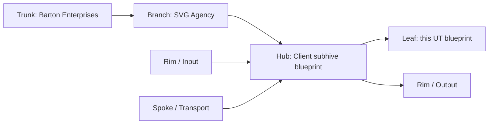
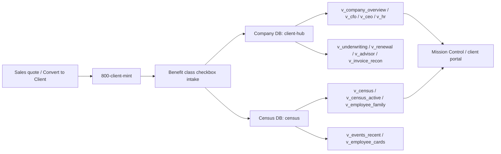

# UT Blueprint - Client System
## Brain of the client subhive: company DB, census DB, and the read views that sit on top of them.
### Status: BUILD
### Medium: database
### Business: svg-agency

---

## UT Checklist (Pre-Flight)

_This file is a build artifact, not a certified manual. The checklist is present so the section boundaries stay visible while the doc is still in BUILD._

| # | Check | Status | Location |
|---|-------|--------|----------|
| 1 | PRD - what / why / who / scope / out-of-scope / success metric | ☐ | §2 |
| 2 | OSAM - READ / WRITE / Join Chain / Forbidden Paths / Query Routing filled | ☐ | §5 |
| 3 | Component Status - every dependency has green / yellow / red with 1-line state | ☐ | §3 |
| 4 | Owner - human who fixes this at 2 AM | ☐ | §1 |
| 5 | Live Dashboard - URL or explicit "N/A" | ☐ | §3 |
| 6 | Kill Switch - exact command to stop the process | ☐ | §8 |
| 7 | Logbook - last audit verdict + date (after certification only) | ☐ | §12 |
| 8 | FCEs Attached - which FCE runs structurally back this doc | ☐ | §3c |
| 9 | BARs Referenced - every BAR this doc touches, with status | ☐ | §3d |
| 10 | LBB Subjects Fed - which LBB subject(s) this doc's session logs go to | ☐ | §3e |
| 11 | Geometry - CTB position + Hub-Spoke role + Altitude | ☐ | §1b |
| 12 | Live Verification - numeric counts and routes grounded against the repo | ☐ | §9b |
| 13 | ctb_node - declared path on Barton Enterprises CTB trunk | ☐ | §1 |

---

# IDENTITY (Thing - what this IS)

## 1. IDENTITY

| Field | Value |
|-------|-------|
| ID | UT-CLIENT-BLUEPRINT |
| Name | Client System UT Blueprint |
| Medium | database |
| Business Silo | svg-agency |
| CTB Position | branch -> client-subhive -> client/docs/UT_BLUEPRINT.md |
| ORBT | BUILD |
| Strikes | 0 |
| Authority | inherited - `law/UNIFIED_TEMPLATE.md` + `law/doctrine/DATABASE_FILL_INSTRUCTIONS.md` + client system locked architecture |
| Last Modified | 2026-04-22 |
| BAR Reference | none |
| Owner | Dave Barton |
| ctb_node | `barton-enterprises/svg-agency/client-subhive/client-blueprint` |

### 1b. Geometry

**CTB Position:** `branch -> client-subhive -> client/docs/UT_BLUEPRINT.md`

**Hub-Spoke Role:** hub (the middle - schemas, views, doctrine, and joins)

**Altitude:** 30k tactical



### HEIR (8 fields - Aviation Model, Bedrock S8)

| Field | Value |
|-------|-------|
| sovereign_ref | imo-creator |
| hub_id | client-subhive |
| ctb_placement | branch |
| imo_topology | middle |
| cc_layer | CC-02 |
| services | Cloudflare D1, Neon PostgreSQL (schema: `clnt`), Hyperdrive, Cloudflare Workers, Mission Control API |
| secrets_provider | doppler |
| acceptance_criteria | Two-database split documented, all open decisions flagged, all referenced files resolve, and the read surfaces remain views not tables |

**Inheritance:** this blueprint inherits from the `imo-creator-v2` sovereign and from the client system locked architecture in the dispatch packet.

**Fill Rule:** Assign `DB-NNN` ID, name in business language, set `Medium = database`, fill all 8 HEIR fields, `services` must name the storage tier (Neon schema `clnt`), `secrets_provider` must be `doppler` where connection strings exist.
**Cross-ref:** `law/doctrine/DATABASE_FILL_INSTRUCTIONS.md §1`; `client/CLAUDE.md`; `client/doctrine/OSAM.md`
**0 → 1 when:** all required identity fields and all 8 HEIR fields are present and the Neon schema name `clnt` is declared.

---

# CONTRACT (Flow - what flows through this)

## 2. PURPOSE

This blueprint defines the client-system brain: which tables live in the company DB, which tables live in the census DB, and which views are the supported read surfaces. Without it, the client subhive drifts into schema-by-memory, the two-database isolation boundary gets blurred, and downstream workers lose a single source of truth for client identity, benefits, vendor links, invoices, and service requests.

This doc is for builders, operators, and auditors. It tells them what the client system stores, who consumes it, and which parts are still intentionally undecided.

**Fill Rule:** 2-3 sentences: (1) what business data this database stores or makes queryable, (2) what downstream process or worker starves without it, (3) what data integrity risk exists if it fails.
**Cross-ref:** `law/doctrine/DATABASE_FILL_INSTRUCTIONS.md §2`; `client/docs/prd/PRD.md`
**0 → 1 when:** this section states what breaks without the client blueprint, names downstream consumers, and does not describe table schemas (those belong in §5).

---

## 3. RESOURCES

_Everything this depends on. A mechanic reads this and knows exactly what to set up before it can run._

### Governing Documentation

| Document | Path | Purpose |
|----------|------|---------|
| Client repo root instructions | `client/CLAUDE.md` | Sovereign instructions for the client repo |
| Client query-routing contract | `client/doctrine/OSAM.md` | OSAM for client concepts and joins |
| Client product requirements | `client/docs/prd/PRD.md` | PRD for the client system |
| Client entity-relationship diagram | `client/src/data/ERD.md` | ERD for client DB tables |
| Client system dispatch | `imo-creator-v2/factory/dispatch/DISPATCH_UT_CLIENT_2026-04-22.md` | Locked architecture §1-15 source of truth |
| Client process coordinator | `Barton-Processes/factory/client/UT_PROCESSES.md` | Sibling process UT that consumes this blueprint |

### Component Status Grid

| Component | HEIR (`hub_id · ctb · cc_layer`) | ORBT | Light | State |
|-----------|----------------------------------|------|-------|-------|
| `imo-creator-v2/workers/client-hub/MANUAL.md` | `client-hub · leaf · CC-03` | BUILD | yellow | Existing worker manual for the live D1 edge API surface. |
| `imo-creator-v2/workers/mission-control-api/docs/DB-CLIENT.md` | `DB-CLIENT · leaf · CC-03` | BUILD | yellow | Existing client database manual for the current D1 client slice. |
| `client/doctrine/OSAM.md` | `client-subhive · branch · CC-02` | BUILD | yellow | Query-routing contract for client concepts and joins. |
| `client/CLAUDE.md` | `client-subhive · branch · CC-02` | BUILD | yellow | Sovereign instructions for the client repo. |
| `imo-creator-v2/workers/client-hub/src/index.ts` | `client-hub · leaf · CC-03` | BUILD | yellow | Declared Hono route surface for the client edge API. |
| `imo-creator-v2/workers/client-hub/migrations/0001_create_tables.sql` | `client-hub · leaf · CC-03` | BUILD | yellow | Checked-in D1 table definitions for the client edge worker. |

### Live Dashboard

| Resource | URL | What it shows |
|----------|-----|---------------|
| Client Hub health | `https://client-hub.svg-outreach.workers.dev/health` | D1 reachability and table count for the client edge worker. |
| Mission Control client dashboard | N/A | The live UI surface is outside this repo snapshot. |

### Dependencies

| Dependency | Type | What It Provides | Status |
|-----------|------|-----------------|--------|
| Company DB `client-hub` (D1) | database | Client identity, plans, benefit classes, vendors, invoices, and service requests | DONE |
| Census DB `census` (D1) | database | PII vault, person records, elections, and employee events | DONE |
| Neon PostgreSQL archive (schema: `clnt`) | database | Long-term vault for certified client data | DONE |
| Cloudflare D1 bindings | infrastructure | Working data and fast read surfaces | DONE |
| Hyperdrive | infrastructure | Connection pooling from Workers to Neon | DONE |
| `CLIENT_DATABASE_URL` (Doppler: imo-creator → dev) | secret | Neon connection string for schema `clnt` | DONE |
| Mission Control API | worker | Existing client and dashboard routes | DONE |
| Client Hub worker | worker | Current edge CRUD surface for the client D1 slice | DONE |
| Censusing / member workflows | process family | Downstream intake, export, and portal flows | DONE |

### Downstream Consumers

| Consumer | What It Needs |
|----------|--------------|
| Client portal and dashboards | Stable views, benefit tiers, and client identity joins |
| Vendor export process | Vendor identity, member identity, and rate/coverage rows |
| HR / benefits operations | Census records, elections, and employee family relationships |
| Auditors | Cross-db join paths, open decisions, and isolation rules |

### Tools & Integrations

| Item | Type | Cost Tier | Credentials | What It Does |
|------|------|-----------|-------------|-------------|
| Cloudflare D1 | database | Cheap | wrangler binding | Working data store for the client edge surface |
| Neon PostgreSQL | vault database | Cheap | `CLIENT_DATABASE_URL` in Doppler | Long-term archive for certified data (schema: `clnt`) |
| Hyperdrive | connection pool | Free | Cloudflare config | Connects Workers to Neon |
| Cloudflare Workers | runtime | Cheap | Cloudflare account | Runs the API and portal surfaces |
| wrangler | deploy / migration tool | Free | Cloudflare token in Doppler | Applies D1 migrations and deploys workers |

### Secrets

| Secret | Doppler Project | Config | Used By |
|--------|----------------|--------|---------|
| `CLIENT_DATABASE_URL` | imo-creator | dev | Neon client database (schema: `clnt`) via Hyperdrive |

### 3c. FCEs Attached

| FCE Name | HEIR (`hub_id · ctb · cc_layer`) | ORBT | Run Directory | Latest P=1 | Rows | Status |
|----------|----------------------------------|------|--------------|------------|------|--------|
| n/a | n/a | n/a | n/a | pending | pending | yellow |

### 3d. BARs Referenced

| BAR | Title | HEIR (`bar-id · ctb · cc_layer`) | ORBT | Status | Relation |
|-----|-------|----------------------------------|------|--------|----------|
| none | none | none | BUILD | pending | tracks |

### 3e. LBB Subjects Fed

| LBB Subject | HEIR (`subject-id · ctb · cc_layer`) | ORBT | What This Doc Writes | Frequency |
|-------------|--------------------------------------|------|---------------------|-----------|
| `svg-client` | `svg-client · branch · CC-02` | BUILD | session summary and client-system architecture notes | per-run |

**Fill Rule:** Include storage tier (Neon schema `clnt`, D1 `client-hub`, D1 `census`), connection method, secrets with Doppler project and config, upstream data sources, downstream consumers, migration tooling, and governing documentation paths (client/CLAUDE.md, client/doctrine/OSAM.md, client/docs/prd/PRD.md, client/src/data/ERD.md).
**Cross-ref:** `law/doctrine/DATABASE_FILL_INSTRUCTIONS.md §3`; `client/CLAUDE.md`; `client/doctrine/OSAM.md`; `client/docs/prd/PRD.md`; `client/src/data/ERD.md`
**0 → 1 when:** every dependency, downstream consumer, tool, secret, storage-tier detail, and governing doc reference is named or explicitly marked `none`.

---

## 4. IMO - Input, Middle, Output

### Two-Question Intake (Bedrock S3)
1. **What triggers this?** - A sales convert-to-client handoff or a client-system build/review request.
2. **How do we get it?** - The CL pipeline provides `sovereign_id`, then the client system mints `client_id`, stores the data in the two DBs, and exposes read surfaces through views.

### Architecture Diagram



### Input
- Sales handoff data: proposed plans, 4-tier rates, carriers, effective dates
- Client identity seed: `sovereign_id`
- Intake data: client details, plan coverage, employee census, vendor identity
- Validation context: open decisions, business rules, and the locked architecture

### Middle

| Step | Input | What Happens | Output | Tool Used |
|------|-------|-------------|--------|-----------|
| 1 | Sales handoff | Sales data is transposed into client-system terms | Client seed payload | Convert-to-client flow |
| 2 | `sovereign_id` | `client_id` is minted from the CL pipeline rule | Company identity key | 800-client-mint |
| 3 | Benefit class choices | Client benefit classes are recorded and validated | Offered-class rows | client-hub / intake |
| 4 | Plan rates and coverage | 4-tier plan rows and coverage templates are stored | Plan and tier records | company DB |
| 5 | Employee and dependent data | Person and election rows are stored in census | Census records | census DB |
| 6 | Event logging | Employee events and company events are appended | Audit/event history | client system |
| 7 | Vendor export preparation | Vendor identity and export specs are prepared | Export-ready vendor artifacts | 820-vendor-export |
| 8 | Portal read surfaces | Views serve dashboards, tickets, and member info | UI-readable datasets | 830-client-portal |

### Output
- Company DB tables for client identity, plans, vendors, invoices, and service requests
- Census DB tables for people, elections, and employee events
- A stable view layer for dashboards and exports
- Explicit placeholders for unresolved architecture decisions

### Circle (Bedrock S5)
Errors in the company DB or census DB feed back through the error tables and validation rules. Unresolved decisions stay open rather than being guessed, and view-layer failures feed back into the schema and routing rules.

**Fill Rule:** `Input` names the data sources feeding the database; `Middle` describes the CQRS write path (data enters from leaves, promotes through gates, lands in CANONICAL); `Output` names the read surfaces and who consumes them; `Circle` names the feedback loop (error table → repair → re-promote).
**Cross-ref:** `law/doctrine/DATABASE_FILL_INSTRUCTIONS.md §4`; `client/doctrine/OSAM.md`
**0 → 1 when:** intake, input, middle, output, and circle are all explicit and the fill rule is detailed enough to populate a real database IMO without inventing new structure.

---

## 5. DATA SCHEMA

_Where the data lives. What's read, written, joined. The plumbing._

### READ Access

| Source | What It Provides | Join Key |
|--------|-----------------|----------|
| `client-hub` company DB (D1) | `client`, `client_benefit_class`, `plan`, `benefit_tier_cost`, `plan_coverage`, `vendor`, `company_vendor_identity`, `company_vendor_link`, `invoice`, `service_request`, `company_events` | `client_id` |
| `census` DB (D1) | `person_pii`, `person`, `person_vendor_identity`, `election`, `employee_event` | `client_id`, `person_id`, `vendor_id` |
| Neon PostgreSQL (schema: `clnt`) | Long-term archive of certified client data | `client_id` |
| `imo-creator-v2/workers/client-hub/migrations/0001_create_tables.sql` | D1 edge schema for the current worker slice | table name |
| `imo-creator-v2/workers/mission-control-api/migrations/0005_client_full.sql` | Fuller client schema snapshot and route expectations | table name |
| `client/doctrine/OSAM.md` | Query routing and allowed joins for client concepts | concept / table |
| `client/src/data/ERD.md` | Entity-relationship diagram for client DB tables | table name |

### WRITE Access

| Target | What It Writes | When |
|--------|---------------|------|
| `client` | company identity and client metadata | onboarding / mint |
| `client_benefit_class` | offered benefit classes | class selection |
| `plan` and `benefit_tier_cost` | plan rows and 4-tier costs | plan intake |
| `plan_coverage` | class-specific coverage templates | plan setup |
| `person_pii` and `person` | vault and operational person records | census intake |
| `person_vendor_identity` | member and card numbers | vendor capture |
| `election` | member election data | enrollment / changes |
| `employee_event` and `company_events` | state transitions and operational events | new_hire / fire / change |
| `invoice` | vendor billing | vendor invoice intake |
| `service_request` | client service work | portal / support |
| Neon schema `clnt` | archived certified client data | certification / archive |

### Full Table Definition Summary

#### Company DB: `client-hub` (D1)

| Table | Purpose | Key Fields |
|------|---------|------------|
| `client` | Sovereign client identity and lifecycle row | `client_id`, `sovereign_id`, `lifecycle_stage`, `status` |
| `client_benefit_class` | Per-client benefit class availability | `client_id`, `benefit_class`, `status` |
| `plan` | Per-class plan row with the 4-tier rates | `plan_id`, `client_id`, `benefit_type`, `rate_ee`, `rate_es`, `rate_ec`, `rate_fam` |
| `benefit_tier_cost` | Exactly 4 rows per plan: EE / ES / EC / FAM | `plan_id`, `coverage_tier`, `cost` |
| `plan_coverage` | Per-class coverage template JSON | `plan_id`, `details` |
| `vendor` | Carriers, TPAs, PBMs, brokers | `vendor_id`, `client_id`, `vendor_name`, `vendor_type` |
| `company_vendor_identity` | Company-level vendor IDs | `vendor_id`, `account_number`, `group_number` |
| `company_vendor_link` | Client -> vendor relationships | `client_id`, `vendor_id` |
| `invoice` | Vendor invoices | `invoice_id`, `client_id`, `vendor_id`, `invoice_number`, `amount` |
| `service_request` | Client service tickets | `service_request_id`, `client_id`, `category`, `status` |
| `company_events` | Company-level lifecycle events | `event_id`, `client_id`, `event_type` |
| `*_error` tables | Error surface per open decision Q2 | `PENDING FOREMAN - Q2` |

#### Census DB: `census` (D1)

| Table | Purpose | Key Fields |
|------|---------|------------|
| `person_pii` | Encrypted vault for sensitive person data | `person_id`, `ssn`, `dob`, `name`, `address`, `email`, `cell_phone` |
| `person` | Operational person record with no PII | `person_id`, `client_id`, `status` |
| `person_vendor_identity` | Member numbers and card numbers | `person_id`, `vendor_id`, `member_number`, `has_card` |
| `election` | Person x plan x tier coverage election | `person_id`, `plan_id`, `coverage_tier`, `effective_date` |
| `employee_event` | `new_hire` / `fire` / `change` event log | `person_id`, `event_type`, `event_details` |

**PII rule:** `person_pii.ssn` is encrypted at rest. No hashing in storage. `person_pii` must enforce `email IS NOT NULL OR cell_phone IS NOT NULL`.

### View Definitions

| View | DB | Reads From | Purpose |
|------|----|------------|---------|
| `v_census` | census | `person`, `person_pii`, `person_vendor_identity`, `election`, `employee_event` | Full census read surface |
| `v_census_active` | census | `person`, `person_pii` | Active people only |
| `v_employee_family` | census | `person`, `person_pii`, `employee_event` | Employee + dependent structure |
| `v_events_recent` | census | `employee_event` | Recent state changes |
| `v_employee_cards` | census | `person_vendor_identity`, `person` | Card-bearing vendor IDs |
| `v_company_overview` | company | `client`, `client_benefit_class`, `plan`, `company_vendor_identity`, `company_vendor_link`, `invoice`, `company_events` | Executive summary |
| `v_cfo` | company | `client`, `plan`, `benefit_tier_cost`, `invoice` | Cost and invoice view |
| `v_ceo` | company | `client`, `company_events`, `plan` | Strategy / lifecycle view |
| `v_hr` | company | `client`, `client_benefit_class`, `person`, `election`, `employee_event` | HR operations |
| `v_underwriting` | company | `client`, `plan`, `plan_coverage`, `benefit_tier_cost`, `company_vendor_identity` | Underwriting and carrier terms |
| `v_renewal` | company | `client`, `plan`, `invoice`, `company_events` | Renewal tracking |
| `v_advisor` | company | `client`, `company_vendor_identity`, `company_vendor_link`, `plan` | Advisor-facing summary |
| `v_invoice_recon` | company | `invoice`, `company_vendor_identity`, `company_vendor_link`, `plan` | Invoice reconciliation |

### Join Chain

```text
CL pipeline sovereign_id
  -> company client.client_id
    -> company client_benefit_class / plan / vendor / invoice / service_request
      -> census person.client_id
        -> census person_pii.person_id
        -> census election.person_id + plan_id
        -> census person_vendor_identity.person_id + vendor_id
    -> Neon schema clnt (archived client data)
```

### Forbidden Paths

| Action | Why |
|--------|-----|
| Direct write into a view | Views are read surfaces only |
| Inventing a third DB for this split | The locked architecture is two-DB only |
| Treating PII as operational data | `person_pii` is the vault, `person` is the operational table |
| Skipping the 4-tier rule | Every plan must produce exactly EE / ES / EC / FAM rows |
| Guessing Q1, Q2, Q4, Q5, or Q6 | Open decisions remain open until the foreman resolves them |
| Writing to Neon `clnt` outside the archive path | Archive is certified data only |

**Fill Rule:** Name every read source with join key; name every write target and writing step; show the join chain to the process spine; list forbidden paths. The Neon schema name `clnt` must appear explicitly.
**Cross-ref:** `law/doctrine/DATABASE_FILL_INSTRUCTIONS.md §5`; `client/doctrine/OSAM.md`; `client/src/data/ERD.md`
**0 → 1 when:** every read path, write path, join chain, forbidden path, and the Neon schema `clnt` are explicit.

---

## 6. DMJ - Define, Map, Join

### 6a. DEFINE (Build the Key)

| Element | ID | Format | Description | C or V |
|---------|-----|--------|-------------|--------|
| Company DB | DB-CLIENT | D1 database `client-hub` | Client-facing company data store | C |
| Census DB | DB-CENSUS | D1 database `census` | PII vault and person operations store | C |
| Neon archive | DB-NEON-CLNT | Neon schema `clnt` | Long-term certified data archive | C |
| `client_id` | KEY-01 | UUID | Sovereign client join key minted from the CL pipeline | C |
| Benefit classes | CLASS-01 | enum (~19 classes) | Medical, Dental, Vision, Life, AD&D, STD, LTD, FSA, DCFSA, HSA, EAP, Accident, Critical Illness, Hospital Indemnity, Telehealth, Commuter, Legal, Pet | C |
| Benefit tiers | TIER-01 | enum | EE / ES / EC / FAM | C |
| Two-DB split | ARCH-01 | architecture rule | company DB vs census DB isolation | C |
| Role views | VIEW-01 | view set | v_census + 8 role views | C |
| 4-tier plan rule | RULE-01 | invariant | every plan produces exactly 4 tier rows | C |
| Client payload | payload | JSON / rows | Per-client input values | V |
| Plan rates | rates | decimals | EE / ES / EC / FAM values | V |
| Member records | member data | rows | person / election / event data | V |

### 6b. MAP (Connect Key to Structure)

| Source | Target | Transform |
|--------|--------|-----------|
| CL `sovereign_id` | `client.client_id` | mint / derive |
| Sales quote | `client`, `plan`, `company_vendor_identity` | transpose |
| Benefit class selection | `client_benefit_class` | classify |
| Plan offer | `plan` + `benefit_tier_cost` + `plan_coverage` | normalize |
| Person intake | `person` + `person_pii` | split operational vs vault |
| Election choice | `election` | route to census |
| Vendor member ID | `person_vendor_identity` | capture |
| Service request | `service_request` | route to company DB |
| Error outcome | `*_error` table | capture and keep open |
| Certified archive | Neon schema `clnt` | archive / promote |

### 6c. JOIN (Path to Spine)

| Join Path | Type | Description |
|-----------|------|-------------|
| `sovereign_id -> client.client_id` | direct | Client identity is minted from the CL pipeline |
| `client.client_id -> census.person.client_id` | direct | Company identity joins to people through client_id |
| `person.person_id -> person_pii.person_id` | direct | Operational person joins to vault PII |
| `person.person_id -> election.person_id` | direct | Election rows belong to a person |
| `plan.plan_id -> election.plan_id` | direct | Elections attach to plans |
| `vendor.vendor_id -> person_vendor_identity.vendor_id` | direct | Member IDs are vendor-scoped |
| `company_vendor_identity.vendor_id -> vendor.vendor_id` | direct | Company-level vendor identity lands in company DB |

**Q3 resolved:** `company_vendor_identity` lives in the company DB and `person_vendor_identity` lives in the census DB.

**Fill Rule:** Define every business element the database touches; map every element from source to target position; join every mapped element to the database spine; refuse completion if any element lacks a map target or spine path.
**Cross-ref:** `law/doctrine/DATABASE_FILL_INSTRUCTIONS.md §6`; `law/doctrine/DMJ.md`
**0 → 1 when:** every defined element has a map target, every join path resolves, and Q3 resolution is explicitly recorded.

---

## 7. CONSTANTS & VARIABLES (Bedrock S2)

### Constants (structure - never changes)
- Two-database split: company DB `client-hub` (D1), census DB `census` (D1)
- Neon PostgreSQL long-term archive under schema `clnt`
- `client_id` is minted from `sovereign_id`
- Every plan produces exactly 4 tier rows: EE, ES, EC, FAM
- `person_pii` is the PII vault and requires encrypted SSN storage
- `person` is operational and contains no PII
- Read surfaces are views, not tables
- Writes land in tables, not views
- `Q3` is resolved; `Q1`, `Q2`, `Q4`, `Q5`, and `Q6` remain open until the foreman resolves them

### Variables (fill - changes every run/cycle)
- Client identity values and lifecycle stage
- Benefit class selections per client
- Plan rates, carrier IDs, and effective dates
- Person / dependent records
- Election values
- Vendor member IDs and card numbers
- Invoice amounts and statuses
- Service request categories and statuses

**Fill Rule:** Constants are fixed database structure (never changes regardless of client); variables are per-run values and mutable content. No process-fill element may remain unclassified.
**Cross-ref:** `law/doctrine/DATABASE_FILL_INSTRUCTIONS.md §7`; `law/doctrine/FOUNDATIONAL_BEDROCK.md §2`
**0 → 1 when:** no element remains unclassified and the Neon schema `clnt` is listed among the constants.

---

## 8. STOP CONDITIONS (Bedrock S6)

| Condition | Action |
|-----------|--------|
| `client_id` formation rule is unresolved | HALT - `PENDING FOREMAN - Q1` |
| Error table strategy is unresolved | HALT - `PENDING FOREMAN - Q2` |
| Vendor library location is unresolved | HALT - `PENDING FOREMAN - Q4` |
| Service request scope is unresolved | HALT - `PENDING FOREMAN - Q5` |
| Benefit class v1 visible list is unresolved | HALT - `PENDING FOREMAN - Q6` |
| A plan does not create exactly 4 tier rows | HALT - fix source schema or intake |
| `person_pii` lacks email or cell_phone | HALT - vault rule violated |
| Direct write to a view | HALT - read surface violation |
| Cross-DB join without `client_id` | HALT - isolation violation |
| Human says stop | STOP |

### Open Decisions (do not invent)

| Q# | Status | Placeholder |
|----|--------|-------------|
| Q1 | OPEN | `PENDING FOREMAN - Q1: client_id formation rule` |
| Q2 | OPEN | `PENDING FOREMAN - Q2: error tables consolidated vs per-spoke` |
| Q3 | RESOLVED | company/vendor identity split is fixed |
| Q4 | OPEN | `PENDING FOREMAN - Q4: vendor library location` |
| Q5 | OPEN | `PENDING FOREMAN - Q5: service request scope (company / employee / both)` |
| Q6 | OPEN | `PENDING FOREMAN - Q6: benefit class v1 visible list (8 vs 19)` |

**Fill Rule:** Include intake failure, schema/routing failure, repeat-failure escalation, human stop, and all domain-specific stops. Open decisions must remain as `PENDING FOREMAN` placeholders — never invented.
**Cross-ref:** `law/doctrine/DATABASE_FILL_INSTRUCTIONS.md §8`; `law/doctrine/FOUNDATIONAL_BEDROCK.md §6`
**0 → 1 when:** all 5 open decisions (Q1, Q2, Q4, Q5, Q6) are flagged, Q3 is marked RESOLVED and not re-opened, and domain-specific stop conditions cover the 4-tier rule and PII vault constraints.

---

## 9. VERIFICATION

_Executable proof that it works. Run these._

```text
1. Compare the company DB table list to the locked architecture.
   expected: client, client_benefit_class, plan, benefit_tier_cost, plan_coverage, vendor, company_vendor_identity, company_vendor_link, invoice, service_request, company_events are present.
2. Compare the census DB table list to the locked architecture.
   expected: person_pii, person, person_vendor_identity, election, employee_event are present.
3. Verify the 4-tier rule.
   expected: every plan emits exactly EE / ES / EC / FAM rows.
4. Verify the PII rule.
   expected: `person_pii` requires email or cell_phone and stores SSN encrypted at rest.
5. Verify the read surfaces.
   expected: v_census + 8 role views exist and each reads only from declared tables.
6. Verify the join chain.
   expected: `sovereign_id -> client_id -> person_id -> election/person_vendor_identity` resolves without orphan rows.
7. Verify Neon schema clnt.
   expected: archive path to Neon schema `clnt` is declared and CLIENT_DATABASE_URL is in Doppler.
```

**Three Primitives Check (Bedrock S1):**
1. **Thing:** Do the two DBs, tables, views, and Neon schema `clnt` exist?
2. **Flow:** Does client data move from CL -> company DB -> census DB -> views?
3. **Change:** Do plans, elections, and events change state without breaking isolation?

**Fill Rule:** Include runnable tests (not commentary); cover Thing, Flow, and Change explicitly; include at least one happy path, one missing-data path, and one error path.
**Cross-ref:** `law/doctrine/DATABASE_FILL_INSTRUCTIONS.md §9`; `client/src/data/ERD.md`
**0 → 1 when:** the three verification steps are runnable, all Three Primitives checks are answerable, and the Neon schema `clnt` appears in at least one verification step.

---

## 10. ANALYTICS

### 10a. Metrics

| Metric | Unit | Baseline | Target | Tolerance |
|--------|------|----------|--------|-----------|
| Section completeness | count/14 | 0 | 14 | = 14 |
| View completeness | count | 0 | 13 | = 13 |
| Open decisions flagged | count | 0 | 5 | = 5 |
| 4-tier plan completeness | count/plan | 0 | 4 | = 4 |
| Cross-DB join orphans | count | 0 | 0 | = 0 |

### 10b. Sigma Tracking

| Metric | Run 1 | Run 2 | Run 3 | Trend | Action |
|--------|-------|-------|-------|-------|--------|
| section completeness | provisional | compare | compare | TIGHTENING | keep or repair |
| view completeness | provisional | compare | compare | TIGHTENING | keep or repair |
| open decisions | 5 | 5 | 5 | FLAT until foreman answers | do not invent |

### 10c. ORBT Gate Rules

| From | To | Gate |
|------|-----|------|
| BUILD | OPERATE | all sections present, views named, joins explicit, open decisions flagged, auditor sign-off |
| OPERATE | REPAIR | schema drift, wrong view layer, or cross-db isolation failure |
| REPAIR | OPERATE | fix applied and verified |
| Any (Strike 3) | TROUBLESHOOT/TRAIN | same client-schema failure repeats |

**Fill Rule:** Define metrics before build starts; track sigma across at least 3 runs; make BUILD → OPERATE contingent on repeated-run evidence and auditor sign-off.
**Cross-ref:** `law/doctrine/DATABASE_FILL_INSTRUCTIONS.md §10`
**0 → 1 when:** metrics, sigma tracking, and gate rules all exist and the BUILD → OPERATE gate requires auditor sign-off.

---

## 11. EXECUTION TRACE

_Append-only. Every action logged. The auditor reads this._

| Field | Format | Required |
|-------|--------|----------|
| trace_id | pending | Yes |
| run_id | pending | Yes |
| step | pending | Yes |
| target | pending | Yes |
| actual | pending | Yes |
| delta | pending | Yes |
| status | BUILD | Yes |
| error_code | null | If failed |
| error_message | null | If failed |
| tools_used | `["apply_patch","shell"]` | Yes |
| duration_ms | pending | Yes |
| cost_cents | 0 | Yes |
| timestamp | 2026-04-22 | Yes |
| signed_by | Codex | Yes |

_No trace entries recorded during BUILD. This table is intentionally empty until the first OPERATE run._

**Fill Rule:** Record what sources were used to build the manual; state whether runtime-built or manually built; keep the trace append-only for audit review.
**Cross-ref:** `law/doctrine/DATABASE_FILL_INSTRUCTIONS.md §11`
**0 → 1 when:** the trace table structure is present, the section is intentionally empty during BUILD (not omitted), and the append-only rule is declared.

---

## 12. LOGBOOK (After Certification Only)

_No logbook during BUILD._

### Birth Certificate

| Field | Value |
|-------|-------|
| heir_ref | pending certification |
| orbt_entered | BUILD |
| orbt_exited | pending |
| action | pending auditor certification |
| gates_passed | pending |
| signed_by | pending |
| signed_at | pending |

**Fill Rule:** Leave empty during BUILD except for placeholders; create only after auditor certification; use as legal identity, not as a build journal.
**Cross-ref:** `law/doctrine/DATABASE_FILL_INSTRUCTIONS.md §12`
**0 → 1 when:** this section remains intentionally incomplete during BUILD and contains only placeholders that an auditor can fill at certification time.

---

## 13. FLEET FAILURE REGISTRY

| Pattern ID | Location | Error Code | First Seen | Occurrences | Strike Count | Status |
|-----------|----------|-----------|-----------|-------------|-------------|--------|
| none | none | none | none | none | 0 | empty during BUILD |

**Fill Rule:** Log reusable failure patterns, not one-off anecdotes; track strike count and status; promote repeat failures toward Troubleshoot/Train and AD issuance.
**Cross-ref:** `law/doctrine/DATABASE_FILL_INSTRUCTIONS.md §13`
**0 → 1 when:** every discovered database failure pattern is logged with strike count and status; intentionally empty during BUILD is acceptable and must be explicitly declared.

---

## 14. SESSION LOG

| Date | What Was Done | LBB Record |
|------|---------------|-----------|
| 2026-04-22 | Built the client-system blueprint UT from the dispatch packet and the checked-in client worker / schema / OSAM references. | pending |
| 2026-04-22 | Corrected audit findings GAP-001 through GAP-004: added Status field to Document Control, added Fill Rule citations to all 14 sections, added Neon schema `clnt` reference, fixed OSAM cross-ref to `client/doctrine/OSAM.md`, added governing documentation table with client repo file paths. | pending |

**Fill Rule:** Append every material edit session; keep one-line summary plus LBB reference; do not hide repair sessions.
**Cross-ref:** `law/doctrine/DATABASE_FILL_INSTRUCTIONS.md §14`
**0 → 1 when:** every editing session that materially changes this document is appended here.

---

## Document Control

| Field | Value |
|-------|-------|
| Created | 2026-04-22 |
| Last Modified | 2026-04-22 |
| Version | 1.2.0 |
| Status | BUILD |
| Template Version | 1.0.0 |
| Medium | database |
| US Validated | pending |
| Governing Engine | `law/doctrine/FOUNDATIONAL_BEDROCK.md` + `law/doctrine/DMJ.md` |
