# ERD — clnt Schema

> GENERATED FROM: `src/data/db/registry/clnt_column_registry.yml`
> DO NOT HAND-EDIT. Run: `npx ts-node scripts/codegen-schema.ts`

**Version**: 3.0.0
**Tables**: 16
**Spine**: client
**Universal Join Key**: client_id

## Table Summary

| Table | Spoke | Leaf Type | PK | FK |
|-------|-------|-----------|----|----|
| client | s1-hub | CANONICAL | client_id | — |
| client_error | s1-hub | ERROR | client_error_id | client.client_id |
| plan | s2-plan | CANONICAL | plan_id | client.client_id |
| plan_error | s2-plan | ERROR | plan_error_id | client.client_id |
| plan_quote | s2-plan | SUPPORT | plan_quote_id | client.client_id |
| person | s3-employee | CANONICAL | person_id | client.client_id |
| employee_error | s3-employee | ERROR | employee_error_id | client.client_id |
| election | s3-employee | SUPPORT | election_id | client.client_id, person.person_id, plan.plan_id |
| enrollment_intake | s3-employee | STAGING | enrollment_intake_id | client.client_id |
| intake_record | s3-employee | STAGING | intake_record_id | client.client_id, enrollment_intake.enrollment_intake_id |
| vendor | s4-vendor | CANONICAL | vendor_id | client.client_id |
| vendor_error | s4-vendor | ERROR | vendor_error_id | client.client_id |
| external_identity_map | s4-vendor | SUPPORT | external_identity_id | client.client_id, vendor.vendor_id |
| invoice | s4-vendor | SUPPORT | invoice_id | client.client_id, vendor.vendor_id |
| service_request | s5-service | CANONICAL | service_request_id | client.client_id |
| service_error | s5-service | ERROR | service_error_id | client.client_id |

## Entity Relationship Diagram

```mermaid
erDiagram
    client {
        UUID client_id PK
        TEXT legal_name
        TEXT fein
        TEXT domicile_state
        DATE effective_date
        TEXT status
        TEXT source
        INT version
        TEXT domain
        TEXT label_override
        TEXT logo_url
        TEXT color_primary
        TEXT color_accent
        JSONB feature_flags
        JSONB dashboard_blocks
        TIMESTAMPTZ created_at
        TIMESTAMPTZ updated_at
    }
    client_error {
        UUID client_error_id PK
        UUID client_id FK
        TEXT source_entity
        UUID source_id
        TEXT error_code
        TEXT error_message
        TEXT severity
        TEXT status
        JSONB context
        TIMESTAMPTZ created_at
    }
    plan {
        UUID plan_id PK
        UUID client_id FK
        TEXT benefit_type
        TEXT carrier_id
        DATE effective_date
        TEXT status
        INT version
        NUMERIC rate_ee
        NUMERIC rate_es
        NUMERIC rate_ec
        NUMERIC rate_fam
        NUMERIC employer_rate_ee
        NUMERIC employer_rate_es
        NUMERIC employer_rate_ec
        NUMERIC employer_rate_fam
        UUID source_quote_id
        TIMESTAMPTZ created_at
        TIMESTAMPTZ updated_at
    }
    plan_error {
        UUID plan_error_id PK
        UUID client_id FK
        TEXT source_entity
        UUID source_id
        TEXT error_code
        TEXT error_message
        TEXT severity
        TEXT status
        JSONB context
        TIMESTAMPTZ created_at
    }
    plan_quote {
        UUID plan_quote_id PK
        UUID client_id FK
        TEXT benefit_type
        TEXT carrier_id
        INT effective_year
        NUMERIC rate_ee
        NUMERIC rate_es
        NUMERIC rate_ec
        NUMERIC rate_fam
        TEXT source
        DATE received_date
        TEXT status
        TIMESTAMPTZ created_at
    }
    person {
        UUID person_id PK
        UUID client_id FK
        TEXT first_name
        TEXT last_name
        TEXT ssn_hash
        TEXT status
        TIMESTAMPTZ created_at
        TIMESTAMPTZ updated_at
    }
    employee_error {
        UUID employee_error_id PK
        UUID client_id FK
        TEXT source_entity
        UUID source_id
        TEXT error_code
        TEXT error_message
        TEXT severity
        TEXT status
        JSONB context
        TIMESTAMPTZ created_at
    }
    election {
        UUID election_id PK
        UUID client_id FK
        UUID person_id FK
        UUID plan_id FK
        TEXT coverage_tier
        DATE effective_date
        TIMESTAMPTZ created_at
        TIMESTAMPTZ updated_at
    }
    enrollment_intake {
        UUID enrollment_intake_id PK
        UUID client_id FK
        TIMESTAMPTZ upload_date
        TEXT status
        TIMESTAMPTZ created_at
        TIMESTAMPTZ updated_at
    }
    intake_record {
        UUID intake_record_id PK
        UUID client_id FK
        UUID enrollment_intake_id FK
        JSONB raw_payload
        TIMESTAMPTZ created_at
    }
    vendor {
        UUID vendor_id PK
        UUID client_id FK
        TEXT vendor_name
        TEXT vendor_type
        TIMESTAMPTZ created_at
        TIMESTAMPTZ updated_at
    }
    vendor_error {
        UUID vendor_error_id PK
        UUID client_id FK
        TEXT source_entity
        UUID source_id
        TEXT error_code
        TEXT error_message
        TEXT severity
        TEXT status
        JSONB context
        TIMESTAMPTZ created_at
    }
    external_identity_map {
        UUID external_identity_id PK
        UUID client_id FK
        TEXT entity_type
        UUID internal_id
        UUID vendor_id FK
        TEXT external_id_value
        DATE effective_date
        TEXT status
        TIMESTAMPTZ created_at
        TIMESTAMPTZ updated_at
    }
    invoice {
        UUID invoice_id PK
        UUID client_id FK
        UUID vendor_id FK
        TEXT invoice_number
        NUMERIC amount
        DATE invoice_date
        DATE due_date
        TEXT status
        TIMESTAMPTZ created_at
        TIMESTAMPTZ updated_at
    }
    service_request {
        UUID service_request_id PK
        UUID client_id FK
        TEXT category
        TEXT status
        TIMESTAMPTZ opened_at
        TIMESTAMPTZ created_at
        TIMESTAMPTZ updated_at
    }
    service_error {
        UUID service_error_id PK
        UUID client_id FK
        TEXT source_entity
        UUID source_id
        TEXT error_code
        TEXT error_message
        TEXT severity
        TEXT status
        JSONB context
        TIMESTAMPTZ created_at
    }

    client ||--o{ client_error : ""
    client ||--o{ plan : ""
    client ||--o{ plan_error : ""
    client ||--o{ plan_quote : ""
    client ||--o{ person : ""
    client ||--o{ employee_error : ""
    client ||--o{ election : ""
    person ||--o{ election : ""
    plan ||--o{ election : ""
    client ||--o{ enrollment_intake : ""
    client ||--o{ intake_record : ""
    enrollment_intake ||--o{ intake_record : ""
    client ||--o{ vendor : ""
    client ||--o{ vendor_error : ""
    client ||--o{ external_identity_map : ""
    vendor ||--o{ external_identity_map : ""
    client ||--o{ invoice : ""
    vendor ||--o{ invoice : ""
    client ||--o{ service_request : ""
    client ||--o{ service_error : ""
```

## Column ID Index

| Column ID | Type | Required | Description |
|-----------|------|----------|-------------|
| clnt.client.client_id | UUID | YES | Sovereign identity. Immutable UUID primary key. Universal join key. |
| clnt.client.legal_name | TEXT | YES | Legal company name as registered. |
| clnt.client.fein | TEXT | NO | Federal Employer Identification Number. |
| clnt.client.domicile_state | TEXT | NO | Two-letter state code of legal domicile. |
| clnt.client.effective_date | DATE | NO | Client effective date for coverage. |
| clnt.client.status | TEXT | YES | Client lifecycle state (active, terminated, suspended). |
| clnt.client.source | TEXT | NO | Origin system identifier (manual, api, migration). |
| clnt.client.version | INT | YES | Record version counter for optimistic concurrency. |
| clnt.client.domain | TEXT | NO | Custom domain for client portal. |
| clnt.client.label_override | TEXT | NO | Display name override for UI rendering. |
| clnt.client.logo_url | TEXT | NO | Client logo URL for branding. |
| clnt.client.color_primary | TEXT | NO | Primary brand color (hex). |
| clnt.client.color_accent | TEXT | NO | Accent brand color (hex). |
| clnt.client.feature_flags | JSONB | YES | Feature toggle configuration. |
| clnt.client.dashboard_blocks | JSONB | YES | Dashboard block layout configuration. |
| clnt.client.created_at | TIMESTAMPTZ | YES | Record creation timestamp. Auto-set, never modified. |
| clnt.client.updated_at | TIMESTAMPTZ | YES | Last modification timestamp. Auto-updated via trigger. |
| clnt.client_error.client_error_id | UUID | YES | Primary key. Auto-generated UUID. |
| clnt.client_error.client_id | UUID | YES | FK to clnt.client. Sovereign join key. |
| clnt.client_error.source_entity | TEXT | YES | Table or process that produced the error. |
| clnt.client_error.source_id | UUID | NO | UUID of the entity that caused the error. Nullable if system-level. |
| clnt.client_error.error_code | TEXT | YES | Machine-readable error code for programmatic handling. |
| clnt.client_error.error_message | TEXT | YES | Human-readable error description. |
| clnt.client_error.severity | TEXT | YES | Error severity level. CHECK: warning, error, critical. |
| clnt.client_error.status | TEXT | YES | Error lifecycle. CHECK: open, resolved, dismissed. |
| clnt.client_error.context | JSONB | NO | Additional error context and metadata. |
| clnt.client_error.created_at | TIMESTAMPTZ | YES | Record creation timestamp. Append-only. |
| clnt.plan.plan_id | UUID | YES | Primary key. Auto-generated UUID. |
| clnt.plan.client_id | UUID | YES | FK to clnt.client. Sovereign join key. |
| clnt.plan.benefit_type | TEXT | YES | Benefit category: medical, dental, vision, life, etc. |
| clnt.plan.carrier_id | TEXT | NO | Carrier identifier for this plan. |
| clnt.plan.effective_date | DATE | NO | Plan effective date for coverage period. |
| clnt.plan.status | TEXT | YES | Plan lifecycle state (active, terminated, pending). |
| clnt.plan.version | INT | YES | Record version counter for optimistic concurrency. |
| clnt.plan.rate_ee | NUMERIC(10,2) | NO | Employee-only rate tier. |
| clnt.plan.rate_es | NUMERIC(10,2) | NO | Employee + Spouse rate tier. |
| clnt.plan.rate_ec | NUMERIC(10,2) | NO | Employee + Children rate tier. |
| clnt.plan.rate_fam | NUMERIC(10,2) | NO | Family rate tier. |
| clnt.plan.employer_rate_ee | NUMERIC(10,2) | NO | Employer contribution for Employee tier. |
| clnt.plan.employer_rate_es | NUMERIC(10,2) | NO | Employer contribution for Employee + Spouse tier. |
| clnt.plan.employer_rate_ec | NUMERIC(10,2) | NO | Employer contribution for Employee + Children tier. |
| clnt.plan.employer_rate_fam | NUMERIC(10,2) | NO | Employer contribution for Family tier. |
| clnt.plan.source_quote_id | UUID | NO | FK to plan_quote. Tracks promotion lineage. NULL for manual/migration plans. |
| clnt.plan.created_at | TIMESTAMPTZ | YES | Record creation timestamp. Auto-set, never modified. |
| clnt.plan.updated_at | TIMESTAMPTZ | YES | Last modification timestamp. Auto-updated via trigger. |
| clnt.plan_error.plan_error_id | UUID | YES | Primary key. Auto-generated UUID. |
| clnt.plan_error.client_id | UUID | YES | FK to clnt.client. Sovereign join key. |
| clnt.plan_error.source_entity | TEXT | YES | Table or process that produced the error. |
| clnt.plan_error.source_id | UUID | NO | UUID of the entity that caused the error. |
| clnt.plan_error.error_code | TEXT | YES | Machine-readable error code. |
| clnt.plan_error.error_message | TEXT | YES | Human-readable error description. |
| clnt.plan_error.severity | TEXT | YES | Error severity. CHECK: warning, error, critical. |
| clnt.plan_error.status | TEXT | YES | Error lifecycle. CHECK: open, resolved, dismissed. |
| clnt.plan_error.context | JSONB | NO | Additional error context and metadata. |
| clnt.plan_error.created_at | TIMESTAMPTZ | YES | Record creation timestamp. Append-only. |
| clnt.plan_quote.plan_quote_id | UUID | YES | Primary key. Auto-generated UUID. |
| clnt.plan_quote.client_id | UUID | YES | FK to clnt.client. Sovereign join key. |
| clnt.plan_quote.benefit_type | TEXT | YES | Benefit category this quote covers. |
| clnt.plan_quote.carrier_id | TEXT | YES | Carrier identifier submitting the quote. |
| clnt.plan_quote.effective_year | INT | YES | Plan year this quote applies to. |
| clnt.plan_quote.rate_ee | NUMERIC(10,2) | NO | Quoted Employee-only rate. |
| clnt.plan_quote.rate_es | NUMERIC(10,2) | NO | Quoted Employee + Spouse rate. |
| clnt.plan_quote.rate_ec | NUMERIC(10,2) | NO | Quoted Employee + Children rate. |
| clnt.plan_quote.rate_fam | NUMERIC(10,2) | NO | Quoted Family rate. |
| clnt.plan_quote.source | TEXT | NO | Origin of quote (broker, carrier portal, RFP). |
| clnt.plan_quote.received_date | DATE | NO | Date the quote was received. |
| clnt.plan_quote.status | TEXT | YES | Quote lifecycle. CHECK: received, presented, selected, rejected. |
| clnt.plan_quote.created_at | TIMESTAMPTZ | YES | Record creation timestamp. Append-mostly. |
| clnt.person.person_id | UUID | YES | Primary key. Auto-generated UUID. |
| clnt.person.client_id | UUID | YES | FK to clnt.client. Sovereign join key. |
| clnt.person.first_name | TEXT | YES | First name. |
| clnt.person.last_name | TEXT | YES | Last name. |
| clnt.person.ssn_hash | TEXT | NO | Hashed SSN. Never stores raw SSN. |
| clnt.person.status | TEXT | YES | Person lifecycle state (active, terminated, on_leave). |
| clnt.person.created_at | TIMESTAMPTZ | YES | Record creation timestamp. Auto-set, never modified. |
| clnt.person.updated_at | TIMESTAMPTZ | YES | Last modification timestamp. Auto-updated via trigger. |
| clnt.employee_error.employee_error_id | UUID | YES | Primary key. Auto-generated UUID. |
| clnt.employee_error.client_id | UUID | YES | FK to clnt.client. Sovereign join key. |
| clnt.employee_error.source_entity | TEXT | YES | Table or process that produced the error. |
| clnt.employee_error.source_id | UUID | NO | UUID of the entity that caused the error. |
| clnt.employee_error.error_code | TEXT | YES | Machine-readable error code. |
| clnt.employee_error.error_message | TEXT | YES | Human-readable error description. |
| clnt.employee_error.severity | TEXT | YES | Error severity. CHECK: warning, error, critical. |
| clnt.employee_error.status | TEXT | YES | Error lifecycle. CHECK: open, resolved, dismissed. |
| clnt.employee_error.context | JSONB | NO | Additional error context and metadata. |
| clnt.employee_error.created_at | TIMESTAMPTZ | YES | Record creation timestamp. Append-only. |
| clnt.election.election_id | UUID | YES | Primary key. Auto-generated UUID. |
| clnt.election.client_id | UUID | YES | FK to clnt.client. Sovereign join key. |
| clnt.election.person_id | UUID | YES | FK to clnt.person. The employee making the election. |
| clnt.election.plan_id | UUID | YES | FK to clnt.plan. The plan being elected. |
| clnt.election.coverage_tier | TEXT | YES | Coverage tier. CHECK: EE, ES, EC, FAM. |
| clnt.election.effective_date | DATE | YES | Election effective date. |
| clnt.election.created_at | TIMESTAMPTZ | YES | Record creation timestamp. Auto-set, never modified. |
| clnt.election.updated_at | TIMESTAMPTZ | YES | Last modification timestamp. Auto-updated via trigger. |
| clnt.enrollment_intake.enrollment_intake_id | UUID | YES | Primary key. Auto-generated UUID. |
| clnt.enrollment_intake.client_id | UUID | YES | FK to clnt.client. Sovereign join key. |
| clnt.enrollment_intake.upload_date | TIMESTAMPTZ | YES | Upload timestamp. Auto-set. |
| clnt.enrollment_intake.status | TEXT | YES | Batch processing status (pending, processing, completed, failed). |
| clnt.enrollment_intake.created_at | TIMESTAMPTZ | YES | Record creation timestamp. |
| clnt.enrollment_intake.updated_at | TIMESTAMPTZ | YES | Last modification timestamp. Auto-updated via trigger. |
| clnt.intake_record.intake_record_id | UUID | YES | Primary key. Auto-generated UUID. |
| clnt.intake_record.client_id | UUID | YES | FK to clnt.client. Sovereign join key. |
| clnt.intake_record.enrollment_intake_id | UUID | YES | FK to clnt.enrollment_intake. Parent batch. |
| clnt.intake_record.raw_payload | JSONB | YES | Raw intake data payload. |
| clnt.intake_record.created_at | TIMESTAMPTZ | YES | Record creation timestamp. Immutable. |
| clnt.vendor.vendor_id | UUID | YES | Primary key. Auto-generated UUID. |
| clnt.vendor.client_id | UUID | YES | FK to clnt.client. Sovereign join key. |
| clnt.vendor.vendor_name | TEXT | YES | Vendor display name. |
| clnt.vendor.vendor_type | TEXT | NO | Vendor classification (carrier, tpa, broker, etc.). |
| clnt.vendor.created_at | TIMESTAMPTZ | YES | Record creation timestamp. Auto-set, never modified. |
| clnt.vendor.updated_at | TIMESTAMPTZ | YES | Last modification timestamp. Auto-updated via trigger. |
| clnt.vendor_error.vendor_error_id | UUID | YES | Primary key. Auto-generated UUID. |
| clnt.vendor_error.client_id | UUID | YES | FK to clnt.client. Sovereign join key. |
| clnt.vendor_error.source_entity | TEXT | YES | Table or process that produced the error. |
| clnt.vendor_error.source_id | UUID | NO | UUID of the entity that caused the error. |
| clnt.vendor_error.error_code | TEXT | YES | Machine-readable error code. |
| clnt.vendor_error.error_message | TEXT | YES | Human-readable error description. |
| clnt.vendor_error.severity | TEXT | YES | Error severity. CHECK: warning, error, critical. |
| clnt.vendor_error.status | TEXT | YES | Error lifecycle. CHECK: open, resolved, dismissed. |
| clnt.vendor_error.context | JSONB | NO | Additional error context and metadata. |
| clnt.vendor_error.created_at | TIMESTAMPTZ | YES | Record creation timestamp. Append-only. |
| clnt.external_identity_map.external_identity_id | UUID | YES | Primary key. Auto-generated UUID. |
| clnt.external_identity_map.client_id | UUID | YES | FK to clnt.client. Sovereign join key. |
| clnt.external_identity_map.entity_type | TEXT | YES | What entity is mapped. CHECK: person, plan. |
| clnt.external_identity_map.internal_id | UUID | YES | Internal entity UUID being mapped. |
| clnt.external_identity_map.vendor_id | UUID | YES | FK to clnt.vendor. Which vendor owns this external ID. |
| clnt.external_identity_map.external_id_value | TEXT | YES | The vendor's external identifier value. |
| clnt.external_identity_map.effective_date | DATE | NO | Effective date of this mapping. |
| clnt.external_identity_map.status | TEXT | YES | Mapping lifecycle state (active, inactive). |
| clnt.external_identity_map.created_at | TIMESTAMPTZ | YES | Record creation timestamp. Auto-set, never modified. |
| clnt.external_identity_map.updated_at | TIMESTAMPTZ | YES | Last modification timestamp. Auto-updated via trigger. |
| clnt.invoice.invoice_id | UUID | YES | Primary key. Auto-generated UUID. |
| clnt.invoice.client_id | UUID | YES | FK to clnt.client. Sovereign join key. |
| clnt.invoice.vendor_id | UUID | YES | FK to clnt.vendor. Vendor that issued this invoice. |
| clnt.invoice.invoice_number | TEXT | YES | Vendor's invoice reference number. |
| clnt.invoice.amount | NUMERIC(12,2) | YES | Invoice total amount. |
| clnt.invoice.invoice_date | DATE | YES | Date on the invoice. |
| clnt.invoice.due_date | DATE | NO | Payment due date. |
| clnt.invoice.status | TEXT | YES | Invoice lifecycle. CHECK: received, approved, paid, disputed. |
| clnt.invoice.created_at | TIMESTAMPTZ | YES | Record creation timestamp. Auto-set, never modified. |
| clnt.invoice.updated_at | TIMESTAMPTZ | YES | Last modification timestamp. Auto-updated via trigger. |
| clnt.service_request.service_request_id | UUID | YES | Primary key. Auto-generated UUID. |
| clnt.service_request.client_id | UUID | YES | FK to clnt.client. Sovereign join key. |
| clnt.service_request.category | TEXT | YES | Request category (enrollment, billing, general, etc.). |
| clnt.service_request.status | TEXT | YES | Request lifecycle state (open, in_progress, resolved, closed). |
| clnt.service_request.opened_at | TIMESTAMPTZ | YES | When the request was opened. Auto-set. |
| clnt.service_request.created_at | TIMESTAMPTZ | YES | Record creation timestamp. Auto-set, never modified. |
| clnt.service_request.updated_at | TIMESTAMPTZ | YES | Last modification timestamp. Auto-updated via trigger. |
| clnt.service_error.service_error_id | UUID | YES | Primary key. Auto-generated UUID. |
| clnt.service_error.client_id | UUID | YES | FK to clnt.client. Sovereign join key. |
| clnt.service_error.source_entity | TEXT | YES | Table or process that produced the error. |
| clnt.service_error.source_id | UUID | NO | UUID of the entity that caused the error. |
| clnt.service_error.error_code | TEXT | YES | Machine-readable error code. |
| clnt.service_error.error_message | TEXT | YES | Human-readable error description. |
| clnt.service_error.severity | TEXT | YES | Error severity. CHECK: warning, error, critical. |
| clnt.service_error.status | TEXT | YES | Error lifecycle. CHECK: open, resolved, dismissed. |
| clnt.service_error.context | JSONB | NO | Additional error context and metadata. |
| clnt.service_error.created_at | TIMESTAMPTZ | YES | Record creation timestamp. Append-only. |
